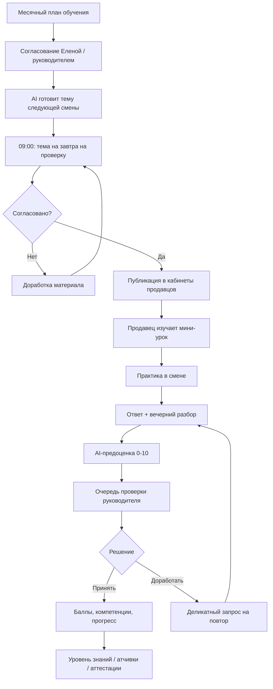
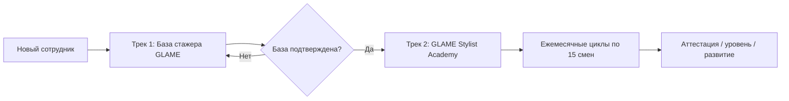
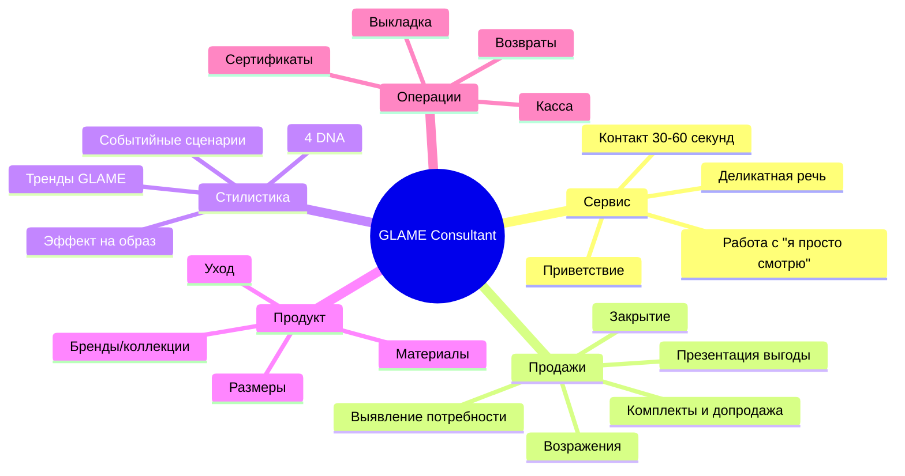
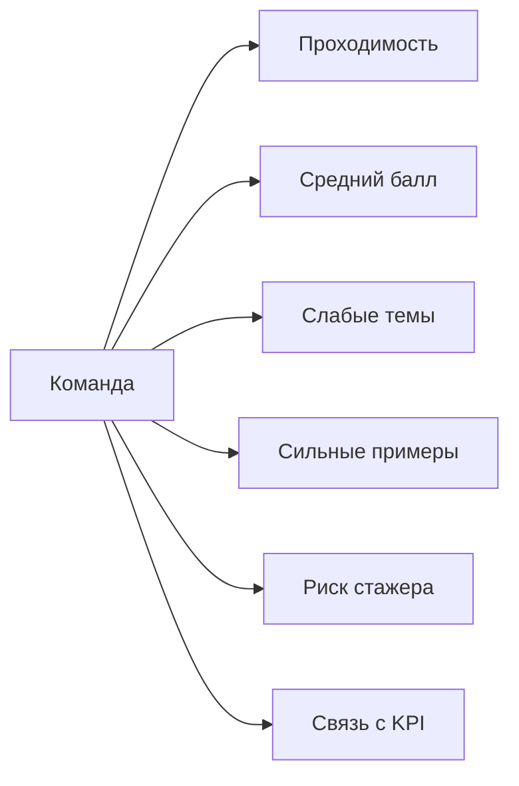

# Отчет: блок обучения продавцов GLAME / AI Trainer

Дата анализа: 2026-06-01  
Объект: обучение продавцов/консультантов GLAME, схема работы, AI-составляющая, аттестации, уровни знаний, мотивационные достижения.

---

## 1. Executive summary

Блок обучения продавцов GLAME уже имеет MVP-фундамент в платформе: есть backend-модели, API, миграция БД, frontend-страницы администратора и продавца, а также базовая AI-оценка ответов. Текущая стадия — **ранний MVP / proof-of-workflow**, не полноценный учебный контур.

Главная идея правильная: обучение должно быть не библиотекой материалов, а **ежедневной операционной системой развития продавца-стилиста**: тема смены → практика в зале → ответ → AI-предоценка → проверка руководителем/наставником → обратная связь → рост уровня.

Ключевой вывод: систему нужно развивать в сторону **двух треков**:

1. **База стажера GLAME** — обязательный onboarding по `Бланку стажера`, каждый рабочий день, с наставником.
2. **GLAME Stylist Academy** — постоянное обучение всей команды: около 15 тем в месяц по сменам, с фокусом на стилистику украшений, продажи и сервис.

---

## 2. Проверенная текущая стадия воплощения

### Что уже есть в платформе

| Уровень | Реализовано | Комментарий |
|---|---:|---|
| Backend-модели | ✅ | `ConsultantTrainingTopic`, `Assignment`, `Submission` |
| Миграция БД | ✅ | `048_consultant_training.py` |
| Admin API | ✅ | темы, согласование, публикация, очередь ответов |
| Seller API | ✅ | список материалов, открытие темы, отправка ответа |
| Frontend admin | ✅ | `/admin/consultant-training` |
| Frontend seller | ✅ | `/profile/training` |
| AI-оценка | ⚠️ MVP | rule-based, не LLM, черновик для руководителя |
| Автогенерация тем 09:00 | ❌ | в UI обозначена логика, cron/agent-процесс не подтвержден |
| Аттестации/уровни | ❌ | нет сущностей экзамена, компетенций, уровней |
| Achievements/мотивация | ❌ | нет бейджей, streak, прогресса, рейтингов качества |
| Интеграция с графиком смен | ❌ | темы сейчас по датам, а нужно по сменам |

### Фактические данные API на момент проверки

- Health API: `healthy`.
- В системе найдена 1 тема обучения: **«Стилистический подбор украшений в GLAME»** от 2026-05-31.
- Статус темы: `needs_revision`.
- Назначений продавцам: `0`.
- Ответов продавцов: `0`.
- Принятых ответов: `0`.
- В личном кабинете текущего пользователя назначенных тем нет.

Вывод: **модуль технически поднят, но учебный процесс еще не запущен в операционную работу**.

---

## 3. Целевая схема работы



---

## 4. Идея продукта

### Что это должно быть

**AI Trainer GLAME** — внутренний тренер, который каждый рабочий день превращает продавца в консультанта-стилиста:

- дает короткую, но конкретную тему на смену;
- связывает материал с реальным ассортиментом GLAME;
- учит говорить с клиентом премиальным языком без давления;
- проверяет не факт «прочитала», а применение в продаже;
- помогает руководителю быстрее видеть слабые места команды;
- формирует историю развития каждого продавца.

### Чем это отличается от обычного обучения

| Обычный курс | AI Trainer GLAME |
|---|---|
| Материалы лежат отдельно | Материал приходит под смену |
| Проверка ручная и редкая | AI делает первичный разбор каждого ответа |
| Нет связи с продажами | Практика в зале + клиентские фразы |
| Все проходят одинаково по календарю | Темы идут по сменам продавца |
| Нет развития уровня | Формируются компетенции, уровни, аттестации |

---

## 5. Правильная структура обучения: 2 трека



### Трек 1. База стажера GLAME

Назначение: довести нового продавца до безопасного уровня самостоятельной работы.

Темы:

- бренд, миссия, ценности GLAME;
- стандарты сервиса;
- этапы контакта с клиентом;
- базовая презентация украшений;
- ассортимент, материалы, уход;
- гарантия, возвраты, касса, сертификаты;
- KPI, открытие/закрытие смены, фотоотчеты;
- правила выкладки и передачи смены.

Контроль: каждый рабочий день — мини-урок, практика, ответ, AI-проверка, наставник.

### Трек 2. GLAME Stylist Academy

Назначение: постоянное развитие всей команды как продавцов-стилистов.

Ритм: **примерно 15 тем в месяц**, потому что у консультанта около 15 рабочих смен.

Фокус:

- украшение как часть образа;
- стилистический эффект изделия;
- клиентская фраза GLAME;
- сезонные/событийные сценарии: свадьба, выпускной, отпуск, подарок;
- 4 DNA-типа: Classic, Romantic, Dramatic, Natural;
- тренды, уже адаптированные GLAME, а не самостоятельный поиск трендов продавцом.

---

## 6. AI-составляющая

### Сейчас

Текущий AI-блок — это rule-based оценка ответа по 5 критериям, максимум 10 баллов:

1. понимание темы;
2. конкретное украшение/сценарий;
3. эффект на образ;
4. язык GLAME;
5. практическое применение.

Это хорошо для MVP, потому что:

- не отправляет обратную связь продавцу напрямую;
- дает руководителю черновик;
- умеет деликатно просить доработку;
- отсеивает слабые ответы вроде «красивое, всем подходит, берите».

### Что нужно усилить

| AI-функция | Сейчас | Нужно для запуска |
|---|---:|---|
| Оценка ответа | ⚠️ rule-based | LLM + рубрика + примеры хороших ответов |
| Генерация уроков | ❌ | по утвержденному месячному плану |
| Персональные рекомендации | ❌ | по слабым компетенциям продавца |
| Анализ команды | ❌ | карта знаний по магазинам/продавцам |
| Связь с продажами | ❌ | сравнение обучения с KPI/конверсией/средним чеком |
| Библиотека лучших ответов | ❌ | только после утверждения менеджером |
| Автоподготовка темы 09:00 | ❌ | cron/agent: завтра на согласование |

---

## 7. Система оценок

### Базовая шкала ответа за смену: 10 баллов

| Критерий | Баллы | Что оцениваем |
|---|---:|---|
| Понимание темы | 0–2 | продавец понял принцип, а не повторил фразу |
| Конкретика изделия/сценария | 0–2 | есть украшение, клиент, ситуация |
| Эффект на образ | 0–2 | объясняет, что меняется в образе |
| Язык GLAME | 0–2 | спокойно, премиально, без давления |
| Практическое применение | 0–2 | можно реально сказать клиенту в зале |

### Интерпретация результата

| Баллы | Статус | Действие |
|---:|---|---|
| 0–3 | Не зачтено | мягкая доработка, конкретный шаблон ответа |
| 4–5 | Слабо | доработка или наставник в смене |
| 6–7 | Принято с комментарием | руководитель уточняет слабое место |
| 8–9 | Хорошо | засчитывается, можно сохранить как сильный пример |
| 10 | Отлично | кандидат в «пример недели» после проверки |

---

## 8. Компетенции и уровни знаний

### Карта компетенций продавца



### Уровни

| Уровень | Название | Критерии перехода |
|---:|---|---|
| 0 | Стажер | проходит базу, работает под наставником |
| 1 | Junior Consultant | база закрыта, средний балл ≥ 6, знает сервис и продукт |
| 2 | Consultant | средний балл ≥ 7.5, уверенные клиентские фразы, стабильное выполнение практик |
| 3 | Stylist Consultant | средний балл ≥ 8.5, сильные стилистические рекомендации, комплекты |
| 4 | Senior Stylist / Mentor | стабильно высокий уровень, помогает проверять/обучать других |

Важно: уровень не должен зависеть только от тестов. Он должен сочетать:

- обучение;
- практику;
- качество ответов;
- подтверждение руководителя;
- реальные KPI: конверсия, средний чек, комплексность продаж, возвраты/жалобы.

---

## 9. Аттестации

### Типы аттестаций

| Аттестация | Когда | Формат |
|---|---|---|
| Входная база | конец стажировки | тест + практическая ситуация + наставник |
| Месячная мини-аттестация | конец месяца | 3–5 кейсов по темам месяца |
| Квартальная | раз в квартал | продукт + сервис + стилистика + продажи |
| Повторная | после слабого результата | только слабые компетенции |
| Mentor-ready | для старших продавцов | проверка способности объяснять и обучать |

### Формула аттестации

```text
Итог = 30% теория + 40% практический кейс + 20% качество языка GLAME + 10% KPI/дисциплина обучения
```

### Пример практического кейса

> Клиентка выбирает украшение к белому жакету и говорит: «Не хочу слишком нарядно». Выберите 2 варианта из ассортимента GLAME, объясните эффект каждого на образ и сформулируйте спокойную фразу без давления.

Оценка:

- изделие выбрано уместно;
- есть объяснение эффекта;
- нет давления;
- предложен следующий шаг/комплект;
- фраза звучит как GLAME.

---

## 10. Achievements / мотивация

Геймификация должна быть премиальной и взрослой: не «игрушечные медальки», а видимые признаки профессионального роста.

### Рекомендуемые достижения

| Achievement | Условие | Зачем |
|---|---|---|
| `Первый разбор` | первый принятый ответ | мягкий старт |
| `5 смен подряд` | 5 принятых практик без пропусков | дисциплина |
| `Язык GLAME` | 5 ответов подряд с 2/2 по языку | премиальный tone of voice |
| `Стилистический эффект` | 5 ответов с 2/2 по эффекту на образ | развитие стилиста |
| `Комплектное мышление` | продавец регулярно предлагает сет/дополнение | рост среднего чека |
| `Лучший пример недели` | ответ выбран руководителем | мотивация без токсичного рейтинга |
| `Наставник месяца` | senior помогает другим | развитие лидеров |
| `Без доработок` | месяц без возврата заданий | качество обучения |

### Что не стоит делать на старте

- публичные жесткие рейтинги «кто хуже»;
- автоматические конкурсы без проверки руководителем;
- награды только за количество, без качества;
- прямую привязку к штрафам.

---

## 11. Дашборды и визуальная аналитика

### Для руководителя



Блоки:

1. **Карта команды:** продавцы × компетенции.
2. **Воронка обучения:** назначено → открыто → отправлено → принято.
3. **Средний балл по магазинам.**
4. **Темы, которые проваливаются.**
5. **Очередь проверки.**
6. **Стажеры с риском.**
7. **Лучшие ответы недели.**

### Для продавца

- мой уровень;
- тема текущей смены;
- прогресс месяца;
- мои сильные компетенции;
- что подтянуть;
- полученные достижения;
- история обратной связи.

---

## 12. Основные разрывы текущего MVP

| Разрыв | Риск | Рекомендация |
|---|---|---|
| Темы привязаны к дате, не к смене | продавец пропускает темы в выходные | связать с графиком смен |
| Нет разделения стажера и академии | смешение onboarding и развития | добавить `training_track` |
| Нет компетенций | нельзя видеть, что именно растет | ввести taxonomy компетенций |
| Нет аттестаций | обучение не подтверждает уровень | добавить exam/certification entities |
| AI rule-based | слабая глубина проверки | добавить LLM-оценку по рубрике |
| Нет автоплана 09:00 | ручная нагрузка | Hermes/cron готовит тему на завтра |
| Нет achievements | меньше мотивации | добавить бейджи и прогресс |
| Нет связи с KPI | сложно доказать бизнес-эффект | связать с продавцами/KPI dashboard |
| Нет библиотеки материалов | каждый урок живет отдельно | добавить topic library/templates |

---

## 13. Рекомендации по внедрению

### Этап 1 — довести MVP до рабочего пилота, 1–2 недели

1. Утвердить 15 тем на ближайший месяц.
2. Разделить материалы на два трека: стажер / академия.
3. Запустить публикацию только на 1 магазин или 3–5 продавцов.
4. Добавить ручной контроль: руководитель проверяет все ответы.
5. Собирать метрики: opened/submitted/accepted/score/revision.

Критерий готовности: минимум 10–15 реальных ответов, понятная очередь проверки, нет утечки AI-комментариев без руководителя.

### Этап 2 — персональный прогресс и компетенции, 2–4 недели

1. Добавить компетенции к каждой теме.
2. Считать профиль продавца: средний балл по компетенциям.
3. Добавить уровни Junior / Consultant / Stylist / Mentor.
4. Добавить бейджи и прогресс месяца.
5. Сделать дашборд руководителя.

Критерий готовности: руководитель видит не только ответы, а карту знаний команды.

### Этап 3 — AI-усиление, 4–6 недель

1. Добавить LLM-проверку по утвержденной рубрике.
2. Генерировать улучшенный пример ответа.
3. Автоматически предлагать повторные темы продавцу по слабым местам.
4. Ввести библиотеку сильных ответов с модерацией.
5. Подключить Hermes-процесс: каждый день 09:00 тема на завтра на утверждение.

Критерий готовности: AI экономит время руководителя, но не заменяет финальное решение.

### Этап 4 — аттестации и бизнес-связь, 6–10 недель

1. Запустить месячные мини-аттестации.
2. Связать обучение с KPI продавца: чек, конверсия, комплексность.
3. Ввести риск-модель: кто не проходит базу/теряет качество.
4. Добавить квартальные аттестации.
5. Сделать отчет для управления: обучение → качество продаж.

Критерий готовности: обучение становится частью управления продавцами, а не отдельной страницей.

---

## 14. Минимальная структура данных для следующей версии

Добавить сущности/поля:

```text
TrainingTrack
- trainee_base
- stylist_academy

TrainingCompetency
- service_contact
- product_knowledge
- glame_language
- styling_effect
- client_scenario
- sales_closing
- operations

TrainingLevel
- trainee
- junior_consultant
- consultant
- stylist_consultant
- senior_mentor

TrainingAchievement
- seller_user_id
- achievement_code
- earned_at
- evidence

TrainingCertification
- seller_user_id
- period
- theory_score
- practice_score
- language_score
- kpi_score
- final_status
```

---

## 15. Рекомендуемый запуск

### Пилот

- Участники: 1 магазин или 3–5 активных продавцов.
- Длительность: 2 недели.
- Темы: 6–8 сменовых мини-уроков.
- Проверка: все ответы через руководителя.
- Цель: проверить не красоту идеи, а операционную дисциплину.

### Метрики пилота

| Метрика | Норма для пилота |
|---|---:|
| Открытие назначенных тем | ≥ 80% |
| Отправка ответов | ≥ 70% |
| Принятие с первого раза | ≥ 60% |
| Средний AI/manager score | ≥ 6.5/10 |
| Ответы, требующие доработки | ≤ 30–35% |
| Время проверки руководителем | ≤ 5 минут на ответ |

---

## 16. Финальная рекомендация

Запускать модуль можно, но не как полноценную академию сразу. Правильный путь:

1. **Сначала пилот на малой группе.**
2. **Параллельно оформить месячный план тем и рубрики.**
3. **Доработать сменовую логику и компетенции.**
4. **После первых данных включать уровни, достижения и аттестации.**
5. **Только после проверки качества — масштабировать на всю команду.**

Главный принцип: AI не должен напрямую «учить и оценивать» продавца без контроля. В премиальном бренде GLAME AI должен быть **усилителем руководителя и наставника**, а не неконтролируемым автотренером.
