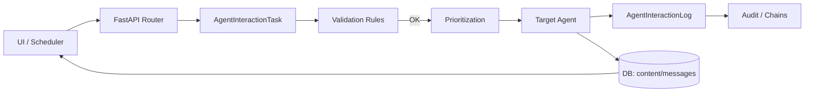
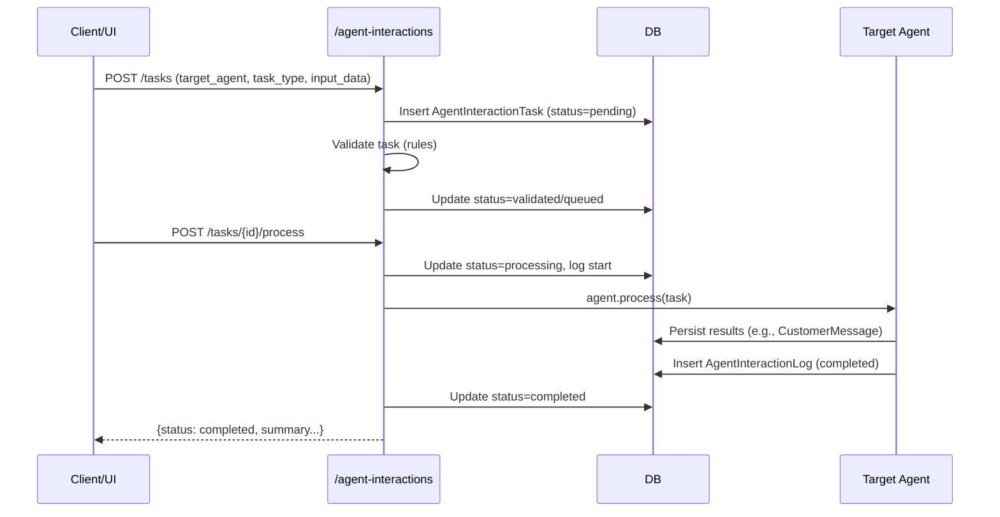
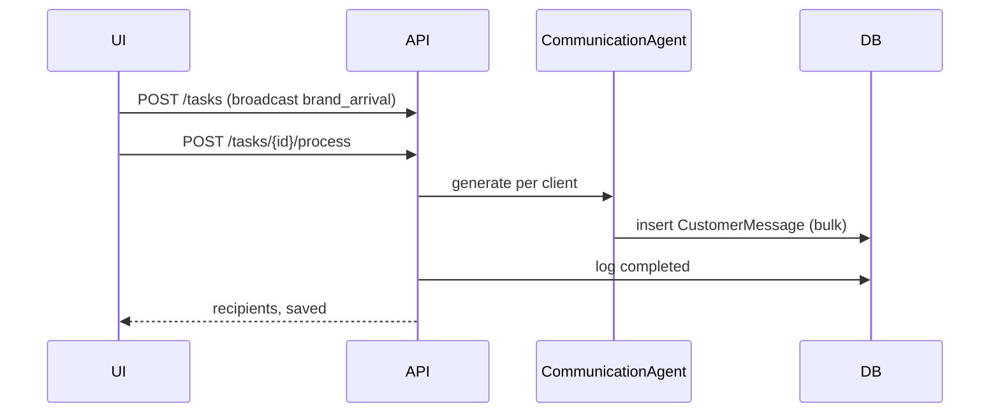
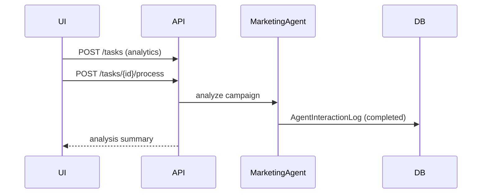

# Архитектура и функционирование системы агентов GLAME

## 1. Введение

Система агентов GLAME — это модульная платформа, обеспечивающая автоматизацию маркетинга, коммуникаций и контента посредством координации нескольких специализированных AI‑агентов. Она включает:
- вычислительное ядро на базе FastAPI (асинхронный Python),
- слой агентов (контент, коммуникации, маркетинг),
- сервисы для LLM, векторного поиска и аналитики,
- протоколы межагентного взаимодействия и аудит,
- хранение задач, логов и контента в БД.

Цели:
- разделить ответственность между типами агентов,
- обеспечить трассируемость и воспроизводимость решений,
- упростить масштабирование, оркестрацию и повторное использование.

## 2. Типы агентов и принципы их работы

### 2.1. Базовый агент
- Файл: [base_agent.py](file:///root/glame-platform/backend/app/agents/base_agent.py)
- Ответственность:
  - единый интерфейс для всех агентов,
  - доступ к LLM‑сервису и векторной БД,
  - утилиты по извлечению контекста.
- Ключевые зависимости: llm_service, vector_service.

### 2.2. ContentAgent и AdvancedContentAgent
- Файлы: [content_agent.py](file:///root/glame-platform/backend/app/agents/content_agent.py), [advanced_content_agent.py](file:///root/glame-platform/backend/app/agents/advanced_content_agent.py)
- ContentAgent: генерация контента и рекомендаций для бренда.
- AdvancedContentAgent:
  - управление системными промптами (версионность),
  - межагентное взаимодействие (получение/обработка задач),
  - интеграция с AI‑Маркетологом и аудитом.

### 2.3. CommunicationAgent
- Файл: [communication_agent.py](file:///root/glame-platform/backend/app/agents/communication_agent.py)
- Ответственность:
  - персонализированные сообщения клиентам (учёт истории покупок, города, бонусов),
  - определение сегмента, корректные обращения (по имени/полу),
  - генерация JSON‑ответов с message/cta.
- Зависимости: CommunicationService (данные клиента, фильтры), LLM.

### 2.4. MarketingAgent
- Файл: [marketing_agent.py](file:///root/glame-platform/backend/app/agents/marketing_agent.py)
- Ответственность:
  - аналитика кампаний, метрик и стратегические рекомендации,
  - формирование аналитического текста или структурированных метрик.

## 3. Модели данных и состояния

### 3.1. Задачи и логирование
- Модель задачи: AgentInteractionTask (тип, приоритет, статус, дедлайны, retries).
- Логи: AgentInteractionLog (цепочки событий: start, completed, failed, dialog_message и др.).
- Передача контента: AgentContentHandoff (handoff между агентами).
- Правила валидации: AgentValidationRule (JSON Schema/кастомная функция).
- Код: [agent_interaction.py](file:///root/glame-platform/backend/app/models/agent_interaction.py)

Статусы (InteractionStatus): pending, validating, validated, queued, processing, completed, failed, cancelled, rejected.

### 3.2. Коммуникации с клиентами
- Модель сообщения: CustomerMessage (message, cta, payload с деталями генерации).
- Код: [customer_message.py](file:///root/glame-platform/backend/app/models/customer_message.py)

## 4. Взаимодействие между агентами

### 4.1. Общая схема



### 4.2. Последовательность обработки задачи



## 5. Протоколы связи и обмена данными

### 5.1. Форматы задач
Пример создания задачи для communication‑agent:

```json
POST /api/agent-interactions/tasks
{
  "source_agent": "ai-marketer-ui",
  "target_agent": "communication-agent",
  "task_type": "broadcast",
  "task_context": {"campaign": "brand_arrival_geometry"},
  "input_data": {
    "event": {"type": "brand_arrival", "brand": "Geometry"},
    "limit": 500,
    "search_criteria": {"segment_name": "VIP"}
  },
  "priority": 2
}
```

### 5.2. Ответы агентов
- CommunicationAgent.generate_message возвращает JSON:

```json
{
  "client_id": "uuid",
  "name": "Имя",
  "gender": "female",
  "segment": "VIP",
  "reason": "brand_arrival",
  "message": "текст",
  "cta": "призыв",
  "brand": "Geometry",
  "store": "Yalta"
}
```

### 5.3. Логи и аудит
- Лог события:

```json
POST /api/agent-interactions/tasks/{task_id}/dialog-logs
{ "role": "user|assistant|system", "message": "text", "metadata": {...} }
```

## 6. Координация и синхронизация

- Единый статемашин для задач (InteractionStatus) + валидация через AgentValidationRule.
- Приоритизация: поля priority/deadline_at; выборки для целевого агента.
- Идемпотентность:
  - детерминированные ID для массовых сообщений (где требуется),
  - on_conflict_do_nothing при батч‑вставках.
- Кэширование/буферизация:
  - кэш моделей OpenRouter,
  - локальные кэши выборок клиентов (при необходимости).

## 7. Обработка ошибок и отказоустойчивость

- Try/catch на уровне агента и API‑роутеров с подробным логом в AgentInteractionLog.
- Поля retry_count/max_retries в задачах — база для стратегий повторов.
- Частичный успех:
  - ошибки на отдельных клиентах логируются как event_type=error, задача завершается со статусом completed при достаточной доле успеха (по правилу).
- Валидация входа (JSON Schema/кастомные функции) предотвращает выполнение невалидных задач.

## 8. Примеры use‑case

1) Массовая коммуникация бренда:
   - UI создаёт задачу target_agent=communication‑agent c event=brand_arrival.
   - Агент подбирает клиентов по истории бренда, генерирует сообщения, сохраняет в CustomerMessage.
   - Маркетолог выгружает XLSX или запускает отправку.

2) Аналитика кампаний:
   - UI создаёт задачу target_agent=analytics‑agent с campaign_id/датами.
   - Агент формирует анализ, пишет лог completed с метриками/summary.

3) Совместная работа агентов:
   - content‑agent сгенерировал пост → handoff в communication‑agent для текстов рассылок.

## 9. Диаграммы последовательности

### 9.1. Коммуникации (сохранение сообщений)



### 9.2. Аналитика



## 10. API взаимодействия между агентами

Основные маршруты (примеры):
- POST /api/agent-interactions/tasks — создать задачу.
- GET /api/agent-interactions/tasks — список задач.
- GET /api/agent-interactions/tasks/{task_id} — задача.
- POST /api/agent-interactions/tasks/{task_id}/process — выполнить.
- GET /api/agent-interactions/tasks/{task_id}/logs — логи.
- POST /api/agent-interactions/tasks/{task_id}/dialog-logs — добавить сообщение диалога.

Сопутствующие (коммуникации/модели):
- GET /api/settings/openrouter/models — перечень моделей OpenRouter, кеш/force_refresh.

## 11. Масштабирование и производительность

- Горизонтальное масштабирование API (stateless) + sticky‑locks для задач при необходимости.
- Асинхронные батчи вставок (bulk insert), on_conflict_do_nothing для идемпотентности.
- Индексы БД:
  - на task.status/created_at/target_agent для выборок очереди,
  - на customer_messages.user_id/payload->generation_id для аналитики и очистки,
  - на logs.task_id/created_at.
- Кэширование:
  - модели OpenRouter и тарифы,
  - результаты выборок сегментов.
- Нагрузка на LLM:
  - коннекшн‑пулы httpx,
  - троттлинг/квоты по модели,
  - агрегация запросов (где применимо), сокращение контекста.

## 12. Зависимости и окружение

Минимальные требования:
- Python 3.11+ (рекомендуется 3.12),
- FastAPI, SQLAlchemy (async), PostgreSQL (asyncpg),
- httpx, pydantic,
- openpyxl (для экспортов), pandas (опционально),
- переменные окружения для OpenRouter:
  - OPENROUTER_API_KEY,
  - OPENROUTER_MANAGEMENT_API_KEY (для /activity,/credits),
  - OPENROUTER_BASE_URL (по умолчанию https://openrouter.ai/api/v1).

Dev‑среда:
- Uvicorn / gunicorn + uvloop,
- CORS для локального фронтенда,
- доступ к статическим директориям.

## 13. Примеры кода

### 13.1. Создание и запуск задачи (curl)

```bash
curl -X POST http://localhost:8000/api/agent-interactions/tasks \
  -H "Content-Type: application/json" \
  -d '{
    "source_agent":"ai-marketer-ui",
    "target_agent":"communication-agent",
    "task_type":"broadcast",
    "input_data":{"event":{"type":"brand_arrival","brand":"Geometry"},"limit":200}
  }'

curl -X POST http://localhost:8000/api/agent-interactions/tasks/<TASK_ID>/process
```

### 13.2. Лог диалога

```bash
curl -X POST http://localhost:8000/api/agent-interactions/tasks/<TASK_ID>/dialog-logs \
  -H "Content-Type: application/json" \
  -d '{"role":"user","message":"Проверь текст рассылки для VIP","metadata":{"lang":"ru"}}'
```

## 14. Рекомендации по эксплуатации

- Наблюдаемость: метрики по статусам задач, длительности, дырам в очереди.
- Алёртинг на рост ошибок, превышение квот OpenRouter.
- Регулярная очистка устаревших логов/временных файлов и архивирование.
- Контроль стоимости моделей и автоматический fallback на альтернативы.

---

Этот документ отражает целевую архитектуру и протоколы системы агентов GLAME. Он предназначен как для разработчиков, так и для инженеров эксплуатации, обеспечивая полное понимание отдельных агентов и их совместной работы.

