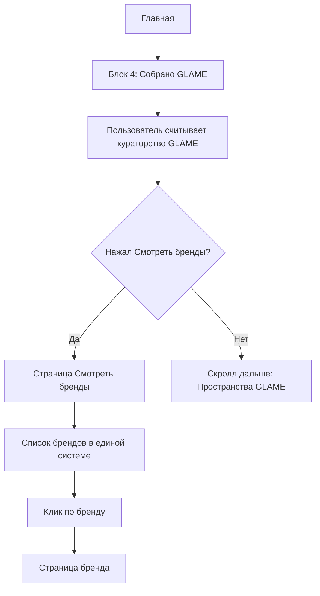

# GLAME App — Главная страница / Блок 4 «Собрано GLAME»

## 1. Роль блока

Блок 4 находится на Главной после блока «Подбор по фото» и перед блоком «Пространства GLAME».

Его задача — не продавать конкретное изделие и не запускать новый сценарий подбора, а объяснить ценность ассортимента GLAME:

> GLAME не показывает случайные украшения. GLAME собирает бренды, линии и формы как кураторскую систему.

## 2. Название и текст

**Заголовок:**  
`Собрано GLAME`

**Текст:**  
`Мы отбираем главное.`  
`Чтобы вы выбирали свое.`

**CTA:**  
`Смотреть бренды`

## 3. Основная логика



## 4. Кликабельность

| Элемент | Кликабелен | Действие |
|---|---:|---|
| CTA `Смотреть бренды` | Да | Переход на `/brands` |
| Заголовок | Нет | Только смысловой элемент |
| Текст | Нет | Только смысловой элемент |
| Визуальная картинка | Нет | Атмосферный слой |
| Список брендов внизу | Нет на Главной | Показывает систему брендов, но не создает 14 маленьких целей клика |

## 5. Почему только одна кнопка

В этом блоке не должно быть второй кнопки `Подобрать по стилю`, потому что:
- подбор уже есть в Hero-сценариях и в разделе «Подбор»;
- блок 4 отвечает за бренды и кураторство;
- одна задача = один главный переход;
- так CJM остается чистым: вдохновение → новинки → AI-подбор → бренды → пространства.

## 6. Список брендов

Бренды показываются в единой системе, без деления на «наши / не наши», «линии / бренды».

1. Geometry  
2. Magna  
3. Pearl  
4. Crystal  
5. Bicolor  
6. Prism Of Elegance  
7. UNOde50  
8. Raganella Princess  
9. Island Soul  
10. AGafi  
11. Antura  
12. Kalliope  
13. Wrinkles of Time  
14. Claudio Canzian  

## 7. Визуальная система

### Палитра

| Название | HEX |
|---|---|
| Графит | `#2E3032` |
| Стальной серый | `#73777A` |
| Холодный светло-серый | `#D9DCDE` |
| Белый | `#F8F9F9` |
| Линия | `#C7C9CB` |

### UI-правила

- radius: `0 px`
- border: `1 px`
- никаких теплых бежевых / золотых UI-акцентов
- без теней, glow, marketplace-бейджей
- верхнее и нижнее меню не входят в макет блока
- графический GLAME-паттерн можно использовать только фоном, дозированно
- визуальная картинка не должна содержать интерфейсный текст

## 8. Assets

В пакет входят:

### `glame_home_block4_background_underlay.png`
Фоновая подложка без текста:
- холодный светло-серый фон;
- рельефный GLAME-паттерн;
- нижняя зона под список брендов;
- без кнопок;
- без заголовков;
- без верхнего и нижнего меню.

### `glame_home_block4_visual_image_no_text.png`
Картинка, используемая в блоке:
- только визуальный слой;
- без UI-текста;
- без кнопок;
- без списка брендов;
- используется как Image.asset / CDN asset внутри Flutter-блока.

### `glame_home_block4_constructor_image_no_text.png`
Опциональная подложка для конструктора:
- фон + визуальная картинка;
- без текста и кнопок;
- может использоваться, если конструктор накладывает весь текст и CTA отдельно.

### `glame_home_block4_design.png`
Контрольный дизайн блока для сверки с разработкой.

## 9. Route

```dart
context.push('/brands');
```

или через именованный роут:

```dart
context.pushNamed('brands');
```

## 10. Analytics

| Event | Trigger |
|---|---|
| `home_block4_view` | Блок появился во viewport |
| `home_block4_brands_click` | Пользователь нажал CTA `Смотреть бренды` |

Payload:

```json
{
  "screen": "home",
  "block": "home_collected_glame",
  "cta": "view_brands"
}
```

## 11. Acceptance checklist

- [ ] В блоке одна CTA-кнопка: `Смотреть бренды`.
- [ ] CTA ведет на `/brands`.
- [ ] Нет кнопки `Подобрать по стилю`.
- [ ] Список брендов единый, без внутренних делений.
- [ ] Названия брендов на Главной не кликабельны.
- [ ] Используется холодная палитра GLAME.
- [ ] Radius = `0`.
- [ ] Stroke = `1 px`.
- [ ] Верхнее и нижнее меню не включены в блок.
- [ ] Картинка для блока доступна отдельно без текста.
- [ ] Фон / подложка доступен отдельно без текста.
