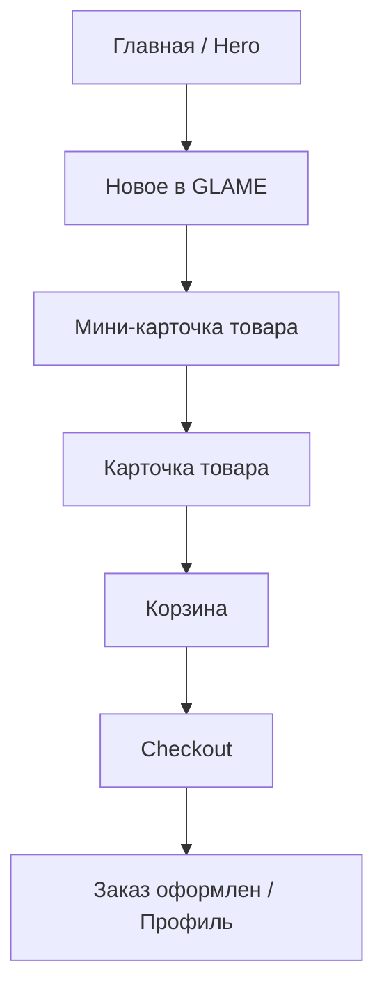
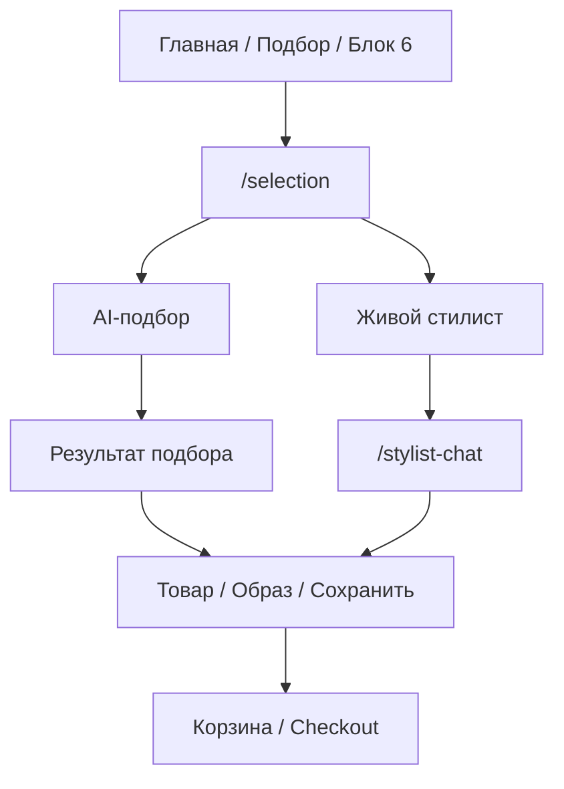
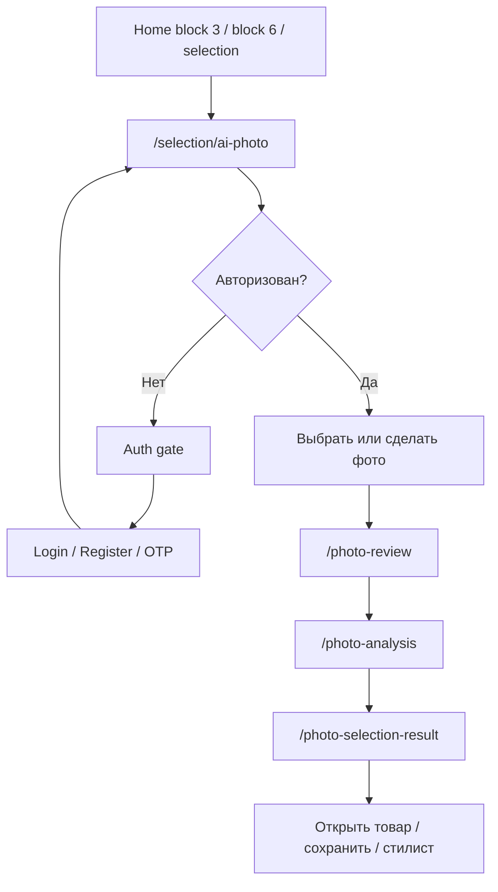
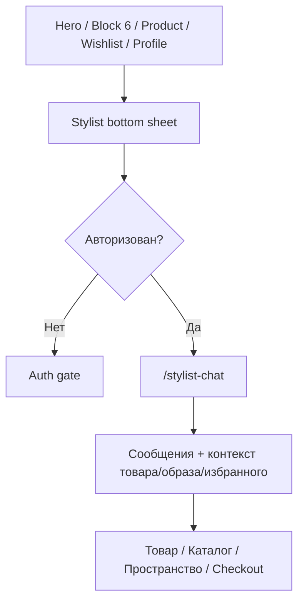
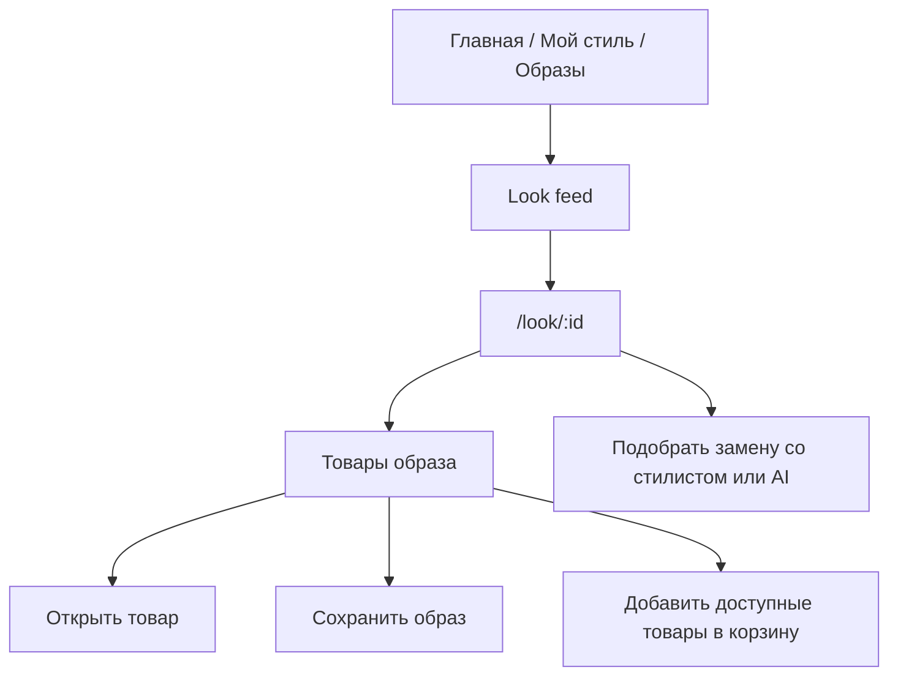
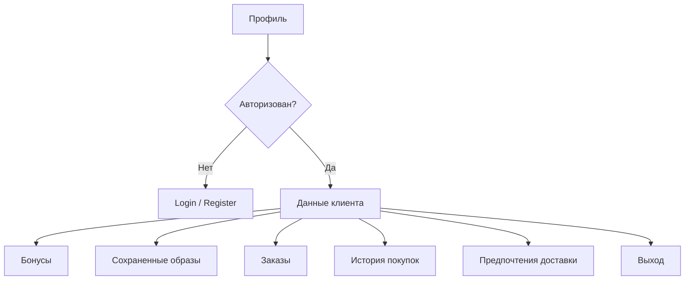

# GLAME App — структура, связи экранов и трекер внедрения дизайна

Дата создания: 2026-06-24  
Назначение: единый рабочий документ для поэтапного приведения клиентского Flutter-приложения GLAME к согласованному дизайну и полной функциональной структуре.

Этот файл является master-трекером. По нему отрабатываем страницы, меняем статусы, фиксируем согласование и видим, что уже сделано, что в работе и что еще предстоит.

## 1. Правила работы со статусами

Статус `Готово` ставится только после явного согласования владельцем продукта.

Допустимые статусы:

| Статус | Значение | Кто может поставить |
| --- | --- | --- |
| `Не начато` | Экран описан, но дизайн/реализация еще не начаты | Codex |
| `Нужно уточнить` | Требуется решение по логике, текстам, фото, составу блока или приоритету | Codex |
| `Дизайн-основа есть` | Есть Stitch/ТЗ/референс или текущий экран можно использовать как основу | Codex |
| `В работе` | Экран сейчас переделывается или готовится к переделке | Codex |
| `Частично внедрено` | Часть дизайна/логики уже внедрена, но экран еще не финальный | Codex |
| `На согласовании` | Экран доведен до версии для просмотра владельцем продукта | Codex |
| `Правки после просмотра` | Есть замечания владельца продукта | Codex |
| `Готово` | Экран утвержден владельцем продукта | Только после согласования с пользователем |

Правило перехода в `Готово`:

```text
Codex внедрил экран
→ Codex проверил сборку / анализ / базовые сценарии
→ статус: На согласовании
→ пользователь смотрит экран
→ пользователь явно пишет, что экран утвержден
→ Codex меняет статус на Готово
```

## 2. Источники требований

Основные документы и референсы:

- `docs/design/stitch_app_design_package/GLAME_APP_STITCH_FULL_DESIGN_TZ.md`
- `docs/design/GLAME_updated_document_system_v2_FULL/00_INDEX_GLAME_DOCUMENT_SYSTEM.md`
- `docs/design/GLAME_updated_document_system_v2_FULL/01_GLAME_IDENTITY_AND_ANTI_DISTORTION.md`
- `docs/design/GLAME_updated_document_system_v2_FULL/02_GLAME_NAVIGATION_SAFE_AREA_SYSTEM.md`
- `docs/design/GLAME_updated_document_system_v2_FULL/03_GLAME_HOME_HERO_SLIDES_LOGIC.md`
- `docs/design/GLAME_updated_document_system_v2_FULL/04_GLAME_HOME_BLOCK2_NEW_IN_GLAME.md`
- `docs/design/GLAME_updated_document_system_v2_FULL/05_GLAME_HOME_BLOCK3_AI_PHOTO_SELECTION.md`
- `docs/design/GLAME_updated_document_system_v2_FULL/06_GLAME_HOME_BLOCK4_BRANDS.md`
- `docs/design/GLAME_updated_document_system_v2_FULL/07_GLAME_HOME_BLOCK5_SPACES.md`
- `docs/design/GLAME_updated_document_system_v2_FULL/08_GLAME_HOME_BLOCK6_HOW_TO_CHOOSE_BUY.md`
- `docs/design/GLAME_updated_document_system_v2_FULL/09_GLAME_LIVE_STYLIST_FLOW.md`
- `docs/design/GLAME_updated_document_system_v2_FULL/10_GLAME_AI_SELECTION_FLOW.md`
- `docs/design/GLAME_updated_document_system_v2_FULL/11_GLAME_SPACES_YALTA_SIMFEROPOL_RULES.md`
- `docs/design/GLAME_updated_document_system_v2_FULL/12_GLAME_UI_TOKENS_AND_COMPONENTS.md`
- `docs/design/GLAME_updated_document_system_v2_FULL/15_GLAME_QA_ACCEPTANCE_CHECKLIST.md`
- `docs/design/GLAME_home_block1_button_layout_files/GLAME_home_block1_button_layout_TZ.md`
- `docs/design/glame_home_block_02_new_in_spec.md`
- `docs/design/block 3/glame_photo_selection_flow_spec_v3.md`
- `docs/design/block 6/GLAME_home_block6_developer_package_FINAL/glame_home_block6_logic.md`
- `docs/design/block 6/GLAME_home_block6_developer_package_FINAL/glame_home_block6_agreed_design.png`
- `docs/mobile_app_plan.md`

Stitch-основа:

- `docs/design/stitch_review_2026-06-16/`
- `tmp/stitch_review_v2/stitch_glame_jewelry_app_design/`

Текущие Flutter-роуты:

- `mobile/glame_app/lib/src/app/app.dart`
- `mobile/glame_app/lib/src/features/home/home_shell.dart`

## 3. Глобальные дизайн-правила GLAME

- Приложение mobile-first.
- Айдентика GLAME строгая, архитектурная, без marketplace-визуала.
- Радиусы: `0`.
- Границы: тонкие, обычно `1 px`.
- Без тяжелых теней, теплых акцентов, декоративных карточек и случайных градиентов.
- Логотип GLAME и G-знак используются только оригинальными assets.
- Верхнее меню и нижняя навигация всегда live Flutter UI, не часть фонового изображения.
- Hero-фото и фоны не должны содержать текст, кнопки, логотип top bar, bottom nav или индикаторы.
- Bottom nav на mobile: 5 основных пунктов, видимая высота около `96 px` + safe area.
- Брендовые названия не сокращать троеточием.
- Фото пространств GLAME не смешивать между Ялтой и Симферополем.
- В сценариях AI и стилиста не дублировать одну и ту же CTA без смысла.
- Для гостя закрытые действия показывают auth gate, а не пустой экран ошибки.

## 4. Навигационная модель

### 4.1. Основное нижнее меню

| Индекс | Label | Смысл | Реальная цель |
| --- | --- | --- | --- |
| `0` | `G` | Главная | `/home?tab=0` |
| `1` | `Украшения` | Каталог | `/home?tab=1` или `/catalog` |
| `2` | `Мой стиль` | Избранное / сохраненное | `/home?tab=2` |
| `3` | `Подбор` | Экран выбора способа подбора | `/home?tab=3` / `/selection` |
| `4` | `Профиль` | Кабинет клиента | `/home?tab=4` |

Решение от 2026-06-24: bottom nav остается по ТЗ. `tab=3` используется для `Подбор`. Корзина вынесена из bottom nav и открывается из top bar / drawer / карточки товара / профильной плитки через скрытый `tab=11`.

### 4.2. Дополнительные разделы через drawer / CTA

| Индекс / route | Раздел | Назначение |
| --- | --- | --- |
| `/home?tab=5` | Образы | Look feed / вдохновение |
| `/home?tab=6` | Новинки | Каталог с фильтром NEW |
| `/home?tab=7` | Коллекции | Каталог коллекций |
| `/home?tab=8` | Сертификат | Информационная страница |
| `/home?tab=9` | Сервис | Информационная страница |
| `/home?tab=10` | Пространства | Список пространств GLAME |
| `/home?tab=11` | Корзина | Скрытый технический tab для открытия корзины из top bar/drawer/товара |
| `/brands` | Бренды | Curated brand universe |
| `/spaces` | Пространства | Отдельный route списка пространств |
| `/stylist-chat` | Чат стилиста | Живой стилист / заявки |

### 4.3. Текущие Flutter routes

```text
/
/onboarding
/login
/auth/register
/auth/otp
/auth/change-password
/home
/catalog
/spaces
/spaces/:slug
/selection
/selection/gift
/selection/ai-photo
/product/:id
/checkout
/stylist-chat
/look/:id
/looks-profile
/photo-upload
/brands
/collections/:slug
/brand/:id
/photo-review
/photo-analysis
/photo-selection-result
```

## 5. Карта клиентских путей

### 5.1. Вдохновение → покупка



### 5.2. Не знаю, что выбрать



### 5.3. AI-подбор по фото



### 5.4. Живой стилист



### 5.5. Образы и сборка образа



### 5.6. Кабинет клиента



## 6. Реестр экранов и статусы

> 2026-06-24: переходим от структурной доработки к полной пересборке визуального слоя приложения по stitch-наработкам. Статус `Готово` ставится только после отдельного просмотра и подтверждения пользователем. Первый этап: единая дизайн-система, затем последовательный перенос каждого экрана на общие GLAME-компоненты.

### 6.1. Навигация, shell и общие элементы

| ID | Экран / компонент | Route / файл | Статус | Что должно быть | Следующий шаг |
| --- | --- | --- | --- | --- | --- |
| NAV-01 | Bottom nav | `HomeShell` | `Готово` | 5 пунктов: G, Украшения, Мой стиль, Подбор, Профиль; safe area; без перекрытия CTA | Утверждено 2026-06-24 |
| NAV-02 | Top bar на hero | `HomeShell`, `HomeScreen` | `На согласовании` | Прозрачный overlay; меню слева, логотип по центру, корзина и поиск справа | Проверить на телефоне, после подтверждения перевести в `Готово` |
| NAV-03 | Top bar внутренних экранов | `GlameTopAppBar`, разные экраны | `На согласовании` | Меню слева, логотип по центру, корзина и поиск справа; единый light/dark/transparent вариант | Проверить на телефоне, после подтверждения перевести в `Готово` |
| NAV-04 | Drawer / раскрывающееся меню | `HomeShell` | `Готово` | Главная, Украшения, Мой стиль, Подбор, Профиль, Новинки, Коллекции, Бренды, Пространства, Сервис, Сертификат, Вход/Выход; корзина вынесена в действия | Утверждено 2026-06-24 |
| NAV-05 | Auth gate shared pattern | `GlameAuthGate`, chat/photo/cart/profile | `Готово` | Единый экран/блок входа вместо ошибок 401 | Утверждено 2026-06-24 |

### 6.2. Auth и onboarding

| ID | Экран | Route | Статус | Требования | Следующий шаг |
| --- | --- | --- | --- | --- | --- |
| AUTH-01 | Onboarding | `/onboarding` | `Дизайн-основа есть` | Короткий вход в GLAME, без лишнего маркетинга | Аудит текущего экрана |
| AUTH-02 | Login | `/login` | `Частично внедрено` | Темный GLAME-стиль, next-route, SMS/почта по текущей логике | Отдельное согласование |
| AUTH-03 | Register | `/auth/register` | `Частично внедрено` | Регистрация, next-route, согласие/контакты если нужно | Отдельное согласование |
| AUTH-04 | OTP | `/auth/otp` | `Не начато` | Код, повторная отправка, ошибки, возврат | Привести к общей дизайн-системе |
| AUTH-05 | Change password | `/auth/change-password` | `Не начато` | Смена пароля/восстановление, состояния ошибок | Привести к общей дизайн-системе |

### 6.3. Главная страница

| ID | Экран / блок | Route | Статус | Требования | Следующий шаг |
| --- | --- | --- | --- | --- | --- |
| HOME-00 | Главная целиком | `/home?tab=0` | `Частично внедрено` | Последовательный story-flow, mobile-first, без marketplace | Финальный проход после блоков |
| HOME-01 | Hero carousel / блок 1 | `/home` | `На согласовании` | Фото магазина/атмосферы, top bar overlay, логотип, CTA по ТЗ, фиксированная зона кнопок | Проверить первый экран на телефоне, после подтверждения перевести в `Готово` |
| HOME-02 | Новое в GLAME / блок 2 | `/home` | `На согласовании` | Editorial drop, мини-карточки без цен, контурные heart, горизонтальная карусель всех товаров | Проверить свайп товаров на телефоне, после подтверждения перевести в `Готово` |
| HOME-03 | AI-подбор по фото / блок 3 | `/home` | `В работе` | CTA на `/selection/ai-photo`, инструкция фото, auth gate | Усилить stitch-композицию блока на главной и повторно показать |
| HOME-04 | Собрано GLAME / бренды / блок 4 | `/home` | `В работе` | Бренды не обрезаются, CTA `/brands` | Принудительно собрать из stitch background + visual assets, без админского single-image варианта |
| HOME-05 | Пространства GLAME / блок 5 | `/home` | `В работе` | Реальные фото Ялты/Симферополя, trust layer | Повторно сверить визуал после прохода главной целиком |
| HOME-06 | Как выбрать и купить / блок 6 | `/home` | `В работе` | Сохранить фото магазина как фон, 3 action-panels, сервис 2x2 | Повторно сверить визуал после прохода главной целиком |

### 6.4. Каталог, коллекции, бренды

| ID | Экран | Route | Статус | Требования | Следующий шаг |
| --- | --- | --- | --- | --- | --- |
| CAT-01 | Каталог | `/catalog`, `/home?tab=1` | `Частично внедрено` | Search, фильтры, категории, сетка, loading/empty/error | Полный визуальный аудит |
| CAT-02 | Новинки | `/home?tab=6`, `/catalog?category=NEW` | `Частично внедрено` | Каталог с контекстом NEW | Согласовать отдельный header |
| CAT-03 | Коллекции | `/home?tab=7`, `/collections/:slug` | `Не начато` | Коллекции как editorial entry, не просто поиск | Описать список коллекций |
| CAT-04 | Бренды | `/brands` | `Частично внедрено` | Curated universe, все названия полностью | Проверить дизайн и список |
| CAT-05 | Бренд detail | `/brand/:id` | `Частично внедрено` | Hero бренда, DNA, подборка GLAME, товары бренда | Согласовать шаблон бренда |

### 6.5. Товар и покупка

| ID | Экран | Route | Статус | Требования | Следующий шаг |
| --- | --- | --- | --- | --- | --- |
| BUY-01 | Карточка товара | `/product/:id` | `Дизайн-основа есть` | Пользователю нравится текущий экран; сохранить как основу | Не трогать без отдельного согласования |
| BUY-02 | Корзина | `/home?tab=11` | `Частично внедрено` | Список товаров, количество, сумма, удаление, переход checkout, auth gate для гостя | Проверить доступ из top bar/drawer/product/profile |
| BUY-03 | Checkout | `/checkout` | `Частично внедрено` | Контакты, доставка, оплата, итог, ошибки | Отдельный UX-аудит |
| BUY-04 | Payment return / статусы | профиль/checkout | `Нужно уточнить` | После оплаты показать статус заказа и возврат в профиль | Уточнить текущую платежную механику |
| BUY-05 | Сертификат | `/home?tab=8` | `Не начато` | Не статичная заглушка, а GLAME-страница сертификата | Подготовить ТЗ/дизайн |

### 6.6. Образы, Мой стиль, избранное

| ID | Экран | Route | Статус | Требования | Следующий шаг |
| --- | --- | --- | --- | --- | --- |
| STYLE-01 | Мой стиль / избранное | `/home?tab=2` | `Частично внедрено` | Saved products, saved looks, CTA стилисту, auth/empty states | Проверить соответствие Stitch |
| STYLE-02 | Look feed / Образы | `/home?tab=5` | `Дизайн-основа есть` | Editorial/feed/grid, фильтры, карточки образов | Уточнить место в bottom/drawer |
| STYLE-03 | Look detail | `/look/:id` | `Дизайн-основа есть` | Пользователю нравится текущий экран; сохранить как основу | Не трогать без отдельного согласования |
| STYLE-04 | Looks profile | `/looks-profile` | `Частично внедрено` | Персональные подборки, фильтр, tab, сохраненные | Аудит связей с избранным |
| STYLE-05 | Сборка образа | требуется route/flow | `Не начато` | Выбор цели → подбор изделий → замена → сохранить → купить | Спроектировать отдельный flow |
| STYLE-06 | Сохраненные образы в профиле | `/home?tab=4` | `Частично внедрено` | Карусель сохраненных образов, открыть/удалить | На согласование после просмотра профиля |

### 6.7. AI-подбор и фото-flow

| ID | Экран | Route | Статус | Требования | Следующий шаг |
| --- | --- | --- | --- | --- | --- |
| AI-01 | Selection entry | `/selection` | `Дизайн-основа есть` | Выбор способа: самостоятельно, стилист, AI, подарок | Сверить с блоком 6 |
| AI-02 | Gift selection | `/selection/gift` | `Не начато` | Подарочный сценарий: повод, бюджет, стиль, получатель | Подготовить дизайн |
| AI-03 | AI photo upload | `/selection/ai-photo`, `/photo-upload` | `Частично внедрено` | Auth gate, инструкция фото, выбор/камера | Проверить по spec v3 |
| AI-04 | Photo review | `/photo-review` | `Дизайн-основа есть` | Проверка фото, заменить/продолжить | Визуальный аудит |
| AI-05 | Photo analysis | `/photo-analysis` | `Дизайн-основа есть` | Нейтральный процесс анализа без техно-перегруза | Визуальный аудит |
| AI-06 | AI result | `/photo-selection-result` | `Дизайн-основа есть` | Товары + объяснение + сохранить + стилист | Визуальный аудит и логика сохранения |

### 6.8. Живой стилист

| ID | Экран / компонент | Route | Статус | Требования | Следующий шаг |
| --- | --- | --- | --- | --- | --- |
| STY-01 | Stylist bottom sheet | CTA из разных мест | `Частично внедрено` | Заявка/чат, график 10:00-20:00 МСК, quick tags | Проверить источники и payload |
| STY-02 | Stylist chat | `/stylist-chat` | `Частично внедрено` | Для гостя auth gate, для клиента чат; без пустого 401-экрана | Проверить guest/live состояния |
| STY-03 | Payload из product/look/wishlist/home | разные CTA | `Нужно уточнить` | Передавать source/scenario/product/favorites | Пройти все точки входа |
| STY-04 | Offline request | bottom sheet/chat | `Нужно уточнить` | Если стилист не на связи, заявка вместо обещания 24/7 | Проверить текущую реализацию |

### 6.9. Пространства GLAME

| ID | Экран | Route | Статус | Требования | Следующий шаг |
| --- | --- | --- | --- | --- | --- |
| SPACE-01 | Список пространств | `/spaces`, `/home?tab=10` | `Дизайн-основа есть` | Ялта и Симферополь, фото, адрес, CTA | Проверить реальные фото |
| SPACE-02 | Ялта detail | `/spaces/yalta` | `Дизайн-основа есть` | Набережная им. Ленина, 18, Приморский пляж | Сверить структуру с ТЗ |
| SPACE-03 | Симферополь detail | `/spaces/simferopol` | `Дизайн-основа есть` | ул. Севастопольская, 62 | Сверить структуру с ТЗ |
| SPACE-04 | Наличие в городе | catalog query | `Нужно уточнить` | Смотреть украшения в Ялте/Симферополе | Проверить фильтр `availableIn` |

### 6.10. Профиль и кабинет

| ID | Экран | Route | Статус | Требования | Следующий шаг |
| --- | --- | --- | --- | --- | --- |
| PROF-01 | Профиль guest | `/home?tab=4` | `Частично внедрено` | Auth gate вместо пустого кабинета | Согласовать текст и дизайн |
| PROF-02 | Профиль авторизованного клиента | `/home?tab=4` | `На согласовании` | Hero клиента, бонусы, быстрые действия, заказы, история, saved looks | Посмотреть на телефоне и дать правки/утверждение |
| PROF-03 | Бонусная программа | профиль | `Частично внедрено` | Баланс, статус, progress, уровни | Согласовать визуал/тексты |
| PROF-04 | Заказы | профиль | `Частично внедрено` | Статусы заказа/оплаты, оплатить, обновить, удалить | UX-аудит после checkout |
| PROF-05 | История покупок | профиль | `Частично внедрено` | Покупки из 1C/customer cabinet | Проверить реальные данные |
| PROF-06 | Предпочтения доставки | профиль | `Частично внедрено` | Самовывоз/СДЭК, город, адрес, комментарий | Согласовать форму |

### 6.11. Информационные страницы

| ID | Экран | Route | Статус | Требования | Следующий шаг |
| --- | --- | --- | --- | --- | --- |
| INFO-01 | Сервис | `/home?tab=9` | `Не начато` | Не заглушка, а сервисная GLAME-страница | Решить, нужна ли отдельная страница, если блок 6 не ведет на service |
| INFO-02 | Гарантия и уход | внутри service/profile/product | `Не начато` | Коротко, спокойно, без FAQ-полотна | Определить место |
| INFO-03 | Доставка и оплата | checkout/service/product | `Не начато` | Условия доставки/оплаты | Определить место |
| INFO-04 | Клуб стильных | service/profile | `Не начато` | Loyalty/community, если требуется | Уточнить концепт |

## 7. Поэтапный план внедрения дизайна

### Этап 0. Фиксация правил и маршрутов

Цель: не ломать уже понравившиеся экраны и не потерять структуру.

Задачи:

- Утвердить этот master-документ.
- Зафиксировать решение bottom nav: `Подбор` в `tab=3`, корзина вне bottom nav.
- Закрепить правило: карточку товара и look detail не трогаем без отдельного разрешения.
- Проверить drawer и top bar как общую навигацию.

Результат этапа:

- Статусы NAV-01...NAV-05 обновлены.
- Есть согласованная карта навигации.

### Этап 1. Главная страница как витрина GLAME

Порядок:

1. HOME-01 Hero carousel.
2. HOME-02 Новое в GLAME.
3. HOME-03 AI-подбор по фото.
4. HOME-04 Собрано GLAME / бренды.
5. HOME-05 Пространства GLAME.
6. HOME-06 Как выбрать и купить.
7. HOME-00 Финальный проход главной целиком.

Критерий перехода:

- Каждый блок после внедрения получает статус `На согласовании`.
- После просмотра владельцем продукта и явного подтверждения статус меняется на `Готово`.

### Этап 2. Витрина покупки

Порядок:

1. CAT-01 Каталог.
2. CAT-02 Новинки.
3. CAT-03 Коллекции.
4. BUY-01 Карточка товара: только аудит без переделки, если не будет отдельного решения.
5. BUY-02 Корзина.
6. BUY-03 Checkout.
7. BUY-04 Статусы оплаты/заказа.

Особое правило:

- Карточка товара сейчас нравится владельцу продукта. Любые изменения только после отдельного согласования.

### Этап 3. Бренды и пространства

Порядок:

1. CAT-04 Бренды.
2. CAT-05 Brand detail.
3. SPACE-01 Список пространств.
4. SPACE-02 Ялта.
5. SPACE-03 Симферополь.
6. SPACE-04 Наличие в городе.

Критические проверки:

- Бренды не обрезаются.
- Фото пространств реальные и не смешаны.
- CTA ведут в правильные маршруты.

### Этап 4. Мой стиль, образы и сборка образа

Порядок:

1. STYLE-01 Мой стиль / избранное.
2. STYLE-02 Look feed.
3. STYLE-03 Look detail: сохранить текущую основу, только аудит.
4. STYLE-04 Looks profile.
5. STYLE-05 Сборка образа.
6. STYLE-06 Сохраненные образы в профиле.

Особое правило:

- Look detail сейчас нравится владельцу продукта. Не переделывать без отдельного решения.
- Сборка образа должна стать полноценным клиентским flow, не декоративной фичей.

### Этап 5. AI-подбор и живой стилист

Порядок:

1. AI-01 Selection entry.
2. AI-03 AI photo upload.
3. AI-04 Photo review.
4. AI-05 Photo analysis.
5. AI-06 AI result.
6. STY-01 Stylist bottom sheet.
7. STY-02 Stylist chat.
8. STY-03 Payload из всех точек входа.
9. STY-04 Offline request.

Критические проверки:

- Гость не попадает в пустой chat/error экран.
- AI upload закрыт auth gate.
- Не обещаем 24/7 для живого стилиста.
- Статус стилиста считается по МСК.

### Этап 6. Кабинет клиента

Порядок:

1. PROF-01 Guest profile.
2. PROF-02 Profile authorized.
3. PROF-03 Loyalty.
4. PROF-04 Orders.
5. PROF-05 Purchase history.
6. PROF-06 Delivery preferences.

Текущее состояние:

- Профиль авторизованного клиента уже структурно переработан в стиле Stitch и находится `На согласовании`.
- Следующий шаг: пользователь смотрит на телефоне и дает правки или разрешение перевести в `Готово`.

### Этап 7. Auth, onboarding и сервисные страницы

Порядок:

1. AUTH-01 Onboarding.
2. AUTH-02 Login.
3. AUTH-03 Register.
4. AUTH-04 OTP.
5. AUTH-05 Change password.
6. INFO-01 Service.
7. INFO-02 Warranty/care.
8. INFO-03 Delivery/payment.
9. INFO-04 Club.

## 8. Шаблон карточки согласования экрана

Использовать перед сменой статуса экрана на `Готово`.

```text
Экран:
ID:
Route:
Что изменено:
Что проверено:
Остались ли спорные места:
Ссылка / build id:
Статус до просмотра: На согласовании

Решение владельца продукта:
[ ] Утверждено, можно ставить Готово
[ ] Нужны правки

Комментарий:
```

## 9. Чеклист приемки каждого экрана

Перед передачей на согласование:

- [ ] Экран соответствует общей GLAME-айдентике.
- [ ] Используются оригинальные логотипы/assets.
- [ ] Top bar и bottom nav живые, не часть изображения.
- [ ] Safe area соблюдена.
- [ ] На 390W и 430W нет обрезанного текста.
- [ ] CTA не перекрываются bottom nav.
- [ ] Все переходы ведут в реальные routes.
- [ ] Guest/auth state отработан.
- [ ] Loading/empty/error states не выглядят технически.
- [ ] Сценарий стилиста не дублирует AI без необходимости.
- [ ] Визуал не превращается в generic marketplace.
- [ ] `flutter analyze` без ошибок после изменения.
- [ ] Новая web-сборка опубликована, если экран нужно смотреть на `http://5.101.179.47:9092/`.

## 10. Текущий ближайший backlog

1. Согласовать этот master-документ как основу процесса.
2. Проверить обновленный bottom nav на телефоне и подтвердить NAV-01.
3. Посмотреть новый профиль на телефоне.
4. По профилю: либо дать правки, либо разрешить перевести PROF-02 в `Готово`.
5. После профиля перейти к следующему экрану по плану: NAV-04 или HOME-06, в зависимости от приоритета.
