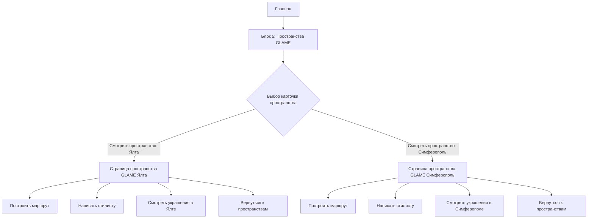

# GLAME App — Главная страница / Блок 5 «Пространства GLAME»

## 1. Роль блока в CJM

Блок 5 стоит после блока 4 «Собрано GLAME».

Логика перехода:

**Бренды собраны GLAME → эти украшения можно почувствовать и примерить в реальных пространствах GLAME.**

Блок 5 не является «адресами магазинов». Это блок доверия: пользователь видит, что GLAME — не только онлайн-витрина, а реальные пространства с архитектурой, стилистами и возможностью примерки.

---

## 2. Главная / Блок 5

### Название

`Пространства GLAME`

### Подзаголовок

`Ялта и Симферополь`

### Карточки пространств

#### Ялта

**Название:**  
`Ялта`

**Адрес:**  
`Набережная им. Ленина, 18`  
`(Приморский пляж)`

**Описание:**  
`Бутик на берегу.`  
`Свет, воздух, море.`

**CTA:**  
`Смотреть пространство`

**Route:**  
`/spaces/yalta`

---

#### Симферополь

**Название:**  
`Симферополь`

**Адрес:**  
`ул. Севастопольская, 62`  
`(1 этаж)`

**Описание:**  
`Пространство городского стиля.`  
`Ритм, форма, свет.`

**CTA:**  
`Смотреть пространство`

**Route:**  
`/spaces/simferopol`

---

## 3. Схема переходов



---

## 4. Что кликабельно в блоке 5

| Элемент | Кликабелен | Действие |
|---|---:|---|
| Кнопка `Смотреть пространство` в карточке Ялты | Да | Переход на `/spaces/yalta` |
| Кнопка `Смотреть пространство` в карточке Симферополя | Да | Переход на `/spaces/simferopol` |
| Фото карточки | Допустимо сделать кликабельным | Тот же route, что у кнопки |
| Название города | Нет | Информационный элемент |
| Адрес | Нет | Информационный элемент |
| Описание | Нет | Информационный элемент |

Рекомендуемая реализация: кликабельна вся карточка через `InkWell`, но визуально кнопка остается основным CTA.

---

## 5. Страница пространства: единая структура

Обе страницы должны иметь одинаковую структуру:

1. Hero-фото пространства.
2. Текст поверх hero.
3. Заголовок `Пространство GLAME`.
4. Короткое описание.
5. CTA:
   - `Построить маршрут`
   - `Написать стилисту`
   - `Смотреть украшения в [городе]`
6. Галерея `Внутри пространства`.
7. Сервисные смыслы:
   - `01 Подбор`
   - `02 Примерка`
   - `03 Наличие`
8. Нижняя кнопка:
   - `Вернуться к пространствам`

---

## 6. Страница Ялты

### Hero

`GLAME Ялта`  
`пространство у моря`  
`Набережная им. Ленина, 18`  
`Приморский пляж`

### Описание

`Место, где украшения подбирают как часть образа — спокойно, точно и без давления.`

### CTA

| Кнопка | Route / action |
|---|---|
| `Построить маршрут` | open maps by address |
| `Написать стилисту` | open stylist chat |
| `Смотреть украшения в Ялте` | `/catalog?availableIn=yalta` |
| `Вернуться к пространствам` | `/spaces` или pop to spaces list |

---

## 7. Страница Симферополя

### Hero

`GLAME Симферополь`  
`пространство городского стиля и ритма`  
`ул. Севастопольская, 62 (1 этаж)`

### Описание

`Ритм города, архитектура и украшения, которые собирают образ.`

### CTA

| Кнопка | Route / action |
|---|---|
| `Построить маршрут` | open maps by address |
| `Написать стилисту` | open stylist chat |
| `Смотреть украшения в Симферополе` | `/catalog?availableIn=simferopol` |
| `Вернуться к пространствам` | `/spaces` или pop to spaces list |

---

## 8. Визуальные правила

### Общее

- верхнее и нижнее меню не входят в макеты;
- radius: `0 px`;
- border: `1 px`;
- холодная палитра;
- без теней, glow, rounded ecommerce;
- без теплого бежевого UI;
- GLAME-паттерн только как фоновый рельеф, дозированно.

### Фото

Использовать только реальные фото конкретного пространства.

Запрещено:
- смешивать Ялту и Симферополь;
- использовать фото Ялты для Симферополя;
- использовать фото Симферополя для Ялты;
- генерировать интерьер;
- дорисовывать архитектуру;
- менять мебель, витрины, материалы, вывески, пропорции.

Разрешено:
- кроп;
- холодная ретушь;
- коррекция экспозиции;
- коррекция контраста;
- легкое повышение резкости.

---

## 9. Asset-файлы в пакете

### Для блока 5 на Главной

- `glame_home_block5_background_underlay.png`
- `glame_block5_yalta_card_photo.png`
- `glame_block5_simferopol_card_photo.png`
- `glame_home_block5_design.png`

### Для страницы Ялты

- `glame_space_yalta_hero_photo.png`
- `glame_space_yalta_gallery_main.png`
- `glame_space_yalta_gallery_01.png`
- `glame_space_yalta_gallery_02.png`
- `glame_space_yalta_page_design.png`

### Для страницы Симферополя

- `glame_space_simferopol_hero_photo.png`
- `glame_space_simferopol_gallery_main.png`
- `glame_space_simferopol_gallery_01.png`
- `glame_space_simferopol_gallery_02.png`
- `glame_space_simferopol_page_design.png`

---

## 10. Analytics events

| Event | Trigger |
|---|---|
| `home_block5_view` | Блок 5 появился во viewport |
| `home_block5_space_click` | Клик по пространству на Главной |
| `space_page_view` | Открыта страница пространства |
| `space_route_click` | Клик `Построить маршрут` |
| `space_stylist_click` | Клик `Написать стилисту` |
| `space_catalog_click` | Клик `Смотреть украшения в городе` |
| `space_back_click` | Клик `Вернуться к пространствам` |

Payload example:

```json
{
  "screen": "home",
  "block": "spaces_glame",
  "space": "simferopol",
  "cta": "view_space"
}
```

---

## 11. Acceptance checklist

- [ ] Блок 5 содержит только Ялту и Симферополь.
- [ ] Карточка Ялты ведет на `/spaces/yalta`.
- [ ] Карточка Симферополя ведет на `/spaces/simferopol`.
- [ ] Адрес Ялты: `Набережная им. Ленина, 18 (Приморский пляж)`.
- [ ] Адрес Симферополя: `ул. Севастопольская, 62 (1 этаж)`.
- [ ] Симферополь позиционируется как `пространство городского стиля и ритма`.
- [ ] Ялта позиционируется как `пространство у моря`.
- [ ] На обеих страницах есть кнопка `Вернуться к пространствам`.
- [ ] На обеих страницах одинаковая структура CTA и галереи.
- [ ] Фото городов не смешиваются.
- [ ] Интерьер не генерируется и не искажается.
- [ ] Верхнее и нижнее меню не включены в блоки.
