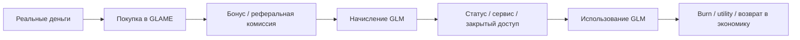
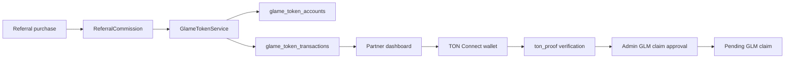
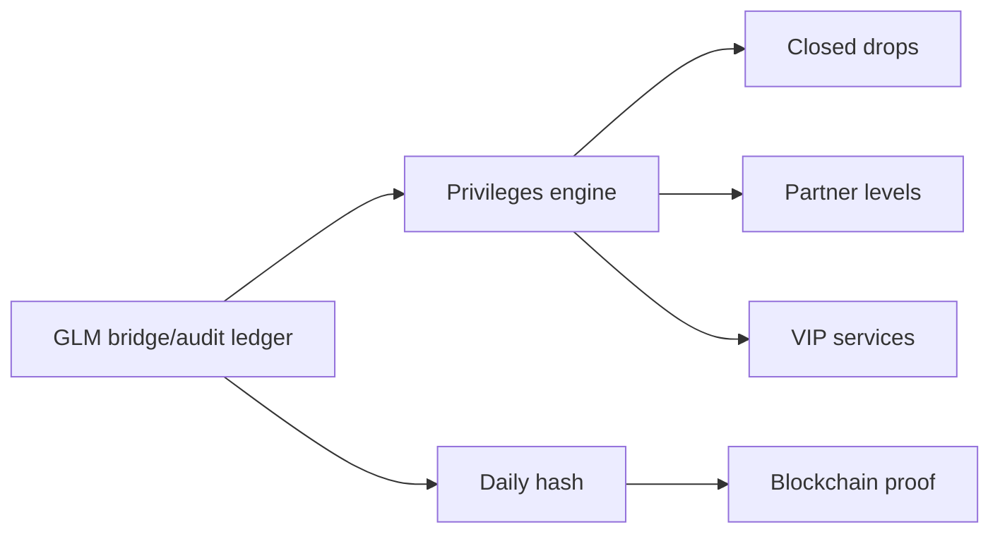
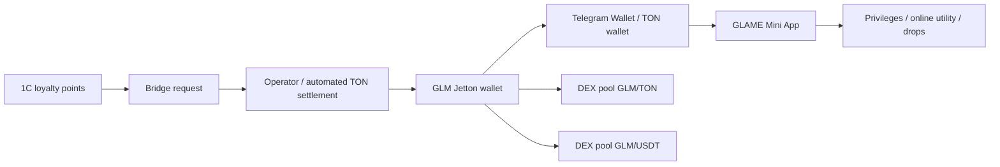
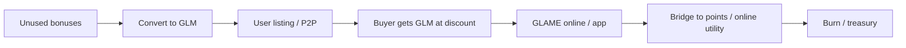

# КриптоГлэйм: план применения криптовалюты и развития GLAME Coin

Дата: 2026-06-30  
Обновлено: 2026-07-05  
Статус: partner MVP внедрен -> TON Connect/proof работает -> GLM Jetton testnet deployed -> `points_to_glm` работает как transfer из банка GLAME через testnet hot-wallet -> `glm_to_points` TON deposit watcher + 1С auto-retry -> treasury/hot-wallet balance readiness показывает реальные testnet-балансы -> Telegram notification/broadcast/escalation layer включен -> GLM/Reward Store online utility pilot с TON checkout, оплатой баллами, фото и остатками -> production hot-wallet/legal/security/mainnet gate  
Рабочее название: CryptoGLAME / GLAME Coin / GLM

## 0.0. Архитектурное решение: баллы = 1С, GLM = TON, платформа = bridge

Актуальная целевая модель: `GLM` - это отдельный клубный crypto/utility-токен GLAME в TON-кошельке, а бонусные баллы 1С - внутренний кассовый инструмент скидки. Они связаны не постоянной синхронизацией, а контролируемыми bridge-операциями.

Две сущности:

- бонусные баллы 1С используются на кассе, в приложении и в текущей программе лояльности;
- бонусные баллы 1С живут по текущим правилам программы и могут сгорать, как было изначально;
- баллы хранятся в 1С; платформа синхронизирует их количество из 1С и инициирует подтвержденные списания/начисления;
- GLM хранится в TON-кошельке пользователя как Jetton; платформа привязывает кошелек, проверяет владение через TON Connect, готовит заявки и сверяет TON-транзакции;
- внутренний GLM ledger на платформе - не "кошелек GLM", а технический журнал/буфер: заявки, резервы, audit trail, tx hash, reconciliation, auto-transfer/settlement и repair-history;
- GLM не сгорает по календарю, если иное не указано для отдельной акции/заблокированного бонуса;
- `1 GLM` может применяться в онлайн-сценариях GLAME/партнерского сайта или после bridge-in в бонусы 1С;
- физические магазины не принимают GLM напрямую: для покупки в магазине пользователь сначала переводит GLM в баллы 1С, затем списывает баллы на кассе;
- внешняя покупка, продажа, DEX-обмен или P2P-передача GLM не меняет бонусный баланс 1С автоматически;
- 1С меняется только в контролируемых bridge-операциях, подтвержденных GLAME.

Bridge-модель:

- `points_to_glm`: клиент списывает/резервирует бонусные баллы 1С до их сгорания, а GLAME отправляет соответствующий GLM в TON-кошелек; ledger фиксирует заявку и исполнение;
- `glm_to_points`: клиент отправляет GLM в treasury/escrow GLAME, после подтверждения получает бонусные баллы 1С для конкретной покупки или будущего использования;
- `buy_loyalty_points`: продукт "покупка баллов лояльности", где клиент фактически покупает/передает GLM в GLAME, а GLAME начисляет баллы 1С с маржой, комиссией или выгодным для компании курсом;
- `ton_withdrawal` / legacy `claim`: технический вывод GLM в TON Jetton после verified wallet и approval; для пользователя это не отдельная сущность, а исполнение операции `points_to_glm` или вывод заработанного GLM;
- `redeem`: клиент тратит GLM внутри GLAME Store/сервисов без обязательного превращения всего баланса в баллы 1С;
- `bridge ledger`: каждая связка 1С <-> GLM фиксируется с idempotency key, статусом, лимитами, source transaction и audit trail.
- `treasury/bank distribution`: пользовательские `points_to_glm` операции не минтят новый GLM под каждую заявку; GLAME переводит уже существующий GLM из treasury/банка. Mint используется отдельно только для пополнения банка по утвержденной tokenomics/approval-процедуре.

Важно для интерфейса: пользователю показываем не `claim`, а понятные действия: "баллы -> GLM в TON", "GLM из TON -> баллы 1С", "оплата GLM", "оплата баллами". Claim остается только техническим названием pending-заявки в backend/admin audit trail.

Для партнерского кабинета убираем лишний пользовательский этап: нет отдельной кнопки "вывести GLM". Пользователь делает одну операцию "баллы -> GLM в TON"; технически backend все равно создает ledger transaction и связанную pending withdrawal-заявку, чтобы сохранить аудит, лимиты и возможность отката.

Доступный GLM-баланс в пользовательском интерфейсе считывается из привязанного TON-кошелька по Jetton master. Platform ledger не считается источником доступного GLM-баланса; он используется для pending-заявок, холдов, аудита и сверки.

Следствие: механика "конвертации бонусов в GLM" остается нормальной bridge-операцией, а не legacy-ошибкой. Целевая модель - не единый баланс, а два отдельных баланса с прозрачным обменным шлюзом.

Важное правило срока действия: баллы 1С не становятся бессрочными автоматически. Их ценность можно сохранить, переведя баллы в GLM до сгорания. Обратный перевод GLM в баллы создает новые баллы 1С по правилам программы на момент операции.

Обязательные технические слои:

- `bridge ledger`: журнал заявок и исполнений `points_to_glm`, `glm_to_points`, `ton_withdrawal/claim`, `redeem`;
- `reserve/lock`: защита от двойного списания на время bridge-операции;
- `1C adapter`: только для подтвержденного списания/начисления баллов при bridge, а не для отслеживания всех GLM-переводов;
- `TON watcher`: отслеживает депозиты GLM в treasury/escrow GLAME для `glm_to_points`;
- `reconciliation`: сверяет только bridge-операции и treasury, а не весь внешний рынок GLM;
- `immutability/audit`: каждое движение bridge/TON/1C и каждая связь между ними фиксируются отдельно.

## 0. Текущий статус реализации на 2026-07-04

### Сделано

- [x] Операционный GLM ledger: добавлены `glame_token_accounts` и `glame_token_transactions` как журнал/буфер до TON-исполнения, не как целевой кошелек GLM.
- [x] GLM начисляется при создании реферальной комиссии из расчета `1 GLM = 1 ₽ реферального вознаграждения`.
- [x] GLM попадает в `hold_balance` до подтверждения комиссии.
- [x] Партнерский кабинет показывает GLM-состояние: TON balance из кошелька, pending/hold/историю заявок и GLM по комиссиям.
- [x] В партнерском кабинете добавлен раздел `CryptoGLAME`.
- [x] Добавлена ручная привязка TON-адреса как резервный путь, без статуса `verified`.
- [x] Добавлен настоящий TON Connect: manifest, provider, подключение кошелька.
- [x] Добавлен `ton_proof`: backend выдает challenge, проверяет domain, timestamp, payload и Ed25519-подпись.
- [x] Подтвержденный кошелек получает `crypto_wallet.status = verified`.
- [x] В админке партнеров добавлены TON-статус, фильтр `TON verified/manual/claim enabled/no wallet`, карточка TON Wallet.
- [x] Админ может включить/выключить `glm_claim_enabled` только для verified TON-кошелька.
- [x] Админ может перевести GLM из `hold_balance` в доступный `balance` для теста/подтвержденных комиссий.
- [x] Партнер может создать pending TON-заявку как техническое исполнение `points_to_glm` после verified wallet, admin approval и доступных баллов/разрешенного баланса.
- [x] В админке добавлена очередь `GLM claim` с фильтром по статусу.
- [x] Админ может обработать pending claim как `processed`, `failed` или `canceled`, сохранить `tx_hash` и комментарий.
- [x] Pending claim резервирует доступный баланс: при заявке GLM списывается из `balance`, при `failed/canceled` возвращается.
- [x] Добавлен batch-release истекшего GLM hold: `available_at <= now` переводится в доступный balance, связанная комиссия переводится в `approved`.
- [x] В админке добавлен GLM Ledger: журнал `earn/release/claim` транзакций с фильтрами по типу и статусу.
- [x] В админке добавлен базовый GLM dashboard: accounts, balance, hold, due hold, monthly earn, pending/processed claim и топ партнеров.
- [x] Добавлена ручная корректировка доступного GLM balance с обязательной причиной и audit-транзакцией `adjustment`.
- [x] Добавлен автоматический scheduler истекшего GLM hold: по расписанию вызывает release due hold и переводит комиссии в `approved`.
- [x] В партнерском кабинете добавлена история GLM-транзакций: начисления, release и claim.
- [x] Добавлены базовые GLM privilege tiers: Start / Muse / Privé / Ambassador, статусный счет и прогресс до следующего уровня.
- [x] Добавлена витрина применения GLM и draft-правила внутреннего приема `1 GLM = 1 ₽` с лимитами по категориям.
- [x] Добавлен MVP `GLM Store`: брендированные товары/сервисы можно оформить за GLM через TON checkout или за баллы 1С через отдельное списание.
- [x] В админке добавлена очередь GLM Store fulfillment: `fulfilled`, `canceled/failed` с возвратом GLM.
- [x] GLM Store расширен до сервисов и доступов: private stylist session, закрытая подборка, private sale pass.
- [x] Внутреннее списание GLM ledger для GLM Store отключено; GLM-оплата идет как TON transfer в treasury, watcher после подтверждения переводит заказ в очередь выдачи.
- [x] Решение скорректировано: GLM POS-код/QR убирается из пользовательского продукта; физические магазины работают только через баллы 1С после `glm_to_points`.
- [x] Добавлена bridge-механика `points_to_glm`: списание бонусных баллов и создание GLM/TON withdrawal-заявки через ledger.
- [x] Добавлены лимиты legacy-конвертации: минимум/максимум за операцию и месячный лимит.
- [x] Добавлен monthly emission guardrail для реферального выпуска GLM.
- [x] В админском dashboard добавлены emission cap, real-backed share, conversion total, store burn/burned total, campaign status.
- [x] Добавлены аудитории и CRM-слой для исторических сгорающих бонусов: список, CSV export, draft `CustomerMessage`; для нового GLM-баланса срок действия должен быть бессрочным.
- [x] Добавлены GLM AI segments: ready to redeem, near tier, high balance no redemption, bonus converters.
- [x] Добавлен включаемый campaign multiplier для "двойной GLM" через env с audit meta в earn-транзакциях.
- [x] Добавлена ledger-based аналитика эффективности GLM: redemption conversion, burn ratio, monthly earn/conversion/redemption, ready-to-spend, high-balance-no-redemption, топ категорий и товаров GLM Store.
- [x] Добавлена admin-корректировка GLM при отмене/возврате реферальной комиссии: отмена комиссии, reversal-транзакция, возврат из hold/balance или пометка manual recovery.
- [x] Добавлена GLM Refund Control очередь: кандидаты на отмену GLM по `orders.status=canceled/refunded/returned` и отрицательным/возвратным сигналам `purchase_history`.
- [x] Добавлен controlled auto-apply для GLM Refund Control: `dry_run` по умолчанию, применение только high-confidence кандидатов, audit через `reversal`.
- [x] Добавлен backend-слой автоматического списания GLM в app checkout: `use_glm_amount`, расчет лимита по категориям, `glm_payment` в order/payment meta, checkout `redemption` ledger.
- [x] GLM Jetton deployed в TON testnet: master `EQAyYQYj96groHTRfNTmEMRTNeK9CAo1L3e1n8Hamnup-cc0`, metadata/icon опубликованы.
- [x] Выполнен первый настоящий `points_to_glm` end-to-end: 500 баллов -> pending TON-заявка -> mint 500 GLM в verified TON wallet -> claim закрыт как `processed` с tx hash.
- [x] Доступный GLM-баланс в партнерке читается из TON-кошелька; platform ledger больше не показывается как источник доступного GLM.
- [x] `GLM -> баллы` переведен в TON deposit модель: заявка больше не списывает внутренний GLM balance, показывает treasury/sender, а settlement проверяет входящий Jetton transfer_notification. Добавлен background auto-watch pending bridge: watcher ищет входящий GLM deposit в treasury по sender/amount после создания заявки и закрывает bridge без ручного tx hash в нормальном сценарии.
- [x] Admin readiness показывает обе очереди bridge: `баллы -> GLM` с auto-transfer статусами и `GLM -> баллы` с TON deposit статусами (`not_started`, `wallet_request_prepared`, `waiting_for_deposit`, `tx_hash_present`) и sample pending-заявок.
- [x] В админке добавлена операторская обработка `GLM -> баллы` через TON deposit tx hash: проверка отправителя, treasury, Jetton и суммы перед начислением баллов 1С.
- [x] В партнерском кабинете добавлен TON Connect сценарий для `GLM -> баллы`: pending-заявка может открыть готовый Jetton transfer в привязанном кошельке, пользователь только подтверждает отправку GLM в treasury.
- [x] Добавлен backend auto-transfer слой для `points_to_glm`: после успешного 1С-списания сервис отправляет GLM из treasury/hot-wallet, находит TON tx и закрывает claim без админа. Background auto-transfer scheduler включен, settlement watcher включен, readiness показывает статус воркеров и разбивку pending-заявок по `ton_auto_transfer.status`.
- [x] Добавлен автоматический retry scheduler для `GLM -> баллы` после TON settlement: если bridge уже закрыт on-chain, но начисление баллов в 1С временно не прошло (`failed`, `ready_for_1c`, `created_without_ref_key`, `posted_without_balance_change`), backend повторяет 1С-sync тем же repair-механизмом без ручной кнопки администратора; readiness показывает статус `1C retry`.
- [x] Добавлен security/readiness gate для hot-wallet signer: testnet env-mnemonic помечается как `pilot_only`, readiness показывает security warnings/mainnet blockers и запрещает считать mainnet-ready, пока signer не вынесен в secret manager/external signer и не создан новый production hot-wallet.
- [x] Добавлен emergency override для `points_to_glm` auto-transfer: админка может поставить auto-transfer на паузу или включить обратно без изменения systemd env и без рестарта; readiness учитывает override и показывает effective enabled status.
- [x] Добавлен auto-transfer health summary в readiness: blocked/not started/waiting settlement counts, GLM amounts, возраст старейшей pending-заявки и флаг `needs_attention` для операционного мониторинга.
- [x] Добавлен `GLM -> баллы` health summary в readiness: waiting TON deposit, tx found, 1C issue counts/amounts, возраст старейшей pending-заявки и `needs_attention`.
- [x] Добавлен readiness alerts layer: backend формирует список alert-ов по paused auto-transfer, blocked/waiting/old pending, найденным TON tx, 1C issues и security warnings; админка показывает alert table.
- [x] Добавлен CSV export для GLM Bridge Reconciliation: операционный отчет по расхождениям bridge/TON/1С можно выгрузить из админки без ручного SQL.
- [x] Добавлена отдельная bridge-domain модель `glame_token_bridge_operations`: каждая операция `points_to_glm` / `glm_to_points` получает нормализованную строку с direction/status/idempotency, GLM/points amount, TON tx/wallet/treasury, 1C document/status и ссылкой на legacy ledger transaction. Выполнен backfill исторических bridge-записей, readiness показывает count/amount/gap, reconciliation использует bridge-domain слой как primary source и дополнительно сверяет legacy ledger consistency.
- [x] Добавлен production alert layer поверх `glame_token_bridge_operations`: readiness считает stale pending, TON waiting, 1C issue, domain gap и показывает sample проблемных операций. В админке добавлена operator-витрина последних bridge operations по новой domain-модели.
- [x] Testnet hot-wallet operational: W5 testnet signer настроен в env, auto-transfer включен, wallet funded примерно 400 GLM и 1 TON gas. Важно: seed был передан в чат, поэтому этот wallet остается только testnet/pilot; production/mainnet требует новый wallet/seed вне чата и secret manager/external signer.
- [x] Production hot-wallet candidate создан без передачи seed в систему и записан в runtime-readiness только как публичный адрес: address `UQBdaChDle6gwKrNroYUL9EE8yKX2n57IQdAp8wJgtwGF44q`, bounceable `EQBdaChDle6gwKrNroYUL9EE8yKX2n57IQdAp8wJgtwGF9Pv`, raw `0:5d68284395eea0c0aacdae86142fd104f32297da7e7b210740a7cc0982dc0617`. Подпись production-транзакций не настроена (`production_signer_mode=not_configured`), mainnet остается blocked до legal/security/secret-manager approval.
- [x] Production/mainnet gate формализован в readiness: добавлены отдельные проверки `production_signer_mode`, `production_legal_approved`, `production_security_approved`, `production_treasury_approved`. Даже при наличии production hot-wallet address mainnet остается заблокирован, пока signer не вынесен в KMS/Vault/external signer и approvals не переведены в true.
- [x] Выполнен testnet `points_to_glm` через transfer существующего GLM из treasury W5: 1С списала 100 баллов, treasury отправил 100 GLM в TON-кошелек партнера, claim закрыт `processed`; добавлен retry на Toncenter `429` и защита от повторной отправки уже sent/sent_waiting transfer.
- [x] Исправлена логика отмены `points_to_glm`: для отмененной заявки 1С не получает новое начисление, а распроводится исходный документ списания, чтобы корректно возвращалось поле `К списанию`.
- [x] UI партнерки разделяет `Баллы 1С`, `GLM в TON`, `GLM в холде` и `TON-заявки`; GLM ledger больше не показывает внутренний `balance/hold` как пользовательский баланс.
- [x] Production deployment выполнен, `/referral`, TON manifest и основные API routes проверены.
- [x] Админские bridge-действия переведены на domain operation id: добавлены endpoints `/admin/glm-bridge/operations/{operation_id}/...` для claim, TON settlement, `glm_to_points`, TON deposit, repair и reconciliation actions; фронт использует `bridge_operation_id` с fallback на legacy `transaction_id`.
- [x] Добавлен MVP Telegram notification layer: отдельный `TelegramNotificationService`, env-настройки admin/partner notifications, admin test/status endpoints, readiness config, уведомления админу о новом партнере, новом реферале, TON verified и GLM hold; партнерские уведомления отправляются при наличии `telegram_chat_id` в profile/meta.
- [x] Привязка Telegram-бота перенесена в профиль партнерского сайта: сайт выдает одноразовую `/start`-ссылку на 15 минут, webhook бота принимает привязку только по этому токену и отклоняет прямой `/start` без сайта.
- [x] Production Telegram webhook настроен для `GLAME_Partner_bot`: env содержит bot token, bot username, webhook secret, admin chat ids; webhook установлен на `/api/referrals/telegram/webhook`, проверен `getWebhookInfo`, прямые запросы без secret получают `403`.
- [x] Админ `315851436` подключен к системным Telegram-оповещениям через `TELEGRAM_ADMIN_CHAT_IDS`; тестовое admin-уведомление отправлено успешно (`sent=1`, errors=0).
- [x] В админке партнерской программы добавлен Telegram broadcast: админ может отправить сообщение от имени партнерской программы всем активным или всем подключенным партнерам, предварительно проверив аудиторию через dry-run.
- [x] Добавлен automatic Telegram escalation MVP для bridge/readiness: фоновый scheduler раз в 15 минут проверяет paused auto-transfer, stale pending bridge operations, TON waiting и 1С issues, отправляет админу агрегированное сообщение с cooldown-state, чтобы не спамить одинаковыми alert-ами.
- [x] Добавлен TON treasury/hot-wallet balance reconciliation: backend сверяет on-chain GLM Jetton balance и TON gas для hot-wallet и treasury/deposit, считает хватит ли GLM/TON на pending `points_to_glm` auto-transfer заявки с buffer, показывает это в readiness/admin UI и добавляет low-balance alerts в Telegram escalation.
- [x] Разведены testnet treasury и hot-wallet: treasury/deposit address `0QDZEwYBMl-73VYhOY3mSzhxg8GRmZ0EjOovVhq9IDMXupJq`, hot-wallet signer/address `0QByviidLvTw0f8ZAIE7Pe672Tg8RCSwWoljQ_cMvcVAXgvn`; W5 signer проверен, env mnemonic корректно читается как 24 слова в кавычках, readiness показывает реальные on-chain balances.
- [x] Исправлен post-transfer response bug в `points_to_glm`: операция на 150 GLM фактически прошла, но endpoint падал на `member_id`; исправлено на `member.id`, операция закрыта `processed/settled`.
- [x] Закрыт ложный `Bridge health = Attention` по старой canceled testnet-операции: readiness health больше не считает 1С issue для `canceled/superseded` bridge-operations; локальный пересчет дает `stale_pending=0`, `ton_waiting=0`, `onec_issue=0`, `needs_attention=false`.
- [x] Добавлены управляемые лимиты testnet hot-wallet в админке: readiness хранит и показывает минимальный/целевой запас GLM и TON gas, дефолт для pilot - минимум 5000 GLM и 0.5 TON gas, целевой запас - 5000 GLM и 2 TON gas. При балансе ниже порога readiness/Telegram escalation дают refill alert.
- [x] Проведена UX-полировка партнерского CryptoGLAME: внутренние слова `claim`, `ledger`, `bridge`, `manual` заменены в пользовательских карточках и истории GLM на понятные этапы "Баллы -> GLM", "GLM -> баллы", "отправляем GLM", "ждем TON-перевод", "баллы начислены", "требуется проверка".
- [x] Добавлен hot-wallet refill plan: backend/admin readiness рассчитывает, сколько GLM и TON gas нужно долить из treasury до целевого hot-wallet уровня, показывает source/destination addresses, дефицит treasury и отдельный endpoint `/api/referrals/admin/glm-hot-wallet-refill-plan`. Автоподпись treasury не включена, чтобы не хранить treasury seed в backend.
- [x] Telegram escalation стал actionable: у каждого GLM alert теперь есть `action_label` и `action_url`, low-balance/refill ведет прямо на `#ton-readiness`, очереди points_to_glm/glm_to_points и reconciliation имеют отдельные anchors в админке. Добавлен `TELEGRAM_ADMIN_PORTAL_URL`.
- [x] Добавлен усиленный overdue-alert для hot-wallet refill: если low-balance warning уже был, но за заданное время нет записи `manual_refill` или успешной проверки восстановления, админ получает повторный `critical` Telegram alert.
- [x] Добавлена безопасная admin-кнопка refill hot-wallet через TON Connect: backend готовит testnet treasury -> hot-wallet транзакцию по refill plan, админ подтверждает ее treasury-кошельком, после `sendTransaction` админка записывает `manual_refill` и обновляет readiness.

### Частично сделано

- [~] TON claim/bridge реализован как автоматизированный pilot-flow: testnet Jetton deployed, первый реальный claim mint выполнен, затем модель изменена на перевод существующего GLM из treasury/банка; `points_to_glm` умеет auto-transfer из W5 hot-wallet после успешного 1С-списания, settlement проверяет tx hash через TON Center и поддерживает BOC/Jetton mint body либо обычный Jetton transfer body amount/recipient. Readiness показывает hot-wallet GLM/TON gas и treasury GLM/TON gas; production hot-wallet candidate и approval gate уже видны в readiness; остаток - secret manager/external signer, production treasury limits и production alerts.
- [~] Admin GLM dashboard расширен: есть totals, claim queue, ledger, conversion, burn, emission cap, campaign, GLM segments и ledger-based effectiveness; еще нужна аналитика эффективности по продажам/марже.
- [~] Release hold реализован вручную, batch-операцией и scheduler-ом по истекшему hold; admin-cancel комиссии, очередь refund candidates и controlled auto-apply уже корректируют GLM, но еще нужна более глубокая классификация доверенных статусов 1С.
- [~] TON proof проверяет подпись по public key, полученному от TON Connect account. Следующий hardening-слой: извлекать public key из `walletStateInit` или on-chain wallet contract.
- [x] Физический магазин исключен из прямого GLM-пилота; целевая модель для кассы - только `glm_to_points` bridge, затем списание бонусов 1С.

### Состояние крупных блоков

- [~] Redemption/burn механика работает через `redemption` и fulfillment queue; fulfillment пока ручной.
- [x] Daily audit hash MVP: deterministic SHA-256 root по дневным GLM-транзакциям, предыдущему root hash и текущим account totals.
- [x] TON Jetton contract: testnet package, metadata, pinned reference, env template, deploy checklists and testnet Jetton master deployed.
- [~] On-chain treasury transfer в TON: treasury test mint, первый реальный claim mint и первый auto-transfer из treasury W5 подтверждены. Для новых пользовательских операций используется перевод существующего GLM из банка GLAME. Добавлены verification settlement endpoint, batch run, включенные background schedulers для settlement, auto-transfer и 1С retry, auto-transfer service, emergency override pause/resume; tx hash + decoded mint/transfer amount/recipient проверяются через TON Center/BOC decoder; добавлен transfer_notification/deposit decoder, partner TON Connect transfer request, admin tx-hash settlement UI, auto-watch для `glm_to_points` и security/readiness gate для hot-wallet signer. Testnet hot-wallet funded и operational; production hot-wallet candidate создан, но production/mainnet все еще требует secret manager/external signer и production monitoring.
- [x] Treasury policy, token policy, public risk disclosure, bridge rules and KYC/AML draft pack.
- [ ] P2P/marketplace GLM.
- [~] Bridge ledger для `points_to_glm`, `glm_to_points`, `claim`, `redeem`: базово реализован через `glame_token_transactions`; отдельная bridge-domain модель/idempotency/reporting добавлена для exchange-направлений, reconciliation уже смотрит на `glame_token_bridge_operations` как primary source и legacy ledger как audit trail, readiness/operator UI показывают domain health и последние операции, action-кнопки переведены на `bridge_operation_id`. Базовые Telegram-уведомления, admin broadcast, automatic bridge alert escalation и on-chain treasury/hot-wallet balance reconciliation готовы; остаток - formal reports, UX-polish и production-grade signer/limits.
- [~] 1C adapter: `glm_to_points` доведен до боевого сценария на testnet - TON deposit подтвержден, документ 1С создан и проведен (`НФ-00000050`), reconciliation чистый; добавлен auto-retry scheduler для временных сбоев начисления 1С после TON settlement. Для `points_to_glm` добавлен 1C spend payload, документ `СписанияБонусов`, feature-flag `ONEC_GLM_BRIDGE_SPEND_SYNC_ENABLED`, meta-аудит, admin repair endpoint, reconciliation-сигналы `onec_spend_*`, кнопки retry/manual/review в админке, hard gate `ONEC_GLM_BRIDGE_SPEND_REQUIRE_SUCCESS` и правильная отмена через распроведение исходного 1С-списания; остаток - formal idempotency/reconciliation report по всем 1С-документам.
- [~] Reserve/lock для защиты от двойного списания при bridge, online checkout, marketplace и on-chain claim: row locks добавлены для ключевых операций, но watcher/marketplace еще требуют отдельного hardening.
- [ ] GLM purchase: покупка GLM увеличивает GLM-баланс; бонусы 1С увеличиваются только после `glm_to_points`.
- [ ] GLM transfer/P2P/DEX: внешние передачи меняют только владение GLM и не меняют 1С до bridge-in.
- [~] Автоматическое списание GLM в online checkout по лимитам категорий: backend checkout готов, но офлайн-магазины должны использовать только баллы 1С после `glm_to_points`.
- [~] KYC/AML draft готов; бухгалтерская модель для crypto payouts и legal approval еще нужны.
- [~] Миграционные уведомления по историческим сгорающим бонусам и возможности bridge `points_to_glm`: Telegram-инфраструктура и broadcast в админке готовы; осталось подготовить тексты/сегменты и согласовать юридическую формулировку.
- [ ] Расширенная аналитика эффективности GLM по продажам, марже, repeat purchase и влиянию GLM-кампаний на оборот.

### Ближайшее решение

Продолжаем консервативный pilot, но фиксируем целевую архитектуру: `1С бонусы -> points_to_glm bridge -> GLM в TON-кошельке -> utility/DEX/P2P -> glm_to_points bridge -> 1С бонусы`.

До mainnet/legal/security approval не обещаем торговлю, ликвидность или курс. Текущий claim/withdrawal - это testnet/pilot-заявка на TON-исполнение через controlled treasury/hot-wallet flow, а не публичный криптовывод.

### Следующие приоритеты

1. Подготовить UX-polish для админской CryptoGLAME-очереди: человекочитаемые статусы и фильтры для operator flow без внутренних `claim/ledger/manual`.
2. Добавить digest-режим Telegram escalation для non-critical событий и раздельные severity thresholds.
3. Подготовить controlled treasury -> hot-wallet refill approval: отдельная модель заявки, two-step approval и signer-mode без treasury seed в backend.
4. Подготовить production hot-wallet/signer слой: production wallet уже зафиксирован как публичный candidate, но подпись должна идти только через KMS/Vault/external signer, с лимитами, daily cap, emergency disable и ротацией секретов.
5. Расширить Telegram notification layer до полной схемы подписок: opt-in/opt-out, категории уведомлений, антиспам и шаблоны сообщений для разных событий.
6. Возвраты и отмены заказов: расширить controlled auto-apply правилами доверенных статусов 1С и лимитами по сумме/периоду.
7. Запустить коммуникационный пилот: через Telegram broadcast уведомить подключенных партнеров о CryptoGLAME/bridge, затем отдельной кампанией предложить клиентам сохранить сгорающие баллы через `points_to_glm` без обещаний роста цены.
8. Расширенная аналитика эффективности GLM: связать ledger-based KPI с заказами, repeat purchase, маржей и оборотом после GLM-кампаний.
9. Legal/security gate: финальная оферта, accounting model, security review Jetton/treasury workflow, mainnet go/no-go.
10. Mainnet/DEX/P2P не запускать до legal/security/treasury approval.

### Актуальный остаток работ после testnet-claim

Коротко: базовый pilot уже доказал оба пути `баллы -> GLM в TON` и `GLM в TON -> баллы 1С`. Нормальный testnet flow уже автоматизирован через treasury/hot-wallet, TON settlement watcher и 1С auto-retry; до следующего продуктового шага нужно закрыть production-надежность, безопасность signer-а и reconciliation.

Обязательно исправить/доделать перед расширением пилота:

- TON settlement automation: endpoint проверки `tx_hash`, BOC/Jetton mint decoder и Jetton transfer decoder для amount/recipient, transfer_notification/deposit decoder для `glm_to_points`, partner TON Connect transfer request, admin deposit UI, batch run и background settlement watcher включены; дальше нужны сверка Jetton balance, внешние production alerts и escalation policy.
- Настоящий `glm_to_points`: базовый testnet E2E подтвержден - пользователь отправил GLM в treasury, settlement проверил `transfer_notification`, bridge закрылся, 1С создала и провела документ начисления; добавлен 1С auto-retry scheduler для временных сбоев после TON settlement. Остаток: production alerts, auto-escalation повторных ошибок и финальная UX-полировка статусов "ожидает TON/проверяется/начислено".
- Настоящий `points_to_glm` с 1С: первый TON mint уже подтвержден как proof-of-deploy, новые операции исполняются переводом существующего GLM из treasury/банка. Backend создает документ 1С `СписанияБонусов`, проверяет доступный баланс, имеет repair/retry endpoint, reconciliation по `onec_spend_sync_status`, processed-gate при `ONEC_GLM_BRIDGE_SPEND_REQUIRE_SUCCESS=true`, auto-transfer service, включенный scheduler и readiness breakdown по status. Остаток: создать отдельный production hot-wallet, положить туда ограниченный запас GLM/TON gas и вынести signer в безопасное хранение.
- Bridge-domain модель: отдельная таблица `glame_token_bridge_operations`, backfill, readiness, domain health, reconciliation primary source, operator-витрина и action endpoints/buttons по `bridge_operation_id` уже готовы. Остаток - внешние уведомления/escalation policy и оставить legacy `glame_token_transactions` только как audit trail.
- Online utility: оставить прямое GLM-использование только в онлайн-сценариях GLAME/партнера, GLM Store, сервисах и дропах; физический магазин обслуживается через `glm_to_points`.
- Legal/security gate: финальная оферта, accounting model, security review Jetton/treasury workflow, treasury approval и решение mainnet go/no-go.

## 1. Цель проекта

Создать вокруг GLAME дополнительный слой лояльности, реферальных вознаграждений и клубных привилегий, используя крипто-технологии аккуратно и поэтапно.

Главная идея: построить полезную клубную экономику GLAME, где токен получает ценность через онлайн-покупки, рефералов, статус, закрытые коллекции и доступ к сервисам. Дальняя цель: полноценный торгуемый `GLM`, который можно передавать, хранить в кошельке, обменивать на TON/USDT и использовать внутри онлайн-сценариев GLAME.

## 2. Базовая концепция

GLAME Coin (`GLM`) - это отдельный клубный crypto/utility-токен GLAME, связанный с бонусными баллами 1С через контролируемый bridge.

GLM должен быть не "монетой с обещанным ростом", а долгим клубным активом GLAME, поддержанным реальной деятельностью GLAME: онлайн-покупками, реферальным оборотом, бонусной программой, клиентскими сервисами и движением реальных денег через бизнес.

Ключевой принцип: GLM и бонусные баллы 1С - разные сущности. Баллы 1С остаются кассовым скидочным инструментом и могут сгорать по действующим правилам. GLM живет отдельно, может быть бессрочным и в будущем торгуемым. Связь между ними происходит только через подтвержденные bridge-операции: баллы -> GLM и GLM -> баллы.

Отдельная стратегическая возможность: дать клиентам способ сохранить ценность сгорающих бонусов. Если у клиентов уже накоплено около 2 млн рублей бонусов, это можно использовать как стартовый пул для `points_to_glm`: клиент переводит часть бонусов в GLM до сгорания, а позже может вернуть GLM в баллы 1С через `glm_to_points`, когда готов к покупке. При этом внешняя продажа или передача GLM не меняет 1С, пока новый держатель сам не выполнит `glm_to_points`.

Отдельный стратегический трек вынесен в `docs/plans/2026-07-01-glame-network-crypto-loyalty-platform.md`: GLAME Network как B2B2C-платформа лояльности для нескольких fashion-магазинов, где GLM начисляется и используется в общей партнерской сети.

Исторически первый этап начинался как off-chain ledger. Актуальная модель после testnet: GLM живет в TON-кошельке, а platform ledger остается операционным журналом заявок, холдов и bridge-аудита:

- начисляется за реферальные покупки;
- может распределяться из treasury/банка GLAME через bridge из бонусных баллов 1С;
- возникает из подтвержденных операций, а не из абстрактной эмиссии;
- отображается в партнерском кабинете;
- проходит холд до подтверждения покупки;
- не продается публично;
- отправляется в TON testnet из treasury/банка через backend auto-transfer после verified wallet, 1С spend и включенного GLM-bridge;
- не переводится между пользователями до запуска P2P/marketplace и lock/reconciliation;
- не обещает доходность или рост цены;
- используется как клубный актив для будущих привилегий GLAME.

Ключевая формулировка:

> GLAME Coin - клубный crypto/utility-токен GLAME. Он связан с бонусами 1С через контролируемый bridge, поддержан реальными онлайн-сервисами и покупками GLAME, начисляется за реальные рекомендации и операции, открывает привилегии, доступ к закрытым коллекциям и повышенные реферальные уровни.

Важное уточнение: "поддержана" в продуктовой логике означает, что полезность GLM создается реальным сервисом GLAME. Это не означает юридическое обязательство GLAME выкупать GLM за рубли, не означает фиксированный курс к фиатной валюте и не является обещанием инвестиционного роста.

## 3. Почему не запускать сразу публичную монету

Публичная монета с обещанием роста цены может создать юридические и операционные риски:

- риск квалификации как investment contract / securities offering;
- требования KYC/AML при свободной передаче, обмене или выводе;
- налоговый учет доходов партнеров;
- репутационный риск, если цена волатильна;
- риск привлечь аудиторию спекулянтов вместо клиентов GLAME.

Поэтому стартовая модель: закрытая клубная валюта, привязанная к реальной пользе внутри GLAME.

## 4. Real-Service-Backed модель

GLM должен быть связан с реальными операциями GLAME. Это главный способ повышать его полезность без обещаний роста цены.

Базовая цепочка:



Источники полезности GLM:

- реальные онлайн-покупки на сайте/в приложении;
- реферальный оборот;
- бонусная программа;
- услуги стилиста и AI-подбора;
- закрытые коллекции;
- физические пространства GLAME используют не GLM напрямую, а баллы 1С после bridge;
- клиентские мероприятия;
- партнерские активности;
- лимитированный доступ к сервисам.

Правило: GLM должен распределяться преимущественно под подтвержденное полезное действие:

- покупка;
- реферальная покупка;
- регистрация по коду;
- отзыв или контент, прошедший модерацию;
- участие в мероприятии;
- активность, которая имеет ценность для GLAME.

Что повышает полезность GLM:

- чем больше сервисов принимают GLM, тем выше его внутренняя ценность;
- чем больше привилегий открывается за GLM, тем выше спрос на него;
- чем больше эмиссия связана с реальным оборотом, тем меньше риск "пустой монеты";
- чем больше utility/burn, тем ниже избыток неиспользуемых токенов;
- чем сильнее бренд GLAME, тем ценнее клубный статус.

Правильная экономическая позиция:

- GLM не обещает рост цены;
- GLM не продается как инвестиция;
- GLM получает ценность через применимость в GLAME;
- GLM является клубной валютой GLAME, связанной с бонусами через bridge, но не заменяет весь бонусный учет 1С.

## 4.1. Как GLAME зарабатывает на GLM

GLAME не должен строить доходность проекта на обещании роста цены GLM. Более безопасная и устойчивая модель - зарабатывать на сервисной инфраструктуре вокруг токена: bridge, online utility, GLM Store, партнерской сети и операционных комиссиях.

Базовый принцип:

> GLAME зарабатывает не на обещании цены GLM, а на операциях, сервисах, комиссиях, spread и партнерской инфраструктуре вокруг GLM.

Основные источники дохода:

1. **Bridge-комиссия**

   Контролируемый обмен между баллами 1С и GLM может иметь комиссию или spread.

   Возможная MVP-модель:

   - `баллы -> GLM`: 0-2%, чтобы клиенту было выгодно сохранять ценность сгорающих баллов;
   - `GLM -> баллы`: 3-10%, потому что GLAME принимает на себя будущую скидочную нагрузку в 1С;
   - срочная обработка, крупные операции или ручной repair могут иметь отдельную сервисную комиссию.

   Пример: пользователь переводит `1000 GLM` в баллы, получает `950 баллов`, а `50 GLM` остается в treasury GLAME как комиссия.

2. **Покупка баллов лояльности за GLM**

   Отдельный продукт `buy_loyalty_points`: пользователь передает GLM в treasury, а GLAME начисляет баллы 1С с выгодным для компании spread.

   Пример:

   - пользователь отправляет `1100 GLM`;
   - получает `1000 баллов`;
   - `100 GLM` остается GLAME как spread.

   Баллы после покупки живут по правилам 1С-программы на момент начисления.

3. **GLM Store и online utility**

   GLAME может продавать за GLM специальные товары и сервисы:

   - брендированные холдеры для украшений;
   - специальные браслеты, упаковку, аксессуары;
   - закрытые дропы;
   - private stylist session;
   - закрытые подборки;
   - private sale pass;
   - ранний доступ к коллекциям.

   Доход появляется, если внутренняя GLM-цена выше себестоимости товара или услуги. Часть полученного GLM можно оставлять в treasury, часть сжигать как utility/burn.

4. **Партнерская сеть GLAME Network**

   Если GLM станет loyalty layer для других fashion/jewelry/beauty-магазинов, GLAME может зарабатывать как оператор сети:

   - subscription за подключение магазина;
   - комиссия с начисления GLM;
   - комиссия с использования GLM;
   - комиссия с redemption/settlement;
   - платные совместные кампании;
   - white-label loyalty для партнеров;
   - аналитика, антифрод и AI-маркетинг как платные модули.

   Это потенциально главный B2B-источник дохода, потому что GLAME продает не "монету", а готовую инфраструктуру лояльности.

5. **P2P/marketplace/DEX-комиссии**

   На более позднем этапе, после legal/security/mainnet approval, можно рассмотреть:

   - внутренний P2P marketplace GLM;
   - комиссию 1-2% с обмена между пользователями;
   - комиссию за быстрый swap;
   - комиссию за вывод или повышенный лимит;
   - DEX liquidity operations.

   Этот блок нельзя запускать до юридического анализа, KYC/AML-правил и treasury approval.

6. **Treasury reserve**

   Treasury GLAME может держать часть GLM для:

   - кампаний;
   - партнерских бюджетов;
   - ликвидности;
   - бонусов;
   - компенсаций;
   - будущих B2B-продаж партнерам.

   Важно: treasury reserve не должен продаваться пользователям как инвестиция и не должен сопровождаться обещанием роста или обратного выкупа.

Рекомендуемая стартовая модель для pilot:

- `баллы -> GLM`: комиссия `0%` на тесте, затем до `2%`;
- `GLM -> баллы`: spread/комиссия `5-10%`;
- `buy_loyalty_points`: spread `10%`;
- GLM Store: маржинальные товары и сервисы;
- GLAME Network: готовить B2B-пакеты как главный будущий источник дохода;
- P2P/DEX: не запускать до legal/security/mainnet gate.

## 5. Bridge-экономика: сгорающие баллы -> GLM -> баллы для покупки

Текущая база неиспользованных бонусов может стать первым источником спроса на GLM. Если в системе есть около 2 млн рублей бонусов, это означает, что у GLAME уже есть внутренняя скидочная нагрузка и накопленная клиентская ценность. Баллы остаются сгорающими, но клиент может сохранить их ценность через bridge в GLM.

Базовая идея:

1. Клиент накопил бонусы, но не планирует покупку.
2. Перед сгоранием клиент переводит бонусы в GLM через `points_to_glm`.
3. GLM не сгорает по календарю и может храниться, передаваться или продаваться после запуска marketplace/on-chain.
4. Новый держатель GLM приходит в GLAME и делает `glm_to_points`.
5. GLAME получает GLM в treasury/escrow и начисляет клиенту баллы 1С по правилам bridge.
6. Клиент использует баллы 1С в покупке по кассовым правилам.
7. GLAME получает новую покупку, а использованные баллы списываются в 1С.

Пример:

- клиент А имеет `10 000` бонусных баллов 1С, которые скоро сгорят;
- клиент А переводит их в `10 000 GLM` через `points_to_glm`;
- клиент А продает `10 000 GLM` клиенту Б за `7 000 ₽` на marketplace/DEX;
- клиент Б покупает украшение за `50 000 ₽`;
- клиент Б делает `glm_to_points`: переводит GLM в treasury/escrow GLAME;
- GLAME начисляет клиенту Б, например, `8 000-10 000` баллов 1С в зависимости от курса, комиссии и лимитов;
- клиент Б списывает баллы как внутреннюю скидку;
- клиент Б платит остаток живыми деньгами;
- GLAME получает продажу и GLM в treasury, а использованные баллы списываются в 1С.

Экономический смысл:

- сгорающие бонусы получают путь сохранения ценности через GLM;
- покупатель GLM получает понятную скидку;
- GLAME получает дополнительный спрос;
- GLAME может зарабатывать на spread/комиссии bridge или продукте "покупка баллов лояльности";
- рынок сам оценивает GLM с дисконтом к 1 ₽;
- внутренняя применимость GLM через `glm_to_points` создает ценовой ориентир.

Важно: GLAME не обязан выкупать GLM за рубли. Ценовой ориентир создается не выкупом, а возможностью bridge-in:

> GLAME может принимать GLM в treasury/escrow и начислять за него баллы 1С по правилам программы, лимитам и текущему курсу bridge.

Рыночная цена GLM может быть ниже 1 ₽, если продавцу нужна ликвидность. Покупатель понимает, что в GLAME он может превратить GLM в баллы для покупки. Это создает естественный арбитраж, но без обещания фиксированного курса и без автоматической синхронизации 1С.

### Ограничения списания

Чтобы GLM не съел маржу, нельзя разрешать безлимитное списание 100% заказа. Нужны правила по категории товара, марже, статусу клиента и кампании.

Стартовые лимиты:

| Категория | Лимит списания GLM |
| --- | ---: |
| Новые коллекции | до 10% заказа |
| Основной ассортимент | до 20% заказа |
| VIP/Privé клиенты | до 30% заказа |
| Старые остатки / clearance | до 40-50% заказа |
| Сервисные привилегии | до 100%, если себестоимость низкая |
| Доставка, сертификаты, товары с низкой маржой | исключить или ограничить |

Формула:

`max_glm_discount = order_total * category_limit * customer_status_multiplier`

### Внутренний marketplace GLM

Вариант для развития:

- пользователи выставляют GLM на продажу;
- покупатели видят предложения с дисконтом;
- GLAME берет комиссию 3-7%;
- часть комиссии сжигается;
- часть идет в treasury;
- сделки проходят через escrow внутри платформы;
- передача GLM происходит после подтверждения оплаты.

Пример комиссии:

- пользователь продает `10 000 GLM` за `7 000 ₽`;
- комиссия marketplace `5%`;
- `500 GLM` сжигается или уходит в treasury;
- покупатель получает `9 500 GLM`;
- продавец получает оплату по правилам платформы.

### Риски

| Риск | Защита |
| --- | --- |
| Массовый выкуп GLM дешевле 1 ₽ и покупка без живых денег | лимит списания в заказе |
| Съедание маржи | лимиты по категориям и маржинальности |
| Спекуляции и fraud | KYC для крупных операций, лимиты, антифрод |
| Конфликт с бонусной офертой | отдельные правила bridge: баллы сгорают как раньше, GLM живет отдельно |
| Юридическая трактовка как платежного инструмента | legal review до публичного marketplace |
| Налоговые вопросы между пользователями | дисклеймеры и отдельная модель для P2P |

## 6. Этапы развития

### Этап 1. Off-chain GLM Ledger

Срок: 1-2 недели  
Статус: done для партнерского MVP.  
Цель: запустить безопасный внутренний учет GLM без блокчейн-вывода.

Уже реализовано в MVP:

- [x] таблица аккаунтов `glame_token_accounts`;
- [x] таблица транзакций `glame_token_transactions`;
- [x] начисление GLM при создании реферальной комиссии;
- [x] отображение GLM в реферальном кабинете;
- [x] GLM по каждой комиссии в таблицах кабинета;
- [x] холд-баланс и доступный баланс;
- [x] admin release из hold в balance;
- [x] политика `transferable=false`, `cash_out=false`;
- [x] pending claim transaction как промежуточный учетный слой.

Правило начисления:

- `1 GLM = 1 рубль реферального вознаграждения`;
- если партнер заработал 350 рублей комиссии, создается `350 GLM` в холде;
- GLM становится полезным через статус и привилегии, а не через обещание обмена на деньги.

### Этап 2. Привилегии за GLM

Срок: 2-4 недели  
Цель: дать токену реальную пользу внутри GLAME.

Механики:

- ранний доступ к новым коллекциям;
- закрытые дропы для партнеров;
- VIP-подборка стилиста;
- участие в приватных мероприятиях;
- повышенный статус в реферальной программе;
- приоритетная обработка запросов;
- доступ к лимитированным подаркам или сертификатам.

Примеры уровней:

| Уровень | Баланс/оборот | Привилегия |
| --- | ---: | --- |
| GLM Start | 0+ GLM | базовый кабинет и начисления |
| GLM Muse | 5 000 GLM | ранний доступ к дропам |
| GLM Privé | 20 000 GLM | закрытые подборки и мероприятия |
| GLM Ambassador | 50 000 GLM | персональные условия и амбассадорский статус |

Важно: уровни дают сервисные преимущества, а не инвестиционную доходность.

### Этап 3. Burn-механика

Срок: 1 месяц после этапа 2  
Цель: создать ограниченность и внутреннюю экономику.

Возможные сценарии burn:

- партнер тратит GLM на участие в закрытом дропе;
- клиент тратит GLM на сервисную привилегию;
- часть GLM сжигается при оплате лимитированного доступа;
- GLM списывается при GLM Store/service redemption или bridge-in в баллы;
- баллы 1С списываются и сгорают по действующим правилам программы.

Политика срока действия:

- бонусные баллы 1С остаются сгорающими по текущей программе;
- GLM не сгорает по календарю, если это не специальная промо-эмиссия с отдельными правилами;
- перевод баллов в GLM до сгорания - добровольный способ сохранить ценность в клубном crypto-активе;
- обратный перевод GLM в баллы создает новые баллы 1С, которые живут по правилам программы на момент начисления;
- текущая "конвертация баллов в GLM" становится `points_to_glm` bridge, а не временной legacy-механикой;
- burn GLM происходит не по календарю, а через добровольное использование: GLM Store, сервисы, лимитированные дропы и bridge/обменные операции.

Пример:

- доступ к закрытой подборке стоит `500 GLM`;
- из них `400 GLM` сжигается;
- `100 GLM` уходит в фонд активности/мероприятий.

Следующие шаги по баллам и GLM:

- [x] описать `points_to_glm`: перевод сгорающих баллов 1С в GLM до истечения срока;
- [x] добавить MVP-механику конвертации баллов в GLM как первый bridge-out слой;
- [~] добавить `glm_to_points`: backend/API/UI/admin queue готовы, нужен TON treasury watcher и боевой тест с 1С;
- [~] добавить продукт "покупка баллов лояльности" через GLM/оплату с выгодой GLAME: backend/API/UI/admin queue готовы, нужна 1С-проводка и финальные правила оферты;
- [ ] добавить уведомление клиенту: "баллы скоро сгорят, можно перевести их в GLM";
- [x] настроить базовые лимиты `points_to_glm`, чтобы не создать неконтролируемую эмиссию GLM.

### Этап 4. On-chain Proof

Срок: после стабилизации экономики  
Статус: частично сделано через TON Connect `ton_proof`; daily audit hash MVP добавлен во внутренний GLAME ledger, публикация hash в блокчейн еще впереди.  
Цель: использовать блокчейн как аудит, не открывая свободный рынок.

Механика:

- [x] пользователь подключает TON-кошелек через TON Connect;
- [x] пользователь подписывает `ton_proof`;
- [x] backend проверяет владение кошельком перед статусом `verified`;
- [x] раз в день формируется Merkle root или hash начислений GLM;
- [~] hash публикуется в блокчейн: web/JSON public journal готов, on-chain publication еще впереди;
- [x] доступный GLM-баланс считывается из TON-кошелька; GLAME ledger остается журналом заявок, холдов и аудита;
- [ ] пользователь видит прозрачность: начисления нельзя незаметно переписать задним числом.

Преимущество: получаем доверие и крипто-технологию без рисков публичного токена.

### Этап 5. Tradable TON Jetton

Срок: testnet pilot работает; mainnet - только после юридической и security-проверки  
Статус: TON testnet Jetton deployed; первый real claim mint выполнен как proof-of-deploy; дальнейшие `points_to_glm` операции исполняются transfer-ом существующего GLM из treasury/банка через backend auto-transfer pilot.  
Цель: выпустить полноценный on-chain `GLM`, который можно хранить в TON-кошельке, передавать, использовать внутри GLAME и обменивать через рыночную ликвидность.

Приоритетная сеть:

- TON, потому что он нативен для Telegram-сценариев: Telegram Wallet, TON Connect, Mini Apps, рефералы, QR-коды, социальное распространение.

Альтернативы:

- Base, если нужен EVM и Coinbase-экосистема;
- Polygon, если нужен массовый EVM и широкое tooling;
- Solana, если важны скорость и дешевые операции;
- Ethereum mainnet, если нужен максимальный имидж, но высокая цена транзакций.

Ограничения на старте:

- вывод только для верифицированных партнеров;
- лимиты на переводы;
- отсутствие публичных обещаний роста;
- запрет на маркетинг в стиле инвестиционного продукта;
- KYC/AML-процедуры при необходимости.

Плановый формат:

- [x] `GLM` выпускается как TON Jetton в testnet;
- [x] пользователь подключает TON-кошелек через TON Connect;
- [x] пользовательский сценарий упрощен до `баллы -> GLM в TON`;
- [x] технический pending withdrawal исполняется on-chain transfer из treasury/банка GLAME в Jetton wallet через backend auto-transfer и auto-settlement watcher;
- [x] GLAME не обещает обратный выкуп;
- [ ] обмен на TON/USDT происходит через DEX/рынок;
- [x] GLAME создает utility, сервисы и спрос, но не гарантирует цену.

### Этап 6. DEX-liquidity and market operations

Срок: после on-chain пилота  
Цель: дать GLM рыночную обращаемость без обещания фиксированного курса.

Варианты ликвидности:

- пара `GLM/TON`;
- пара `GLM/USDT`;
- liquidity pool на TON DEX;
- treasury liquidity под прозрачными правилами;
- лимиты и vesting для treasury/team/ambassador allocation.

Принципы:

- GLAME не гарантирует цену GLM;
- GLAME не обещает выкуп GLM;
- ликвидность - рыночная, а не обязательство компании;
- публичная коммуникация фокусируется на utility, а не на доходности;
- все treasury-операции должны иметь внутренний регламент.

### Этап 7. Regulated crypto rewards

Срок: только после юридической и бухгалтерской модели  
Цель: использовать GLM или поддерживаемую криптовалюту как один из вариантов партнерского вознаграждения.

Варианты:

- партнер получает стандартную комиссию в рублях/учетной валюте, а затем выбирает выплату в TON/USDT;
- партнер получает часть вознаграждения в GLM по правилам программы;
- партнер сам решает держать GLM, передать или обменять на DEX.

Важно:

- криптовыплата не должна быть способом обхода официальных выплат, налогов или договоров;
- сумма вознаграждения должна фиксироваться в учетной валюте;
- нужен KYC/AML и проверка кошелька;
- нужен учет курса на момент выплаты;
- нужны правила возврата/отмены комиссии;
- нужен отдельный legal review.

## 7. Применение в реферальной программе

Текущая реферальная система GLAME уже имеет основу:

- партнерские уровни `Stylish Start / Pro / Expert / Privé`;
- ставки 3%, 5%, 7%, 10%;
- холд вознаграждения;
- welcome-бонус для приглашенного клиента;
- интеграция с 1C для заказов, комиссий и бонусных операций;
- партнерский кабинет.

GLM должен усилить, а не заменить эту систему.

Модель:

1. Партнер приглашает клиента.
2. Клиент делает покупку.
3. Создается реферальная комиссия.
4. Партнер получает стандартное вознаграждение по текущим правилам.
5. Дополнительно создается GLM-транзакция.
6. GLM находится в холде до подтверждения покупки.
7. После подтверждения GLM становится доступным для клубных механик.

## 8. Токеномика GLM

Стартовая модель:

| Параметр | Значение |
| --- | --- |
| Код | GLM |
| Название | GLAME Coin |
| Decimals | 9 в TON Jetton; внутренние заявки могут отображать целые GLM |
| Тип | клубный utility/crypto token в TON + операционный bridge/audit ledger |
| Max supply | 10 000 000 GLM |
| Monthly referral emission cap | 250 000 GLM |
| Transferable | этап 1: no; on-chain этап: yes |
| Cash-out | этап 1: no; on-chain этап: через рыночный DEX-обмен, без гарантии выкупа GLAME |
| Первичный источник эмиссии | реальные операции GLAME, реферальные комиссии, `points_to_glm` bridge |
| Экономическая поддержка | онлайн-сервисы, онлайн-покупки, реферальный оборот, bridge в баллы 1С, клубные привилегии |
| Внутренний прием | online utility redemption по правилам программы; физический магазин только через `glm_to_points` -> баллы 1С |
| Обязательство выкупа | нет |
| Обещание роста цены | нет |

Правила:

- GLM может продаваться пользователям только после legal review и не как инвестиция;
- GLM не обещает доходность;
- GLM начисляется за полезные действия, реферальные операции и `points_to_glm` bridge;
- GLM должен быть связан с реальным оборотом или ценной активностью;
- GLM не является фиатной валютой и не требует обещания обратного выкупа;
- GLM списывается при использовании внутренней ценности, привилегий или bridge-in в баллы 1С;
- бонусные баллы 1С сгорают по действующим правилам программы;
- GLM не сгорает по календарю, если это не специальная промо-эмиссия;
- GLM может использоваться для статуса и доступа.
- на on-chain этапе GLM может передаваться и торговаться, но цена определяется рынком, а не гарантией GLAME.
- GLAME может принимать GLM как внутреннюю онлайн-сервисную ценность напрямую или через `glm_to_points`.
- GLAME должен ограничивать online-списание GLM по категориям, марже и статусу клиента.
- внешние покупки, продажи и передачи GLM не меняют бонусный баланс 1С до bridge-in.

Предварительное распределение для tradable token:

| Категория | Доля | Условие |
| --- | ---: | --- |
| Rewards/community | 40% | эмиссия под покупки, рефералов, активности |
| GLAME treasury | 20% | vesting/lock, операции по регламенту |
| Liquidity | 15% | DEX pools `GLM/TON` и/или `GLM/USDT` |
| Team | 10% | long vesting |
| Partners/ambassadors | 10% | кампании, статусы, амбассадоры |
| Reserve | 5% | страховой и операционный резерв |

### 8.1. Treasury / банк GLAME и оборот токена

Целевая on-chain модель: GLAME выпускает ограниченный supply GLM и держит первичный объем в главном treasury-кошельке. Treasury работает как "банк" токена, но не как обещание выкупа или гарантии цены.

Базовая схема:

```text
GLAME Treasury
  -> партнеры / пользователи / бонусы / кампании
  -> online utility / GLM Store / bridge / комиссии
  -> GLAME Treasury или burn
```

На старте GLM не должен бесконечно минтиться под каждую операцию. Более прозрачная модель - заранее определить max supply и распределить его по корзинам: rewards, partner liquidity, GLM Store/utility, treasury reserve, team/vesting, DEX liquidity после legal approval.

Пример:

```text
Max supply: 10 000 000 GLM
Первичный кошелек: GLAME Treasury
```

Дальше GLM уходит из treasury только по понятным основаниям:

- реферальные награды после hold;
- `points_to_glm`: клиент списывает/резервирует баллы 1С и получает GLM в TON-кошелек;
- партнерские закупки GLM для кампаний;
- B2B-пакеты GLAME Network;
- маркетинговые кампании и ambassador allocations;
- liquidity allocation после legal/security/mainnet approval.

Если партнер покупает GLM у GLAME, то GLM не остается на главном счете. В treasury остается средство оплаты, а GLM переводится партнеру:

```text
Партнер платит TON/USDT/фиат -> treasury GLAME
GLAME отправляет GLM -> TON-кошелек партнера или merchant allocation
```

Пример:

```text
Было:
Treasury GLAME: 10 000 000 GLM, 0 USDT

Партнер купил:
10 000 GLM за 100 USDT

Стало:
Treasury GLAME: 9 990 000 GLM, 100 USDT
Партнер: 10 000 GLM
```

GLM возвращается в treasury, когда пользователь или партнер:

- переводит GLM в баллы 1С через `glm_to_points`;
- покупает товар или сервис в GLM Store;
- оплачивает online utility;
- платит bridge-комиссию;
- участвует в платной кампании или redemption-механике.

Возвращенные GLM можно:

- оставить в treasury и использовать повторно;
- частично сжечь через burn;
- отправить в reward/campaign pool по регламенту.

Рекомендуемая MVP-политика:

- на testnet: возвращенные GLM оставлять в treasury, burn не включать;
- после статистики оборота: определить долю burn, например `0-30%` от возвращенных GLM;
- все treasury-операции фиксировать в audit/ledger с основанием, tx hash и ответственным;
- продажи GLM партнерам делать только как utility budget для кампаний, а не как инвестиционный продукт;
- публичные продажи, DEX и USDT-обмен запускать только после legal/security/mainnet gate.

## 9. Что может дать рост полезности и внутренней ценности

Не обещание цены, а рост применимости:

- больше партнеров приводят клиентов;
- больше клиентов делают покупки;
- GLM открывает реальные привилегии;
- GLM принимается в большем количестве сервисов GLAME;
- физические магазины остаются в 1С-балльной модели: GLM используется там только после bridge `GLM -> баллы`;
- GLM связан с реальным движением денег через покупки и referral turnover;
- накопленные баллы получают путь в GLM через `points_to_glm`, а GLM получает рыночную ликвидность через marketplace/P2P;
- клиенты покупают GLM с дисконтом и приходят в GLAME за покупками;
- marketplace GLM становится новым каналом привлечения покупателей;
- лимитированная эмиссия ограничивает избыток токенов;
- burn снижает доступный объем;
- закрытые дропы создают спрос;
- амбассадорские уровни мотивируют держать GLM;
- бренд GLAME усиливает эмоциональную ценность клубной валюты.

Правильная формулировка:

- можно: "GLM получает ценность через пользу внутри GLAME";
- можно: "GLM поддержан реальными онлайн-сервисами и операциями GLAME";
- можно: "ценность GLM зависит от того, сколько привилегий и сервисов GLAME его принимают";
- можно: "GLAME может принимать GLM через bridge в баллы или сервисы по правилам программы";
- нельзя: "GLM будет расти в цене";
- нельзя: "GLAME гарантирует рост или выкуп GLM";
- можно: "держатели GLM получают клубные привилегии";
- нельзя: "держатели GLM заработают".

## 10. Продуктовые сценарии

### Для партнера

- видеть GLM-баланс в кабинете;
- видеть GLM в холде по каждой комиссии;
- получать уровни за накопление GLM;
- открывать закрытые коллекции;
- получать доступ к амбассадорским материалам;
- участвовать в закрытых событиях GLAME.

### Для клиента

- получать welcome GLM за регистрацию по коду;
- получать GLM за покупки, отзывы, фото для AI-подбора;
- переводить сгорающие бонусные баллы в GLM до истечения срока;
- продавать/передавать GLM другому пользователю после включения marketplace/on-chain;
- покупать GLM с дисконтом и переводить его в баллы 1С перед покупкой;
- тратить GLM на сервисные привилегии;
- собирать статус Muse / Privé;
- получать NFT/pass в будущем.

### Для GLAME

- повысить удержание партнеров;
- сделать referral-программу эмоциональнее;
- собрать комьюнити вокруг бренда;
- увеличить повторные покупки;
- дать AI-маркетингу новый сегментационный признак;
- превратить сгорающие бонусы и `glm_to_points` в источник нового спроса;
- получать marketplace-комиссию и burn-механику;
- построить основу для будущего on-chain проекта.

## 11. Архитектура

Текущий MVP:



Следующий слой:



Tradable token layer:



Liquid bonus marketplace layer:



## 12. Модель данных

Уже добавлено:

- [x] `glame_token_accounts`;
- [x] `glame_token_transactions`;
- [x] связь с `users`;
- [x] связь с `referral_program_members`;
- [x] связь с `referral_commissions`;
- [x] `balance`;
- [x] `hold_balance`;
- [x] `lifetime_earned`;
- [x] `lifetime_burned`;
- [x] `source_id` для идемпотентности;
- [x] `transaction_type=release` для перевода hold в balance;
- [x] `transaction_type=claim`, `status=pending` для claim-заявок;
- [x] `crypto_wallet` в `referral_program_members.meta`;
- [x] `crypto_wallet_challenge` для TON Connect challenge;
- [x] `glm_claim_enabled` в wallet meta.

Следующие таблицы:

- `glame_token_privileges`;
- `glame_token_redemptions`;
- `glame_token_burns`;
- `glame_token_policy_versions`;
- `glame_token_daily_audit_hashes`;
- `glame_token_service_uses`;
- `glame_token_online_acceptance_rules`;
- `glame_token_emission_limits`;
- `glame_token_wallet_links` - пока реализовано через `referral_program_members.meta.crypto_wallet`;
- `glame_token_claims` - пока реализовано через `glame_token_transactions.transaction_type=claim`;
- `glame_token_treasury_operations`;
- `glame_token_liquidity_events`;
- `glame_token_bridge_operations` - `points_to_glm`, `glm_to_points`, `buy_loyalty_points`;
- `glame_token_marketplace_orders`;
- `glame_token_marketplace_trades`;
- `glame_token_redemption_rules`;

## 13. Админка

Уже добавлено:

- [x] TON-статус партнера: verified/manual/no wallet;
- [x] фильтр по TON-статусу;
- [x] счетчики `TON verified` и `GLM claim`;
- [x] карточка TON Wallet / GLM claim;
- [x] включение/отключение `glm_claim_enabled`;
- [x] ограничение: claim можно разрешить только verified-кошельку;
- [x] отображение `balance`, `hold_balance`, pending claim;
- [x] ручной перевод hold в balance для теста/подтвержденных комиссий.
- [x] очередь `GLM claim` с фильтром `pending/processed/failed/canceled`;
- [x] обработка pending claim: `processed`, `failed`, `canceled`, `tx_hash`, комментарий;
- [x] резервирование claim-суммы в ledger до обработки заявки.
- [x] batch-release истекшего hold из админки;
- [x] автоматический scheduler истекшего hold;
- [x] GLM Ledger: журнал `earn/release/claim` с фильтрами.
- [x] базовый GLM dashboard: общий выпуск, hold, pending claim, due hold, monthly earn, топ партнеров.
- [x] GLM Store: брендированные товары, redemption за GLM, очередь выдачи, отмена/ошибка с возвратом.
- [x] policy: GLM и бонусные баллы 1С разделены; баллы сгорают по текущим правилам, GLM живет отдельно.
- [x] Bonus -> GLM conversion: первый MVP-слой `points_to_glm` bridge.
- [x] Emission guardrail: месячный лимит реферального выпуска GLM `250 000`, cap в точке начисления, остаток лимита и real-backed share в админке.
- [x] Store burn metrics: GLM, потраченный в GLM Store, и общий burned total в админском dashboard.
- [x] Bonus expiry audience: аудитория клиентов с бонусами, истекающими в ближайшие `7/30/60/90` дней; текст кампании предлагает `points_to_glm` bridge до сгорания баллов.
- [x] Bonus expiry CSV export: выгрузка legacy-аудитории с контактами и сгорающими баллами для миграционного CRM-процесса.
- [x] Bonus expiry CRM drafts: создание `CustomerMessage` draft-сообщений для legacy-аудитории исторических сгорающих бонусов без автоматической отправки.
- [x] TON operator claim flow: CSV/prepare tooling, claim-aware mint script, ручная подпись через TON Connect/Blueprint, запись tx hash в ledger.

Нужно добавить дальше:

- отправку prepared CRM draft через выбранный канал;
- `glm_to_points` очередь: подтверждение депозита GLM и начисление баллов 1С;
- настройки продукта "покупка баллов лояльности": курс, комиссия, лимиты, срок действия начисленных баллов;
- marketplace volume;
- средняя рыночная цена GLM к внутреннему 1 ₽;
- арбитражные операции и подозрительные сделки;
- управление правилами уровней.
- автоматическое списание GLM в online checkout / online utility redemption;
- расширенная аналитика эффективности GLM по продажам, марже и повторным покупкам.

## 14. AI-маркетинг

GLM можно использовать в сегментации:

- партнеры с высоким GLM, но низкой активностью;
- партнеры с GLM в холде;
- клиенты с GLM, но без повторной покупки;
- кандидаты в Privé;
- амбассадоры с высоким referral turnover;
- пользователи, которым можно предложить закрытый дроп.
- клиенты, у которых есть GLM, но они не пользовались сервисами;
- партнеры, которым не хватает GLM до следующего уровня;
- онлайн-каналы, где GLM стимулирует повторные покупки.
- клиенты с большими неиспользованными бонусами;
- клиенты, готовые купить GLM с дисконтом перед покупкой;
- пользователи, продающие GLM, которых можно вернуть в покупку;

Примеры кампаний:

- "До GLM Muse осталось 700 GLM";
- "Ваши GLM открывают ранний доступ к новой коллекции";
- "Пригласите подругу до воскресенья и получите двойной GLM";
- "Закрытая подборка доступна за GLM".
- "Ваши GLM уже открывают онлайн-сервисную привилегию";
- "GLM можно использовать для закрытого доступа к новой коллекции".
- "Ваши бонусы скоро сгорят - переведите их в GLM и сохраните ценность";
- "Купите GLM с дисконтом и переведите его в баллы перед покупкой".

## 15. Юридические принципы

Обязательные правила коммуникации:

- не обещать рост цены;
- не называть GLM инвестицией;
- не продавать GLM как финансовый актив;
- не обещать пассивный доход;
- не открывать свободную торговлю без юридической проверки;
- явно писать, что GLM - клубная валюта GLAME;
- писать "поддержана сервисами GLAME", а не "гарантированно обеспечена рублем";
- не использовать формулировки про обязательный выкуп;
- если GLM торгуется, явно указывать, что цена определяется рынком;
- не обещать ликвидность или возможность продажи по фиксированному курсу;
- отделять GLM utility от официальной партнерской выплаты;
- отдельно описать, что GLM и бонусные баллы 1С являются разными сущностями;
- отдельно описать, что бонусные баллы 1С сгорают по текущим правилам;
- отдельно описать bridge `points_to_glm` и `glm_to_points`;
- отдельно описать продукт "покупка баллов лояльности", курс, комиссию и срок действия начисленных баллов;
- отдельно описать лимиты списания GLM;
- не обещать пользователям, что они всегда смогут продать GLM по 1 ₽;
- условия программы фиксировать в оферте.

Нужно подготовить:

- обновление оферты реферальной программы;
- правила GLM;
- раздел "GLM не является денежным средством, ценной бумагой или инвестиционным продуктом";
- раздел "GLM поддерживается полезностью сервисов GLAME, но не является обязательством GLAME по обратному выкупу";
- раздел "передача и обмен GLM возможны только в рамках поддерживаемых сетей и рыночной ликвидности";
- раздел "криптовыплаты партнерам не отменяют налоговые и договорные обязанности";
- правила начисления, списания, истечения и отмены;
- правила marketplace/P2P, если включается торговля между пользователями;
- правила комиссии marketplace;
- правила корректировки при возврате товара;
- правила bridge между 1С, TON GLM и операционным ledger;
- правила покупки/продажи/передачи GLM без автоматического изменения баллов 1С;
- правила reserve/lock против двойного списания;
- правила блокировки при злоупотреблениях.

## 16. Регуляторные ориентиры

Перед публичным on-chain запуском нужна отдельная юридическая проверка.

Ориентиры для анализа:

- SEC: способ предложения crypto asset может создать investment contract, даже если сам актив не является ценной бумагой.
- FinCEN: convertible virtual currency и передача стоимости могут подпадать под money transmission в зависимости от фактов.
- MiCA: в ЕС crypto-assets и провайдеры криптоуслуг регулируются отдельно.

Источники:

- SEC: https://www.sec.gov/resources-small-businesses/capital-raising-building-blocks/transactions-involving-crypto-assets
- SEC release 2026: https://www.sec.gov/newsroom/press-releases/2026-30-sec-clarifies-application-federal-securities-laws-crypto-assets
- FinCEN CVC guidance: https://www.fincen.gov/system/files/2019-05/FinCEN%20Guidance%20CVC%20FINAL.pdf
- MiCA Regulation: https://eur-lex.europa.eu/legal-content/EN/TXT/?uri=CELEX%3A32023R1114

## 17. Roadmap

### Sprint 1 - выполнено

- [x] зафиксировать название: GLAME Coin / GLM;
- [x] утвердить базовое правило начисления: `1 GLM = 1 ₽ referral reward`;
- [x] добавить GLM в партнерский кабинет;
- [x] добавить ledger и начисление за referral commission;
- [x] добавить раздел CryptoGLAME;
- [x] добавить текстовые дисклеймеры в кабинете.

### Sprint 2 - выполнено частично / завершить

- [x] TON Connect provider и manifest;
- [x] `ton_proof` challenge + server-side verification;
- [x] verified wallet status;
- [x] admin TON status/filter;
- [x] admin claim approval;
- [x] admin release hold -> balance;
- [x] partner pending claim request;
- [x] обработка pending claim админом: processed/failed/canceled, tx hash, комментарий;
- [x] резервирование claim-суммы до обработки заявки;
- [x] admin batch-release истекшего hold;
- [x] журнал GLM-транзакций в админке;
- [x] базовый admin GLM dashboard;
- [ ] hardening TON proof: derive public key from `walletStateInit` или on-chain wallet contract;
- [x] список GLM-транзакций в партнерском кабинете;

### Sprint 3 - ledger hardening / выполнено частично

- [x] автоматизировать release hold при подтверждении комиссии / истечении hold;
- [~] добавить отмену/корректировку GLM при возврате заказа: ручной admin-control, очередь кандидатов и controlled auto-apply готовы, нужны более точные правила доверенных статусов 1С;
- [x] добавить журнал GLM-транзакций в админке;
- [x] добавить страницу/очередь pending claims в админке;
- [x] добавить ручную корректировку GLM с обязательной причиной и audit log;
- [x] зафиксировать новую policy: GLM отдельно от сгорающих бонусных баллов 1С, связь через bridge;
- [x] добавить базовые privilege tiers: Start / Muse / Privé / Ambassador;
- [x] добавить витрину "где можно использовать GLM";
- [x] добавить правила `1 GLM = 1 ₽` внутренней ценности;
- [x] добавить лимиты списания по категориям.

### Sprint 4 - utility/redemption pilot

- [x] redemptions: трата GLM на брендированные товары GLM Store;
- [x] burn ledger: списание фиксируется как `redemption`, fulfillment/cancel workflow готов;
- [x] закрытый дроп / private sale как первый paid-by-GLM сценарий;
- [x] сервисные сценарии: стилист, закрытая подборка, private sale pass через GLM redemption queue;
- [x] прямое использование GLM в физических магазинах исключено из пилота; офлайн-покупки идут через `glm_to_points` и баллы 1С;
- [x] backend checkout-списание GLM по лимитам категорий (`use_glm_amount`, `glm_payment`, ledger `redemption`);
- [x] AI-сегменты по GLM: готовые аудитории ready to redeem / near tier / high balance no redemption / bonus converters;
- [x] кампании "двойной GLM": env-managed referral multiplier, audit meta в earn-транзакциях, отображение campaign status в партнерском и админском кабинетах;
- [x] ledger-based аналитика эффективности GLM;
- [ ] расширенная аналитика эффективности GLM через связку с заказами, маржей и повторными покупками.

### Sprint 5 - GLM/1C bridge and loyalty points product

- [x] переименовать текущую конвертацию в `points_to_glm` и явно показать, что баллы 1С списываются/резервируются;
- [~] добавить `glm_to_points`: backend/API, partner request UI, TON Connect Jetton transfer request, treasury/sender fallback-инструкции, admin-processing queue, TON deposit settlement endpoint, admin tx-hash UI, background auto-watcher и 1С auto-retry готовы; нужен production monitoring и auto-escalation повторных ошибок.
- [~] добавить продукт "покупка баллов лояльности": backend/API, partner UI, admin queue, spread, срок баллов и 1С document payload готовы; автоматическая 1С-проводка включается feature-flag `ONEC_GLM_BRIDGE_BONUS_SYNC_ENABLED`, нужен отдельный боевой тест продуктового сценария и финальная экономика spread.
- [~] добавить `reserve/lock` перед bridge-операциями, checkout, marketplace и on-chain claim: DB row locks добавлены для account/bridge/claim/redemption; marketplace/on-chain watcher locks еще впереди;
- [~] добавить reconciliation job только по bridge-операциям, treasury и 1С-документам: отдельная bridge-domain модель `glame_token_bridge_operations`, backfill, readiness, domain health, reconciliation primary source, CSV export, operator-витрина, action-кнопки по `bridge_operation_id` и TON treasury/hot-wallet balance reconciliation готовы; остаток - formal audit exports и production escalation policy;
- [~] добавить audit report по расхождениям bridge и repair workflow: reconciliation report, Retry 1С, Manual doc, reviewed/legacy workflow, auto-retry 1С и bridge-domain report готовы; дальше нужны внешние уведомления/escalation policy и domain-action endpoints;
- [x] оставить сгорание бонусных баллов 1С по действующим правилам;
- [x] добавить CRM-сценарий: "баллы скоро сгорят - переведите их в GLM".

### Sprint 6 - audit/legal/on-chain preparation

- [x] daily audit hash: таблица `glame_token_daily_audit_hashes`, backend generator/API и admin UI для ручной генерации.
- [x] выгрузка hash в публичный журнал: admin publish, публичный API и static JSON/JSONL journal.
- [ ] юридическая проверка on-chain модели;
- [x] token policy и risk disclosure: draft-документы в `docs/policies`, публичные short-form версии в `/static/glm_policy`.
- [x] treasury policy: внутренний draft для finance/legal review.
- [x] KYC/AML правила для on-chain/crypto payout сценариев: внутренний draft controls/triggers.
- [x] правила bridge `баллы 1С <-> GLM`, включая сроки, курсы, комиссии, лимиты и отмены: draft rules + public short-form.

### Sprint 7 - TON testnet

- [x] разработать TON Jetton contract: подготовлен testnet package `contracts/ton/glm-jetton`, implementation decision зафиксирован в пользу standard TEP-74 Jetton reference; добавлен lock на upstream commit `d55f228edb0eb477cb4845d67e0dacc6489c6b57`, команды `reference:status`/`reference:fetch`, local vendor checkout, readiness-проверки reference lock/vendor/commit, GLM Blueprint deploy generator `blueprint:prepare`, predeploy checker `blueprint:status`, compiled artifact checker `build:status`; JettonMinter/JettonWallet скомпилированы, wallet library cell проверен, testnet deploy выполнен. Security review остается отдельным gate для mainnet.
- [x] выпустить GLM Jetton в TON testnet: Jetton master deployed `EQAyYQYj96groHTRfNTmEMRTNeK9CAo1L3e1n8Hamnup-cc0`, deploy tx `WjOKZpqirwRjpMsAPujtkaXHmMGnq0JRYFU6m9yEADA=`, artifact/env/backend readiness обновлены.
- [x] связать pending claim с testnet treasury transfer: добавлен `onchain_policy`, env config, testnet metadata с GLAME icon, admin TON CSV export/operator fallback, dry-run tooling; первый реальный claim mint 500 GLM выполнен как proof-of-deploy, дальнейшее исполнение идет переводом существующего GLM из treasury/банка через auto-transfer.
- [x] исправить TON decimals scale: ledger отображает целые GLM, Jetton metadata использует `decimals=9`, mint tooling конвертирует `amount_glm` в base units.
- [x] сохранить tx hash в claim transaction: claim `78d490dc-3410-4f4c-9631-163a82184dbd` закрыт как `processed`, tx hash `D170br4eQHRlDYFJpbrg+QDyyYy2vkVMkrHJgfgauSk=`.
- [~] протестировать claim в Telegram Wallet / TON wallet: on-chain balance 500 GLM подтвержден через Toncenter; нужна финальная визуальная проверка в целевых кошельках/Telegram wallet.
- [x] добавить TON watcher/settlement service: backend service, admin endpoint `/admin/glm-claims/{claim_id}/ton-settlement`, bridge deposit endpoint `/admin/glm-bridge/glm-to-points/{bridge_id}/ton-deposit`, partner TON Connect transfer request, admin deposit UI, batch endpoint `/admin/glm-ton-settlement/run` и включенный scheduler проверяют `tx_hash`, treasury transfer amount/recipient и deposit transfer_notification; `GLM -> баллы` testnet E2E выполнен, 1С auto-retry добавлен.
- [ ] провести security review контракта.

### Sprint 8 - TON mainnet, только после legal/security approval

- [ ] выпустить GLM Jetton в TON mainnet;
- [ ] открыть on-chain claim для верифицированных партнеров;
- [ ] создать ограниченную DEX liquidity pair `GLM/TON`;
- [ ] затем рассмотреть пару `GLM/USDT`;
- [ ] вести treasury-операции по утвержденному регламенту.

### Sprint 9 - crypto payout track, отдельная legal/accounting model

- [ ] добавить crypto payout как опциональный режим;
- [ ] фиксировать сумму комиссии в учетной валюте;
- [ ] добавить KYC/AML для партнеров с криптовыплатами;
- [ ] добавить проверку кошельков;
- [ ] добавить бухгалтерский отчет по crypto payouts.

### Sprint 10 - bonus marketplace / P2P pilot

- [ ] открыть P2P/marketplace GLM для ограниченной группы;
- [ ] добавить escrow;
- [ ] добавить marketplace fee;
- [ ] добавить burn части комиссии;
- [ ] добавить антифрод и лимиты;
- [ ] оценить влияние на продажи и маржу.

## 18. KPI

Основные:

- количество партнеров с GLM;
- сумма GLM в холде;
- сумма доступного GLM;
- referral turnover;
- repeat purchase rate по рефералам;
- activation rate партнеров;
- количество redemptions;
- burn ratio;
- доля партнеров, перешедших в следующий уровень.
- доля GLM, выпущенных под реальные покупки;
- доля GLM, использованных в сервисах;
- количество online redemption операций с GLM;
- повторные покупки пользователей с GLM.
- объем сгорающих бонусов, переведенных в GLM через `points_to_glm`;
- объем GLM, переведенных в баллы через `glm_to_points`;
- выручка/spread от продукта "покупка баллов лояльности";
- marketplace volume;
- средняя цена GLM на marketplace;
- доля заказов с купленным GLM;
- incremental revenue от GLM-арбитража;
- маржа заказов с GLM.

Защитные:

- возвраты по реферальным заказам;
- подозрительные self-referral схемы;
- ручные корректировки;
- жалобы клиентов;
- юридические инциденты;
- ошибки bridge-операций с 1C.
- превышение лимитов списания;
- аномальные P2P-сделки;
- концентрация GLM у отдельных пользователей.

## 19. Риски и защита

| Риск | Защита |
| --- | --- |
| Токен воспринимают как инвестицию | коммуникация только как club utility |
| "Поддержана сервисом" трактуют как "обеспечена рублем" | явно указать отсутствие обязательного выкупа |
| Спекулятивные ожидания | нет публичной продажи и cash-out |
| Торгуемый GLM воспринимают как гарантированный актив | явно указать рыночный риск и отсутствие гарантии цены |
| Недостаточная ликвидность на DEX | запускать поэтапно, не обещать фиксированный обмен |
| Treasury pressure / слив токенов | vesting, lock, treasury policy |
| Криптовыплаты трактуются как обход официальных выплат | фиксировать комиссии в учетной валюте, KYC/AML, договоры, налоговая модель |
| Пользователи скупают дешевые GLM и списывают 100% заказа | лимиты списания по категории/марже |
| GLM marketplace снижает маржу | динамические лимиты и исключение низкомаржинальных товаров |
| Бонусная нагрузка становится слишком ликвидной | лимиты P2P/marketplace, reserve/lock и лимиты списания по марже |
| P2P-торговля создает fraud | escrow, лимиты, KYC для крупных сделок |
| Саморефералы | уже есть проверка `Cannot use own referral code`, расширить fraud scoring |
| Возвраты заказов | GLM держать в холде до подтверждения |
| Перевыпуск токенов | monthly emission cap |
| Юридический риск | отдельная оферта и legal review |
| Потеря доверия | audit hash и прозрачная история начислений |

## 20. Рекомендуемое позиционирование

Коротко:

> GLAME Coin - клубная валюта GLAME для партнеров и клиентов. Она поддержана реальными онлайн-сервисами и покупками GLAME, начисляется за реальные рекомендации и операции и открывает доступ к привилегиям бренда.

Расширенно:

> GLAME Coin не обещает доходность и не является инвестиционным продуктом. Его внутренняя ценность формируется тем, что GLAME принимает GLM в онлайн-сервисах, закрытых дропах и клубных механиках.

Для liquid bonus economy:

> GLM дает способ сохранить ценность сгорающих бонусов в более гибкой клубной валюте. Пользователь может перевести бонусы в GLM, хранить или передавать GLM, а перед покупкой перевести GLM обратно в баллы 1С по правилам bridge. Рыночная цена GLM между пользователями может быть ниже или выше в зависимости от спроса.

Для tradable token этапа:

> На on-chain этапе GLM может передаваться и обмениваться через поддерживаемые рыночные инструменты. GLAME развивает полезность токена внутри своей экосистемы, но не гарантирует цену, доходность или обратный выкуп.

Для партнеров:

> Чем больше качественных рекомендаций и реальных покупок, тем больше GLM и выше клубный статус. GLM появляется из реальной активности, а не из абстрактной эмиссии.

Для клиентов:

> GLM помогает получать больше персональных возможностей внутри GLAME: подборки, ранний доступ, закрытые предложения и сервисные привилегии.

Чего избегать:

- "заработай на росте GLM";
- "инвестируй в GLAME Coin";
- "токен вырастет";
- "пассивный доход";
- "купите сейчас, потом будет дороже".
- "GLM обеспечен рублем";
- "GLAME обязуется выкупить GLM".
- "GLM всегда можно обменять по фиксированному курсу";
- "GLAME гарантирует ликвидность".
- "GLM можно списать на 100% любого заказа";
- "GLAME гарантирует, что пользователь продаст GLM по 1 ₽".

## 21. Следующее решение

Выбран текущий путь:

1. Консервативный pilot: GLM только для партнеров referral-программы.
2. TON Connect verification: verified wallet как обязательное условие bridge-out в TON.
3. Admin/security gate: GLAME включает TON-операции только verified-партнерам; mainnet заблокирован readiness-ом до legal/security/treasury approval.
4. Pending TON operation: партнер создает заявку "баллы -> GLM в TON", backend списывает баллы в 1С, auto-transfer отправляет существующий GLM из treasury/hot-wallet, settlement фиксирует tx hash в ledger.

Практический статус на 2026-07-04:

- `points_to_glm`: рабочий testnet pilot, 1С spend обязателен, auto-transfer отправляет GLM из treasury/hot-wallet, settlement закрывает claim.
- `glm_to_points`: рабочий testnet pilot, TON deposit watcher находит входящий GLM в treasury, 1С начисляет баллы, auto-retry повторяет начисление при временных сбоях.
- Readiness: показывает queues, schedulers, 1C retry, auto-transfer emergency override, health по обоим bridge-направлениям, alerts, security warnings и mainnet blockers. После testnet liquidity rehearsal: status `ready_for_transfer`, hot-wallet около `5000 GLM / ~2 TON`, treasury около `9 995 350 GLM`, pending `points_to_glm = 0`, blockers `0`, auto-transfer/settlement/1C retry running.
- Treasury/hot-wallet monitoring: добавлена on-chain сверка GLM/TON gas, admin endpoints, readiness-карточки, refill plan и редактируемые лимиты hot-wallet. Базовый operational target: держать hot-wallet не ниже `5000 GLM` и `0.5 TON`, целевой refill до `5000 GLM` и `2 TON`; при нехватке создается admin Telegram alert с action-ссылкой в readiness.
- Hot-wallet operational workflow: readiness теперь показывает понятный следующий шаг пополнения, суммы GLM/TON, source treasury, destination hot-wallet, ошибки достаточности treasury, последний Telegram alert и кнопки `Проверить балансы`/`Скопировать план`.
- Операционный cleanup: старый canceled `points_to_glm`/1С issue больше не влияет на health; readiness должен показывать `Bridge health = OK` после deploy/restart.
- Telegram: production webhook настроен; партнерская привязка защищена одноразовым токеном с сайта; админские уведомления проверены; broadcast партнерам добавлен в админку; automatic bridge/readiness escalation включен с cooldown. Low-balance refill warning усиливается до `critical`, если hot-wallet не восстановлен и пополнение не записано за заданное время. Admin action URL исправлен на `https://portal.glamejewelry.ru/admin/referrals`.
- Админская CryptoGLAME-очередь: UI упрощен под реальные действия оператора без внутренних терминов `claim/bridge/manual`: `Баллы -> GLM`, `GLM -> баллы`, `TON-перевод`, `проверить TON`, `повторить 1С`, `внести документ`, `отменить списание 1С`. Сверка показывает понятные этапы вместо технических статусов.
- Mainnet: production hot-wallet candidate address уже зафиксирован как публичный адрес для readiness. Mainnet заблокирован проверками `production_signer_missing`, `production_legal_approval_missing`, `production_security_approval_missing`, `production_treasury_approval_missing` до подключения безопасного signer-а без seed в env, legal/accounting/security approval и treasury policy approval. Seed, переданный в чат, нельзя использовать для production/mainnet.

Скорректированная рекомендация:

1. Завершить bridge pilot:
   - `points_to_glm` уже работает end-to-end в testnet через 1С spend + treasury auto-transfer;
   - `glm_to_points` уже работает через TON deposit watcher + начисление баллов 1С + auto-retry;
   - action endpoints/buttons уже переведены на `bridge_operation_id`, чтобы оператор работал с нормализованной bridge-операцией, а не с legacy ledger transaction;
   - monitoring-шаг on-chain treasury balance reconciliation и low-balance Telegram alert добавлен;
   - админская очередь и reconciliation UI приведены к продуктовой терминологии;
2. Усилить online utility:
   - GLM Store и сервисные привилегии оставить онлайн;
   - online checkout/utility redemption отделить от физического магазина;
   - физический магазин обслуживать только через баллы 1С после `glm_to_points`.
3. Параллельно завершить legal/policy:
   - [x] правила GLM;
   - [ ] обновление партнерской оферты;
   - [x] risk disclosure;
   - [x] treasury policy;
   - [x] KYC/AML draft для будущих on-chain/crypto payouts;
   - [ ] финальное legal/accounting approval.
4. TON Jetton testnet уже запущен; следующий gate:
   - security review;
   - production hot-wallet и безопасный signer вместо env mnemonic;
   - TON watcher/settlement monitoring;
   - production-grade TON treasury balance thresholds и escalation policy уже заложены в readiness; перед mainnet нужно только утвердить реальные лимиты и пополнить hot-wallet/treasury;
   - treasury policy approval;
   - mainnet launch только без обещания цены и без гарантии выкупа.
5. Bridge `баллы -> GLM -> баллы` уже является ядром pilot; следующий крупный продуктовый трек - "покупка баллов лояльности", GLM purchase/top-up и экономика spread, потому что это влияет на бонусную нагрузку, маржу, оферту и клиентские расчеты.

## 22. Что делаем дальше

Текущий статус на 2026-07-04: testnet-пилот работает, админские очереди и readiness уже показывают основные операционные состояния, Telegram-уведомления ведут в `https://portal.glamejewelry.ru/admin/referrals`.

### Сверка плана с текущей реализацией на 2026-07-05

| Блок | Что реализовано | Статус | Что осталось |
| --- | --- | --- | --- |
| TON Connect / proof | Партнер подключает TON-кошелек, backend проверяет `ton_proof`, привязанный адрес используется для bridge и чтения GLM. | Готово для testnet pilot | Перед mainnet - повторная security-проверка wallet proof, домена manifest и session handling. |
| GLM Jetton | Testnet Jetton deployed, metadata/icon подключены, treasury и hot-wallet видны в readiness. | Готово для testnet pilot | Mainnet deploy только после legal/security/treasury approval. |
| `Баллы -> GLM` | 1C списывает баллы через отрицательное начисление, hot-wallet автоматически отправляет GLM, watcher закрывает TON tx. | Готово и проверено end-to-end | Держать auto-transfer в testnet, добавить production signer/KMS перед боевым режимом. |
| `GLM -> баллы` | Partner отправляет GLM в treasury, watcher находит deposit, 1C начисляет баллы, auto-retry повторяет временные 1C ошибки. | Готово и проверено end-to-end | Полировать UX статусов и operator runbook для спорных TON tx. |
| Hot-wallet / treasury readiness | Балансы GLM/TON gas, лимиты, refill plan, Telegram alerts и ручное пополнение через TON Connect работают. | Готово для testnet operations | Автоматический refill не включать до безопасного treasury signer; пока refill остается admin-approved. |
| 1C reconciliation | Рабочий баланс считается как `sum(Начислено) - sum(КСписанию)` по активным движениям; платформа сверяется с `1C К списанию`, лоты формы карты - диагностика. | Готово для monitoring | Для старых тестовых документов не делать массовый repair; при необходимости - отдельный cleanup-runbook по конкретным документам. |
| Reward Store / online utility | Витрина, admin CRUD, фото, остатки, покупка за баллы 1C, TON checkout за GLM и очередь выдачи реализованы. | MVP готов | Провести контрольный testnet-платеж товара за GLM и проверить `pending_ton_payment -> pending_fulfillment`; дописать FAQ/оферту. |
| Telegram bot | Admin alerts, partner binding, broadcast и ссылки на `portal.glamejewelry.ru` подключены. | Готово для pilot | Добавить digest/подписки по типам событий после стабилизации основных потоков. |
| Экономика GLM | В плане зафиксированы комиссии, spread, utility store, покупка баллов и неинвестиционная формулировка без обещания роста. | Концепт + часть MVP | Принять финальные тарифы/spread и legal wording до публичного запуска. |
| Mainnet / production | Readiness blockers и approval gate видны. | Заблокировано правильно | Нужны KMS/Vault/external signer, лимиты treasury, security review, legal/accounting approval. |

Обновление testnet liquidity rehearsal:

- [x] Сминтили `10 000 000 GLM` в testnet treasury/admin wallet.
- [x] Treasury balance после минта: около `9 995 350 GLM` после refill hot-wallet.
- [x] Пополнили hot-wallet из treasury на `4850 GLM`.
- [x] Hot-wallet достиг целевого уровня `5000 GLM` и около `2 TON gas`.
- [x] Refill plan стал `ok`, low-balance alerts исчезли.
- [x] Ручное пополнение записано в журнал hot-wallet как `manual_refill`.

Ближайшие шаги по порядку:

1. Операционно стабилизировать hot-wallet:
   - [x] пополнить hot-wallet до рабочего лимита `5000 GLM`;
   - [x] оставить TON gas не ниже `0.5 TON`, целевой уровень около `2 TON`;
   - [x] после пополнения проверить balances/readiness;
   - [x] убедиться, что refill plan перестал быть `warning/blocked`.
2. Провести контрольный end-to-end тест:
   - [x] партнер создает заявку `Баллы -> GLM`;
   - [x] 1С списывает баллы отрицательным начислением, уменьшая и `К списанию`, и лоты формы карты;
   - [x] auto-transfer отправляет GLM из hot-wallet;
   - [x] settlement фиксирует TON tx;
   - [x] админка показывает операцию как обработанную;
   - [x] обратный тест `GLM -> баллы`: TON deposit в treasury, watcher находит перевод, 1С начисляет баллы.
3. Довести admin monitoring до production-операционного уровня:
   - [x] добавить историю refill-проверок и журнал ручных пополнений treasury/hot-wallet;
   - [x] добавить явную отметку "пополнение выполнено" после ручного transfer через запись `manual_refill`;
   - [x] добавить отдельный admin alert, если hot-wallet не пополнен дольше заданного времени после warning;
   - [x] добавить безопасную admin-операцию refill через TON Connect: backend готовит transfer из treasury в hot-wallet, админ подтверждает в treasury-кошельке, затем система записывает `manual_refill` и повторно проверяет readiness.
4. Закрыть 1C reconciliation как production-monitoring:
   - [x] добавить сверку `платформа / 1C К списанию / 1C лоты`;
   - [x] протестировать repair-кнопку для исторических лотных расхождений;
   - [x] отключить repair по умолчанию, потому что OData-лоты и форма карты 1C не являются надежной парой для автоматического исправления;
   - [x] снять проведение тестового repair-документа `НФ-00000068`; контрольная карта `79782860100` сходится по рабочему балансу `платформа 270 / 1C К списанию 270`;
   - [x] исправить формулу чтения `AccumulationRegister_БонусныеБаллы_RecordType`: рабочий остаток теперь считается как `sum(Начислено) - sum(КСписанию)` по активным движениям `Period <= now`, а не по `RecordType=Expense`;
   - [x] добавить Telegram/admin alert при новых критичных расхождениях `платформа != 1C К списанию`; `1C К списанию != 1C лоты` оставить диагностикой.
5. Подготовить online utility:
   - [x] витрина GLM Store для онлайн-товаров/привилегий;
   - [x] отключить старое внутреннее списание GLM ledger для GLM Store, чтобы не смешивать platform ledger и фактический TON GLM;
   - [x] добавить покупку Reward Store за баллы 1С: списание баллов через исправленный OData spend-flow, очередь выдачи, возврат баллов при отмене/ошибке;
   - [x] добавить TON checkout для GLM Store: партнер подтверждает GLM transfer в treasury, watcher закрывает оплату, затем товар попадает в очередь выдачи;
   - [x] добавить доступное количество, фото товара и показ `Осталось X шт.` в партнерской витрине; при оформлении покупка резервирует 1 штуку;
   - [ ] провести контрольный testnet-платеж GLM Store за товар и проверить переход `pending_ton_payment -> pending_fulfillment`;
   - [ ] зафиксировать правила списания GLM/баллов на партнерском сайте в оферте/FAQ;
   - продукт "покупка баллов лояльности" с GLM spread и лимитами.
6. Подготовить production/mainnet gate:
   - новый production hot-wallet без seed-фразы в env;
   - безопасный signer: KMS/Vault/external signer;
   - legal/accounting approval;
   - security review Jetton/treasury/signer workflow;
   - финальная treasury policy approval;
   - mainnet только после снятия всех readiness blockers.

Следующая реализация в коде: провести контрольный GLM Store testnet checkout, закрыть operator UX выдачи/отмены товара и оформить публичные правила обмена. Полностью автоматический refill из treasury не включаем, пока treasury signer не вынесен в KMS/Vault/external signer с лимитами и approval-policy; иначе backend получил бы возможность самостоятельно тратить банк GLAME.

Новый порядок тестирования после хаоса тестовых 1C-документов:

1. Не удалять массово документы в рабочей 1C без плана отката.
2. Для нового E2E использовать чистую тестовую бонусную карту или отдельного тестового партнера с нулевым остатком.
3. Прогнать `GLM -> баллы`: TON deposit в treasury -> watcher -> начисление 1C -> сверка платформы и `К списанию`.
4. Прогнать `Баллы -> GLM`: отрицательное начисление в 1C -> auto-transfer hot-wallet -> settlement -> сверка платформы и `К списанию`.
5. Только если старые тестовые документы продолжают мешать оператору, готовить отдельный cleanup-runbook по конкретным документам GLAME с проверкой до/после.
