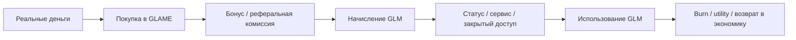
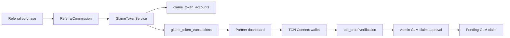
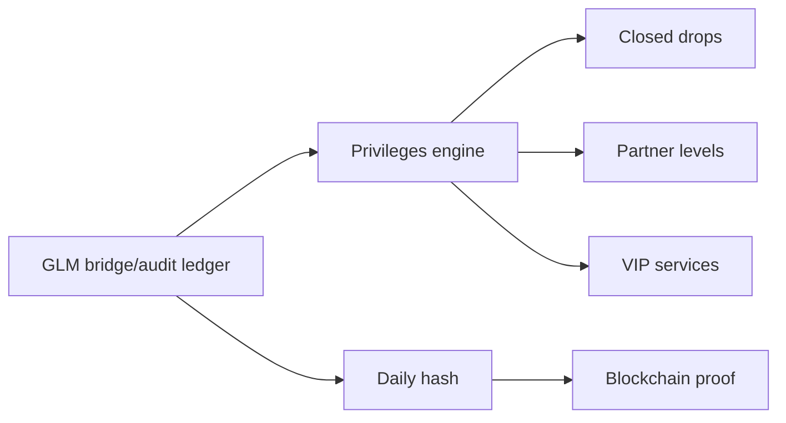
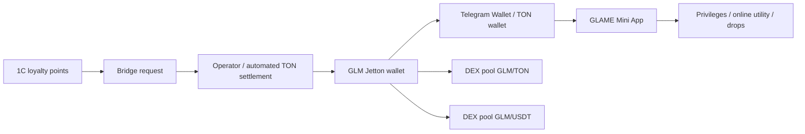
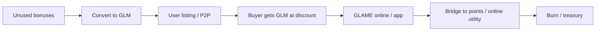

# КриптоГлэйм: план применения криптовалюты и развития GLAME Coin

Дата: 2026-06-30
Обновлено: 2026-08-01
Статус: controlled mainnet pilot готов -> GLM Jetton mainnet deployed -> bank mint `10 000 000 GLM` выполнен -> metadata/icon корректно отображаются через TonAPI/Tonkeeper -> TON Connect/proof усилен проверкой `walletStateInit` -> `points_to_glm`, `glm_to_points`, `buy_glm_with_ton` и GLM Store checkout/fulfillment проверены end-to-end на mainnet -> treasury/hot-wallet readiness и Telegram alerts включены -> Cloudflare external signer подключен и ограничен лимитами -> legacy backend hot-wallet mnemonic удален из runtime env -> свежий launch evidence `2026-07-18` сохранен после security hardening -> signed/offline approval refs заполнены проверяемыми хэшами policy/evidence документов -> public landing `/glm` и `/glm/audit` опубликованы -> production approvals выставлены в `/admin/crypto`, Go/no-go показывает `GO` -> public wording очищен от инвестиционных обещаний -> Tonkeeper asset-list PR merged и TonAPI whitelist проверен -> админский/партнерский UI переведен на продуктовую терминологию GRAM для нативной монеты сети TON -> добавлен controlled GLAME Exchange Desk: покупка GLM за GRAM и пилотная продажа GLM в GLAME за GRAM по заявке без обещания buyback/ликвидности -> до расширения аудитории осталось выполнить production-наблюдение и операторский регламент exchange desk
Рабочее название: CryptoGLAME / GLAME Coin / GLM

## 0.0. Архитектурное решение: баллы = 1С, GLM = TON, платформа = bridge

Актуальная целевая модель: `GLM` - это отдельный клубный crypto/utility-токен GLAME в TON-кошельке, а бонусные баллы 1С - внутренний кассовый инструмент скидки. Они связаны не постоянной синхронизацией, а контролируемыми bridge-операциями.

Две сущности:

- бонусные баллы 1С используются на кассе, в приложении и в текущей программе лояльности;
- бонусные баллы 1С живут по текущим правилам программы и могут сгорать, как было изначально;
- баллы хранятся в 1С; платформа синхронизирует их количество из 1С и инициирует подтвержденные списания/начисления;
- GLM хранится в TON-кошельке пользователя как Jetton; платформа привязывает кошелек, проверяет владение через TON Connect, готовит заявки и сверяет TON-транзакции;
- внутренний GLM ledger на платформе - не "кошелек GLM", а технический журнал/буфер: заявки, резервы, audit trail, tx hash, reconciliation, auto-transfer/settlement и repair-history;
- GLM не сгорает по календарю, если иное не указано для отдельной акции/заблокированного бонуса;
- `1 GLM` может применяться в онлайн-сценариях GLAME/партнерского сайта или после bridge-in в бонусы 1С;
- физические магазины не принимают GLM напрямую: для покупки в магазине пользователь сначала переводит GLM в баллы 1С, затем списывает баллы на кассе;
- внешняя покупка, продажа, DEX-обмен или P2P-передача GLM не меняет бонусный баланс 1С автоматически;
- 1С меняется только в контролируемых bridge-операциях, подтвержденных GLAME.

Bridge-модель:

- `points_to_glm`: клиент списывает/резервирует бонусные баллы 1С до их сгорания, а GLAME отправляет соответствующий GLM в TON-кошелек; ledger фиксирует заявку и исполнение;
- `glm_to_points`: основной сценарий перевода GLM в баллы GLAME, где клиент отправляет GLM в treasury, а GLAME начисляет баллы 1С после подтверждения TON-перевода и правил bridge;
- `buy_glm_with_ton`: controlled primary sale / покупка GLM за GRAM, где клиент отправляет GRAM в treasury, а GLAME отправляет GLM из hot-wallet в подтвержденный TON-кошелек; стартовое распределение от GLAME считается как `1 GLM = 1 ₽`, GRAM-сумма фиксируется по актуальному GRAM/RUB rate на момент заявки;
- `sell_glm_for_ton`: controlled exchange desk / пилотная продажа GLM в GLAME за GRAM, где клиент отправляет GLM в treasury GLAME, а оператор закрывает выплату GRAM по фактическому tx hash, лимитам и доступному резерву; это не публичное обещание обратного выкупа, фиксированного курса или ликвидности;
- `ton_withdrawal` / legacy `claim`: технический вывод GLM в TON Jetton после verified wallet и approval; для пользователя это не отдельная сущность, а исполнение операции `points_to_glm` или вывод заработанного GLM;
- `redeem`: клиент тратит GLM внутри GLAME Store/сервисов без обязательного превращения всего баланса в баллы 1С;
- `bridge ledger`: каждая связка 1С <-> GLM фиксируется с idempotency key, статусом, лимитами, source transaction и audit trail.
- `treasury/bank distribution`: пользовательские `points_to_glm` операции не минтят новый GLM под каждую заявку; GLAME переводит уже существующий GLM из treasury/банка. Mint используется отдельно только для пополнения банка по утвержденной tokenomics/approval-процедуре.

Важно для интерфейса: пользователю показываем не `claim`, а понятные действия: "баллы -> GLM", "GLM -> баллы GLAME", "купить GLM за GRAM", "продать GLM в GLAME за GRAM", "оплата GLM", "оплата баллами". `TON` оставляем как название сети/протокола, `GRAM` - как пользовательское название нативной монеты. Claim остается только техническим названием pending-заявки в backend/admin audit trail.

Для партнерского кабинета убираем лишний пользовательский этап: нет отдельной кнопки "вывести GLM". Пользователь делает одну операцию "баллы -> GLM в TON"; технически backend все равно создает ledger transaction и связанную pending withdrawal-заявку, чтобы сохранить аудит, лимиты и возможность отката.

Доступный GLM-баланс в пользовательском интерфейсе считывается из привязанного TON-кошелька по Jetton master. Platform ledger не считается источником доступного GLM-баланса; он используется для pending-заявок, холдов, аудита и сверки.

Следствие: механика "конвертации бонусов в GLM" остается нормальной bridge-операцией, а не legacy-ошибкой. Целевая модель - не единый баланс, а два отдельных баланса с прозрачным обменным шлюзом.

Важное правило срока действия: баллы 1С не становятся бессрочными автоматически. Их ценность можно сохранить, переведя баллы в GLM до сгорания. Обратный перевод GLM в баллы создает новые баллы 1С по правилам программы на момент операции.

Обязательные технические слои:

- `bridge ledger`: журнал заявок и исполнений `points_to_glm`, `glm_to_points`, `ton_withdrawal/claim`, `redeem`;
- `reserve/lock`: защита от двойного списания на время bridge-операции;
- `1C adapter`: только для подтвержденного списания/начисления баллов при bridge, а не для отслеживания всех GLM-переводов;
- `TON watcher`: отслеживает депозиты GLM в treasury/escrow GLAME для `glm_to_points`;
- `reconciliation`: сверяет только bridge-операции и treasury, а не весь внешний рынок GLM;
- `immutability/audit`: каждое движение bridge/TON/1C и каждая связь между ними фиксируются отдельно.

## 0. Текущий статус реализации на 2026-07-18

### Итоговая сверка

CryptoGLAME уже прошел путь от раннего технического пилота к controlled mainnet pilot. Основные пользовательские и операционные потоки работают, production approvals выставлены в `/admin/crypto`, а Go/no-go readiness показывает `GO`. Mainnet E2E закрыт по `Баллы -> GLM`, `GLM -> баллы`, `Купить GLM за GRAM` и GLM Store checkout/fulfillment; свежий launch evidence после security hardening сохранен `2026-07-18`, signed/offline approval refs заполнены хэшами документов. На 2026-08-01 добавлен первый controlled exchange desk слой: покупка GLM за GRAM и заявка на продажу GLM в GLAME за GRAM без обещания постоянного выкупа. Широкий публичный запуск теперь упирается не в разработку ядра, а в production-наблюдение, лимиты и операторский регламент.

### Сделано

- [x] Архитектура зафиксирована: баллы 1C и GLM - разные сущности, связанные контролируемым bridge; GLM хранится в TON-кошельке, 1C-баллы остаются кассовым инструментом.
- [x] TON Connect и `ton_proof` работают: партнер подключает кошелек, backend проверяет владение адресом, сверяет `walletStateInit` с адресом и public key, verified wallet используется для bridge, GLM Store и чтения on-chain баланса.
- [x] `points_to_glm` работает end-to-end: 1C списывает баллы, hot-wallet отправляет GLM в подтвержденный TON-кошелек, settlement фиксирует TON tx, операция закрывается без ручного админа в нормальном сценарии.
- [x] `glm_to_points` работает end-to-end: партнер отправляет GLM в treasury, watcher находит TON transfer, 1C начисляет баллы, auto-retry закрывает временные ошибки 1C.
- [x] `buy_glm_with_ton` работает end-to-end: партнер создает покупку GLM за GRAM, GRAM amount считается автоматически по GRAM/RUB, watcher валидирует payment в treasury, external signer отправляет GLM из hot-wallet, reconciliation/replay остаются чистыми.
- [x] `sell_glm_for_ton` добавлен как controlled exchange desk MVP: партнер создает заявку на продажу GLM в GLAME за GRAM, TON Connect готовит перевод GLM в treasury, админ закрывает GRAM payout по tx hash; сценарий выключается env-флагом и не является публичной гарантией buyback/ликвидности.
- [x] 1C spend-flow исправлен: рабочим источником для CryptoGLAME считается `К списанию`; старый путь, который ломал лоты формы карты, признан неактуальным.
- [x] Bridge-domain слой готов: `glame_token_bridge_operations`, idempotency, statuses, TON tx, 1C status, reconciliation, admin actions по `bridge_operation_id`; legacy ledger остается audit trail, а не продуктовой моделью.
- [x] GLM Store / Reward Store готов как online utility MVP: товары, услуги, фото, остатки `Осталось X шт.`, покупка за баллы 1C, TON checkout за GLM, fulfillment queue, cancel/refund flow; mainnet checkout/fulfillment E2E закрыт `2026-07-17`.
- [x] Telegram bot подключен: admin alerts, partner binding через одноразовый токен с сайта, broadcast партнерам, bridge/readiness escalation, low-balance alerts и ссылки на `https://portal.glamejewelry.ru/admin/crypto`.
- [x] Admin UX разделен: реферальная программа остается в `/admin/referrals`, CryptoGLAME вынесен в `/admin/crypto`; из crypto убраны РМК, медиаматериалы и настройки отчислений.
- [x] Treasury/hot-wallet monitoring готов: on-chain GLM/TON balances, editable thresholds, refill plan, fixed batch refill model (`alert < 5000 GLM`, пополнение на `5000 GLM`, TON gas до целевого уровня), manual TON Connect refill.
- [x] Mainnet GLM Jetton выпущен; bank/treasury mint `10 000 000 GLM` выполнен; versioned metadata `jetton-metadata-mainnet-v2.json` опубликована; актуальная иконка `glm-token-icon-v3.png` подключена на публичном metadata URL, TON Connect manifest и отображается в TonAPI/Tonkeeper.
- [x] External signer подключен через Cloudflare Worker; backend не должен хранить production hot-wallet seed; signer health/preflight и mainnet smoke-test `1 GLM` выполнены.
- [x] External signer получил hard limits на стороне Cloudflare Worker: max per tx, daily cap, hourly cap, минимальная пауза между переводами, KV usage и `/health` с текущими лимитами.
- [x] Legacy backend hot-wallet mnemonic удален из `/etc/glame-platform/glame-stack.env`; runtime mainnet auto-transfer готовность теперь опирается на external signer, а не на env mnemonic.
- [x] Свежий launch evidence после удаления legacy mnemonic и усиления TON proof сохранен: `backend/data/crypto_glame_evidence/launch-evidence-20260718.json`, `checks ok`, secret exposure findings `0`, admin route audit `94/94`, ton-assets package `OK`, SHA-256 `82614f62afdf61cc646e8e3957644639b9804361ba70d50f526102a74643532e`.
- [x] Signed/offline approval refs заполнены в `backend/static/glm_policy/production-approvals.json`: legal/security/treasury/public wording ссылаются на SHA-256 policy-документов и свежий launch evidence; позднее эти refs можно заменить на номера/ссылки внешних подписанных документов.
- [x] Replay/idempotency audit добавлен для bridge/store/refund: admin endpoint и кнопка `Replay audit` проверяют дубли TON tx и операции без обязательных tx hash.
- [x] Telegram warning digest добавлен: critical-события уходят сразу, warning/non-critical события группируются в digest-окно, включая сводку `GLM Operations Attention`, чтобы после запуска бот не спамил одинаковыми служебными предупреждениями.
- [x] Admin route security audit добавлен: `scripts/security/check_referrals_admin_routes.py` проверяет, что `/admin...` endpoints в referrals API требуют `require_admin()`.
- [x] Signer health/pause responses редактируются перед показом в backend/UI, чтобы не раскрывать token/secret/api_key/mnemonic/private_key/authorization/password.
- [x] Secret exposure guard добавлен: `scripts/security/check_secret_exposure.py` сканирует tracked-файлы без вывода значений секретов; runtime `nohup.out` исключен из Git.
- [x] Combined launch-check runner добавлен: `scripts/security/run_crypto_glame_launch_checks.py` собирает local security/token/git checks в один JSON evidence report.
- [x] Mainnet treasury/bank wallet и hot-wallet зафиксированы в readiness; hot-wallet пополнен рабочим запасом GLM/TON gas.
- [x] Mainnet readiness исправлен: legacy testnet/deploy checks больше не блокируют общий статус при `Go/no-go = GO`; старые blueprint/reference blockers остаются диагностикой.
- [x] Readiness endpoint стабилизирован после перехода на mainnet/external signer: исправлен `UnboundLocalError` в `/api/referrals/admin/glm-ton-readiness`, из runtime env убраны тестовые TON endpoint/settlement lookup addresses, admin UI больше не должен падать в fallback `testnet / Нет кошелька`.
- [x] Production approval evidence refs защищены от случайного стирания: добавлена кнопка `Заполнить SHA refs`, а backend сохраняет существующие refs при пустом save из UI.
- [x] Public landing `/glm` открыт без авторизации: описывает GLM Coin, tokenomics, риски, roadmap, офлайн-магазины GLAME, мобильное приложение, реферальные начисления GLM за покупки рефералов и связь с реальными баллами лояльности.
- [x] В партнерском разделе CryptoGLAME добавлена кнопка `О проекте Crypto GLAME`, ведущая на публичную страницу `https://partner.glamejewelry.ru/glm`.
- [x] Public audit page `/glm/audit` добавлена: показывает опубликованные GLM daily root hash, previous hash chain, totals и ссылки на публичный JSON/JSONL journal без персональных данных.
- [x] GLM audit hash publication можно вести вручную из `/admin/crypto` или включить scheduler `GLM_AUDIT_HASH_PUBLISH_SCHEDULER_ENABLED`; readiness показывает статус `Audit hash`.
- [x] Public policy pack готов в `/static/glm_policy`: token policy, risk disclosure, bridge rules, FAQ, operator runbook, production signer contract, metadata.
- [x] Public wording вычитан: `/glm`, партнерский CryptoGLAME блок, token policy, FAQ и bridge rules приведены к utility-формулировкам без обещаний роста цены, buyback, фиксированного внешнего курса, гарантированной ликвидности, USDT-обмена или инвестиционного дохода.
- [x] Operational stats очищены от testnet-шумов через cutover: старые testnet/pilot операции остаются в audit trail, но не должны искажать рабочие GLM Effectiveness / Treasury Turnover.
- [x] Mainnet production regression закрыт evidence-файлами: `points-to-glm-e2e-20260717.json`, `glm-to-points-e2e-20260717.json`, `buy-glm-with-ton-e2e-20260717.json`, `glm-store-checkout-fulfilled-e2e-20260717.json`.

### Неактуальное и закрытое

- Старый пользовательский `claim/withdrawal` UI больше не является отдельным продуктовым действием. Для пользователя остаются понятные сценарии: `Баллы -> GLM`, `GLM -> баллы`, `оплата GLM`, `оплата баллами`.
- Отдельный дублирующий продукт `Покупка баллов за GLM` снят с launch-модели. Покупка баллов покрывается основным bridge `GLM -> баллы GLAME`, покупка GLM покрывается сценарием `Купить GLM за GRAM`, а обратная продажа GLM в GLAME покрывается controlled exchange desk заявкой.
- Модель внутреннего GLM balance на платформе как источника доступных GLM закрыта. Доступный GLM читается из TON-кошелька; platform ledger нужен для заявок, холдов, аудита и reconciliation.
- Testnet-only treasury/hot-wallet сценарии больше не являются целевыми для production. Они остаются историей пилота и инструментом регрессионных проверок.
- Прямой GLM POS-код для физических магазинов исключен. Офлайн-магазины используют баллы 1C; GLM сначала переводится в баллы через `glm_to_points`.
- Автоматический treasury auto-refill без подтверждения администратора не запускаем, пока treasury signer не вынесен в отдельный KMS/Vault/external signer с лимитами и approval-policy.
- Обещания роста цены, buyback, гарантированного курса, ликвидности или USDT-обмена не используем в публичной коммуникации.

### Что осталось до полной реализации и расширения аудитории

Детальный актуальный список находится в разделе `22`. Коротко осталось:

- провести несколько дней production-наблюдения на малых реальных операциях;
- зафиксировать KYC/AML лимиты и ответственных для крупных/подозрительных on-chain сценариев;
- после появления надежного COGS/category margin подключить маржинальность к `GLM Effectiveness`;
- расширять UX спорных TON tx/refund/manual repair по фактическим production-кейсам.

P2P/DEX/listing, массовые crypto payouts и открытый marketplace не являются launch blockers и вынесены в отдельные future gates. Первый безопасный шаг до P2P/DEX - controlled GLAME Exchange Desk: GLAME сам продает GLM из банка за GRAM и может пилотно принимать GLM обратно за GRAM по заявкам, лимитам и доступному резерву без обещания постоянной ликвидности.

## 1. Цель проекта

Создать вокруг GLAME дополнительный слой лояльности, реферальных вознаграждений и клубных привилегий, используя крипто-технологии аккуратно и поэтапно.

Главная идея: построить полезную клубную экономику GLAME, где токен получает ценность через онлайн-покупки, рефералов, статус, закрытые коллекции и доступ к сервисам. Дальняя цель: полноценный торгуемый `GLM`, который можно передавать, хранить в кошельке, обменивать на TON/USDT и использовать внутри онлайн-сценариев GLAME.

## 2. Базовая концепция

GLAME Coin (`GLM`) - это отдельный клубный crypto/utility-токен GLAME, связанный с бонусными баллами 1С через контролируемый bridge.

GLM должен быть не "монетой с обещанным ростом", а долгим клубным активом GLAME, поддержанным реальной деятельностью GLAME: онлайн-покупками, реферальным оборотом, бонусной программой, клиентскими сервисами и движением реальных денег через бизнес.

Ключевой принцип: GLM и бонусные баллы 1С - разные сущности. Баллы 1С остаются кассовым скидочным инструментом и могут сгорать по действующим правилам. GLM живет отдельно, может быть бессрочным и в будущем торгуемым. Связь между ними происходит только через подтвержденные bridge-операции: баллы -> GLM и GLM -> баллы.

Отдельная стратегическая возможность: дать клиентам способ сохранить ценность сгорающих бонусов. Если у клиентов уже накоплено около 2 млн рублей бонусов, это можно использовать как стартовый пул для `points_to_glm`: клиент переводит часть бонусов в GLM до сгорания, а позже может вернуть GLM в баллы 1С через `glm_to_points`, когда готов к покупке. При этом внешняя продажа или передача GLM не меняет 1С, пока новый держатель сам не выполнит `glm_to_points`.

Отдельный стратегический трек вынесен в `docs/plans/2026-07-01-glame-network-crypto-loyalty-platform.md`: GLAME Network как B2B2C-платформа лояльности для нескольких fashion-магазинов, где GLM начисляется и используется в общей партнерской сети.

Исторически первый этап начинался как off-chain ledger. Актуальная модель после testnet: GLM живет в TON-кошельке, а platform ledger остается операционным журналом заявок, холдов и bridge-аудита:

- начисляется за реферальные покупки;
- может распределяться из treasury/банка GLAME через bridge из бонусных баллов 1С;
- возникает из подтвержденных операций, а не из абстрактной эмиссии;
- отображается в партнерском кабинете;
- проходит холд до подтверждения покупки;
- не продается публично;
- отправляется в TON mainnet из hot-wallet/treasury GLAME через external signer после verified wallet, 1С spend и включенного GLM-bridge; testnet остается rehearsal/audit history;
- не переводится между пользователями до запуска P2P/marketplace и lock/reconciliation;
- не обещает доходность или рост цены;
- используется как клубный актив для будущих привилегий GLAME.

Ключевая формулировка:

> GLAME Coin - клубный crypto/utility-токен GLAME. Он связан с бонусами 1С через контролируемый bridge, поддержан реальными онлайн-сервисами и покупками GLAME, начисляется за реальные рекомендации и операции, открывает привилегии, доступ к закрытым коллекциям и повышенные реферальные уровни.

Важное уточнение: "поддержана" в продуктовой логике означает, что полезность GLM создается реальным сервисом GLAME. Это не означает юридическое обязательство GLAME выкупать GLM за рубли, не означает фиксированный курс к фиатной валюте и не является обещанием инвестиционного роста.

## 3. Почему не запускать сразу публичную монету

Публичная монета с обещанием роста цены может создать юридические и операционные риски:

- риск квалификации как investment contract / securities offering;
- требования KYC/AML при свободной передаче, обмене или выводе;
- налоговый учет доходов партнеров;
- репутационный риск, если цена волатильна;
- риск привлечь аудиторию спекулянтов вместо клиентов GLAME.

Поэтому стартовая модель: закрытая клубная валюта, привязанная к реальной пользе внутри GLAME.

## 4. Real-Service-Backed модель

GLM должен быть связан с реальными операциями GLAME. Это главный способ повышать его полезность без обещаний роста цены.

Базовая цепочка:


```mermaid
flowchart LR
    A["Реальные деньги"] --> B["Покупка в GLAME"]
    B --> C["Бонус / реферальная комиссия"]
    C --> D["Начисление GLM"]
    D --> E["Статус / сервис / закрытый доступ"]
    E --> F["Использование GLM"]
    F --> G["Burn / utility / возврат в экономику"]
```

Источники полезности GLM:

- реальные онлайн-покупки на сайте/в приложении;
- реферальный оборот;
- бонусная программа;
- услуги стилиста и AI-подбора;
- закрытые коллекции;
- физические пространства GLAME используют не GLM напрямую, а баллы 1С после bridge;
- клиентские мероприятия;
- партнерские активности;
- лимитированный доступ к сервисам.

Правило: GLM должен распределяться преимущественно под подтвержденное полезное действие:

- покупка;
- реферальная покупка;
- регистрация по коду;
- отзыв или контент, прошедший модерацию;
- участие в мероприятии;
- активность, которая имеет ценность для GLAME.

Что повышает полезность GLM:

- чем больше сервисов принимают GLM, тем выше его внутренняя ценность;
- чем больше привилегий открывается за GLM, тем выше спрос на него;
- чем больше эмиссия связана с реальным оборотом, тем меньше риск "пустой монеты";
- чем больше utility/burn, тем ниже избыток неиспользуемых токенов;
- чем сильнее бренд GLAME, тем ценнее клубный статус.

Правильная экономическая позиция:

- GLM не обещает рост цены;
- GLM не продается как инвестиция;
- GLM получает ценность через применимость в GLAME;
- GLM является клубной валютой GLAME, связанной с бонусами через bridge, но не заменяет весь бонусный учет 1С.

## 4.1. Как GLAME зарабатывает на GLM

GLAME не должен строить доходность проекта на обещании роста цены GLM. Более безопасная и устойчивая модель - зарабатывать на сервисной инфраструктуре вокруг токена: bridge, online utility, GLM Store, партнерской сети и операционных комиссиях.

Базовый принцип:

> GLAME зарабатывает не на обещании цены GLM, а на операциях, сервисах, комиссиях, spread и партнерской инфраструктуре вокруг GLM.

Основные источники дохода:

1. **Bridge-комиссия**

   Контролируемый обмен между баллами 1С и GLM может иметь комиссию или spread.

   Возможная MVP-модель:

   - `баллы -> GLM`: 0-2%, чтобы клиенту было выгодно сохранять ценность сгорающих баллов;
   - `GLM -> баллы`: 3-10%, потому что GLAME принимает на себя будущую скидочную нагрузку в 1С;
   - срочная обработка, крупные операции или ручной repair могут иметь отдельную сервисную комиссию.

   Пример: пользователь переводит `1000 GLM` в баллы, получает `950 баллов`, а `50 GLM` остается в treasury GLAME как комиссия.

2. **Покупка баллов лояльности за GLM**

   Отдельный продукт `buy_loyalty_points`: пользователь передает GLM в treasury, а GLAME начисляет баллы 1С с выгодным для компании spread.

   Пример:

   - пользователь отправляет `1100 GLM`;
   - получает `1000 баллов`;
   - `100 GLM` остается GLAME как spread.

   Баллы после покупки живут по правилам 1С-программы на момент начисления.

3. **GLM Store и online utility**

   GLAME может продавать за GLM специальные товары и сервисы:

   - брендированные холдеры для украшений;
   - специальные браслеты, упаковку, аксессуары;
   - закрытые дропы;
   - private stylist session;
   - закрытые подборки;
   - private sale pass;
   - ранний доступ к коллекциям.

   Доход появляется, если внутренняя GLM-цена выше себестоимости товара или услуги. Часть полученного GLM можно оставлять в treasury, часть сжигать как utility/burn.

4. **Партнерская сеть GLAME Network**

   Если GLM станет loyalty layer для других fashion/jewelry/beauty-магазинов, GLAME может зарабатывать как оператор сети:

   - subscription за подключение магазина;
   - комиссия с начисления GLM;
   - комиссия с использования GLM;
   - комиссия с redemption/settlement;
   - платные совместные кампании;
   - white-label loyalty для партнеров;
   - аналитика, антифрод и AI-маркетинг как платные модули.

   Это потенциально главный B2B-источник дохода, потому что GLAME продает не "монету", а готовую инфраструктуру лояльности.

5. **P2P/marketplace/DEX-комиссии**

   На более позднем этапе, после legal/security/mainnet approval, можно рассмотреть:

   - внутренний P2P marketplace GLM;
   - комиссию 1-2% с обмена между пользователями;
   - комиссию за быстрый swap;
   - комиссию за вывод или повышенный лимит;
   - DEX liquidity operations.

   Этот блок нельзя запускать до юридического анализа, KYC/AML-правил и treasury approval.

6. **Treasury reserve**

   Treasury GLAME может держать часть GLM для:

   - кампаний;
   - партнерских бюджетов;
   - ликвидности;
   - бонусов;
   - компенсаций;
   - будущих B2B-продаж партнерам.

   Важно: treasury reserve не должен продаваться пользователям как инвестиция и не должен сопровождаться обещанием роста или обратного выкупа.

Рекомендуемая стартовая модель для pilot:

- `баллы -> GLM`: комиссия `0%` на тесте, затем до `2%`;
- `GLM -> баллы`: spread/комиссия `5-10%`;
- `buy_loyalty_points`: spread `10%`;
- GLM Store: маржинальные товары и сервисы;
- GLAME Network: готовить B2B-пакеты как главный будущий источник дохода;
- P2P/DEX: не запускать до legal/security/mainnet gate.

## 5. Bridge-экономика: сгорающие баллы -> GLM -> баллы для покупки

Текущая база неиспользованных бонусов может стать первым источником спроса на GLM. Если в системе есть около 2 млн рублей бонусов, это означает, что у GLAME уже есть внутренняя скидочная нагрузка и накопленная клиентская ценность. Баллы остаются сгорающими, но клиент может сохранить их ценность через bridge в GLM.

Базовая идея:

1. Клиент накопил бонусы, но не планирует покупку.
2. Перед сгоранием клиент переводит бонусы в GLM через `points_to_glm`.
3. GLM не сгорает по календарю и может храниться, передаваться или продаваться после запуска marketplace/on-chain.
4. Новый держатель GLM приходит в GLAME и делает `glm_to_points`.
5. GLAME получает GLM в treasury/escrow и начисляет клиенту баллы 1С по правилам bridge.
6. Клиент использует баллы 1С в покупке по кассовым правилам.
7. GLAME получает новую покупку, а использованные баллы списываются в 1С.

Пример:

- клиент А имеет `10 000` бонусных баллов 1С, которые скоро сгорят;
- клиент А переводит их в `10 000 GLM` через `points_to_glm`;
- клиент А продает `10 000 GLM` клиенту Б за `7 000 ₽` на marketplace/DEX;
- клиент Б покупает украшение за `50 000 ₽`;
- клиент Б делает `glm_to_points`: переводит GLM в treasury/escrow GLAME;
- GLAME начисляет клиенту Б, например, `8 000-10 000` баллов 1С в зависимости от курса, комиссии и лимитов;
- клиент Б списывает баллы как внутреннюю скидку;
- клиент Б платит остаток живыми деньгами;
- GLAME получает продажу и GLM в treasury, а использованные баллы списываются в 1С.

Экономический смысл:

- сгорающие бонусы получают путь сохранения ценности через GLM;
- покупатель GLM получает понятную скидку;
- GLAME получает дополнительный спрос;
- GLAME может зарабатывать на utility-сервисах, GLM Store, controlled sale GLM за GRAM и допустимой комиссии/spread в bridge/exchange desk сценариях после legal/accounting approval;
- рынок сам оценивает GLM с дисконтом к 1 ₽;
- внутренняя применимость GLM через `glm_to_points` создает ценовой ориентир.

Важно: GLAME не обязан выкупать GLM за рубли. Ценовой ориентир создается не выкупом, а возможностью bridge-in:

> GLAME может принимать GLM в treasury/escrow и начислять за него баллы 1С по правилам программы, лимитам и текущему курсу bridge.

Рыночная цена GLM может быть ниже 1 ₽, если продавцу нужна ликвидность. Покупатель понимает, что в GLAME он может превратить GLM в баллы для покупки. Это создает естественный арбитраж, но без обещания фиксированного курса и без автоматической синхронизации 1С.

### Ограничения списания

Чтобы GLM не съел маржу, нельзя разрешать безлимитное списание 100% заказа. Нужны правила по категории товара, марже, статусу клиента и кампании.

Стартовые лимиты:

| Категория | Лимит списания GLM |
| --- | ---: |
| Новые коллекции | до 10% заказа |
| Основной ассортимент | до 20% заказа |
| VIP/Privé клиенты | до 30% заказа |
| Старые остатки / clearance | до 40-50% заказа |
| Сервисные привилегии | до 100%, если себестоимость низкая |
| Доставка, сертификаты, товары с низкой маржой | исключить или ограничить |

Формула:

`max_glm_discount = order_total * category_limit * customer_status_multiplier`

### Внутренний marketplace GLM

Вариант для развития:

- пользователи выставляют GLM на продажу;
- покупатели видят предложения с дисконтом;
- GLAME берет комиссию 3-7%;
- часть комиссии сжигается;
- часть идет в treasury;
- сделки проходят через escrow внутри платформы;
- передача GLM происходит после подтверждения оплаты.

Пример комиссии:

- пользователь продает `10 000 GLM` за `7 000 ₽`;
- комиссия marketplace `5%`;
- `500 GLM` сжигается или уходит в treasury;
- покупатель получает `9 500 GLM`;
- продавец получает оплату по правилам платформы.

### Риски

| Риск | Защита |
| --- | --- |
| Массовый выкуп GLM дешевле 1 ₽ и покупка без живых денег | лимит списания в заказе |
| Съедание маржи | лимиты по категориям и маржинальности |
| Спекуляции и fraud | KYC для крупных операций, лимиты, антифрод |
| Конфликт с бонусной офертой | отдельные правила bridge: баллы сгорают как раньше, GLM живет отдельно |
| Юридическая трактовка как платежного инструмента | legal review до публичного marketplace |
| Налоговые вопросы между пользователями | дисклеймеры и отдельная модель для P2P |

## 6. Этапы развития

### Этап 1. Off-chain GLM Ledger

Срок: 1-2 недели
Статус: done для партнерского MVP.
Цель: запустить безопасный внутренний учет GLM без блокчейн-вывода.

Уже реализовано в MVP:

- [x] таблица аккаунтов `glame_token_accounts`;
- [x] таблица транзакций `glame_token_transactions`;
- [x] начисление GLM при создании реферальной комиссии;
- [x] отображение GLM в реферальном кабинете;
- [x] GLM по каждой комиссии в таблицах кабинета;
- [x] холд-баланс и доступный баланс;
- [x] admin release из hold в balance;
- [x] политика `transferable=false`, `cash_out=false`;
- [x] pending claim transaction как промежуточный учетный слой.

Правило начисления:

- `1 GLM = 1 рубль реферального вознаграждения`;
- если партнер заработал 350 рублей комиссии, создается `350 GLM` в холде;
- GLM становится полезным через статус и привилегии, а не через обещание обмена на деньги.

### Этап 2. Привилегии за GLM

Срок: 2-4 недели
Цель: дать токену реальную пользу внутри GLAME.

Механики:

- ранний доступ к новым коллекциям;
- закрытые дропы для партнеров;
- VIP-подборка стилиста;
- участие в приватных мероприятиях;
- повышенный статус в реферальной программе;
- приоритетная обработка запросов;
- доступ к лимитированным подаркам или сертификатам.

Примеры уровней:

| Уровень | Баланс/оборот | Привилегия |
| --- | ---: | --- |
| GLM Start | 0+ GLM | базовый кабинет и начисления |
| GLM Muse | 5 000 GLM | ранний доступ к дропам |
| GLM Privé | 20 000 GLM | закрытые подборки и мероприятия |
| GLM Ambassador | 50 000 GLM | персональные условия и амбассадорский статус |

Важно: уровни дают сервисные преимущества, а не инвестиционную доходность.

### Этап 3. Burn-механика

Срок: 1 месяц после этапа 2
Цель: создать ограниченность и внутреннюю экономику.

Возможные сценарии burn:

- партнер тратит GLM на участие в закрытом дропе;
- клиент тратит GLM на сервисную привилегию;
- часть GLM сжигается при оплате лимитированного доступа;
- GLM списывается при GLM Store/service redemption или bridge-in в баллы;
- баллы 1С списываются и сгорают по действующим правилам программы.

Политика срока действия:

- бонусные баллы 1С остаются сгорающими по текущей программе;
- GLM не сгорает по календарю, если это не специальная промо-эмиссия с отдельными правилами;
- перевод баллов в GLM до сгорания - добровольный способ сохранить ценность в клубном crypto-активе;
- обратный перевод GLM в баллы создает новые баллы 1С, которые живут по правилам программы на момент начисления;
- текущая "конвертация баллов в GLM" становится `points_to_glm` bridge, а не временной legacy-механикой;
- burn GLM происходит не по календарю, а через добровольное использование: GLM Store, сервисы, лимитированные дропы и bridge/обменные операции.

Пример:

- доступ к закрытой подборке стоит `500 GLM`;
- из них `400 GLM` сжигается;
- `100 GLM` уходит в фонд активности/мероприятий.

Следующие шаги по баллам и GLM:

- [x] описать `points_to_glm`: перевод сгорающих баллов 1С в GLM до истечения срока;
- [x] добавить MVP-механику конвертации баллов в GLM как первый bridge-out слой;
- [x] добавить `glm_to_points`: backend/API, partner UI, TON Connect transfer request, treasury/deposit settlement, admin queue, watcher, 1C auto-retry и E2E-проверка готовы;
- [x] нормализовать `GLM -> баллы GLAME`: backend/API, partner UI, admin queue, 1C document payload и TON deposit в treasury готовы; отдельный дублирующий блок "покупка баллов за GLM" снят с launch UI.
- [x] добавить уведомление клиенту: "баллы скоро сгорят, можно перевести их в GLM";
- [x] настроить базовые лимиты `points_to_glm`, чтобы не создать неконтролируемую эмиссию GLM.

### Этап 4. On-chain Proof

Срок: после стабилизации экономики
Статус: сделано для launch через TON Connect `ton_proof`, проверку `walletStateInit`, daily audit hash и публичный `/glm/audit`. On-chain publication hash остается future layer, не launch blocker.
Цель: использовать блокчейн как аудит, не открывая свободный рынок.

Механика:

- [x] пользователь подключает TON-кошелек через TON Connect;
- [x] пользователь подписывает `ton_proof`;
- [x] backend проверяет владение кошельком перед статусом `verified`;
- [x] раз в день формируется Merkle root или hash начислений GLM;
- [x] hash публикуется публично через web/JSON public journal `/glm/audit`; on-chain publication hash вынесена в future layer;
- [x] доступный GLM-баланс считывается из TON-кошелька; GLAME ledger остается журналом заявок, холдов и аудита;
- [x] пользователь видит прозрачность через public audit journal/hash chain; on-chain anchoring можно добавить позже без блокировки launch.

Преимущество: получаем доверие и крипто-технологию без рисков публичного токена.

### Этап 5. Tradable TON Jetton

Срок: controlled mainnet pilot готов; публичное расширение - после сохранения signed/offline approvals и короткого production-наблюдения.
Статус: TON mainnet Jetton deployed; primary bank mint `10 000 000 GLM` выполнен в treasury/bank wallet; `points_to_glm` и `buy_glm_with_ton` исполняются переводом существующего GLM из hot-wallet через external signer, а не минтом под каждую заявку.
Цель: выпустить полноценный on-chain `GLM`, который можно хранить в TON-кошельке, передавать, использовать внутри GLAME и обменивать через рыночную ликвидность.

Приоритетная сеть:

- TON, потому что он нативен для Telegram-сценариев: Telegram Wallet, TON Connect, Mini Apps, рефералы, QR-коды, социальное распространение.

Альтернативы:

- Base, если нужен EVM и Coinbase-экосистема;
- Polygon, если нужен массовый EVM и широкое tooling;
- Solana, если важны скорость и дешевые операции;
- Ethereum mainnet, если нужен максимальный имидж, но высокая цена транзакций.

Ограничения на старте:

- вывод только для верифицированных партнеров;
- лимиты на переводы;
- отсутствие публичных обещаний роста;
- запрет на маркетинг в стиле инвестиционного продукта;
- KYC/AML-процедуры при необходимости.

Плановый формат:

- [x] `GLM` выпускается как TON Jetton в testnet;
- [x] пользователь подключает TON-кошелек через TON Connect;
- [x] пользовательский сценарий упрощен до `баллы -> GLM в TON`;
- [x] технический pending withdrawal исполняется on-chain transfer из treasury/банка GLAME в Jetton wallet через backend auto-transfer и auto-settlement watcher;
- [x] GLAME не обещает обратный выкуп;
- [x] обмен на TON/USDT через DEX/рынок вынесен из launch scope в отдельный future gate после legal/security решения;
- [x] GLAME создает utility, сервисы и спрос, но не гарантирует цену.

### Этап 6. DEX-liquidity and market operations

Срок: после on-chain пилота
Цель: дать GLM рыночную обращаемость без обещания фиксированного курса.

Варианты ликвидности:

- пара `GLM/TON`;
- пара `GLM/USDT`;
- liquidity pool на TON DEX;
- treasury liquidity под прозрачными правилами;
- лимиты и vesting для treasury/team/ambassador allocation.

Принципы:

- GLAME не гарантирует цену GLM;
- GLAME не обещает выкуп GLM;
- ликвидность - рыночная, а не обязательство компании;
- публичная коммуникация фокусируется на utility, а не на доходности;
- все treasury-операции должны иметь внутренний регламент.

### Этап 7. Regulated crypto rewards

Срок: только после юридической и бухгалтерской модели
Цель: использовать GLM или поддерживаемую криптовалюту как один из вариантов партнерского вознаграждения.

Варианты:

- партнер получает стандартную комиссию в рублях/учетной валюте, а затем выбирает выплату в TON/USDT;
- партнер получает часть вознаграждения в GLM по правилам программы;
- партнер сам решает держать GLM, передать или обменять на DEX.

Важно:

- криптовыплата не должна быть способом обхода официальных выплат, налогов или договоров;
- сумма вознаграждения должна фиксироваться в учетной валюте;
- нужен KYC/AML и проверка кошелька;
- нужен учет курса на момент выплаты;
- нужны правила возврата/отмены комиссии;
- нужен отдельный legal review.

## 7. Применение в реферальной программе

Текущая реферальная система GLAME уже имеет основу:

- партнерские уровни `Stylish Start / Pro / Expert / Privé`;
- ставки 3%, 5%, 7%, 10%;
- холд вознаграждения;
- welcome-бонус для приглашенного клиента;
- интеграция с 1C для заказов, комиссий и бонусных операций;
- партнерский кабинет.

GLM должен усилить, а не заменить эту систему.

Модель:

1. Партнер приглашает клиента.
2. Клиент делает покупку.
3. Создается реферальная комиссия.
4. Партнер получает стандартное вознаграждение по текущим правилам.
5. Дополнительно создается GLM-транзакция.
6. GLM находится в холде до подтверждения покупки.
7. После подтверждения GLM становится доступным для клубных механик.

## 8. Токеномика GLM

Стартовая модель:

| Параметр | Значение |
| --- | --- |
| Код | GLM |
| Название | GLAME Coin |
| Decimals | 9 в TON Jetton; внутренние заявки могут отображать целые GLM |
| Тип | клубный utility/crypto token в TON + операционный bridge/audit ledger |
| Max supply | 10 000 000 GLM |
| Monthly referral emission cap | 250 000 GLM |
| Transferable | этап 1: no; on-chain этап: yes |
| Cash-out | этап 1: no; on-chain этап: через рыночный DEX-обмен, без гарантии выкупа GLAME |
| Первичный источник эмиссии | реальные операции GLAME, реферальные комиссии, `points_to_glm` bridge |
| Экономическая поддержка | онлайн-сервисы, онлайн-покупки, реферальный оборот, bridge в баллы 1С, клубные привилегии |
| Внутренний прием | online utility redemption по правилам программы; физический магазин только через `glm_to_points` -> баллы 1С |
| Обязательство выкупа | нет |
| Обещание роста цены | нет |

Правила:

- GLM может продаваться пользователям только после legal review и не как инвестиция;
- GLM не обещает доходность;
- GLM начисляется за полезные действия, реферальные операции и `points_to_glm` bridge;
- GLM должен быть связан с реальным оборотом или ценной активностью;
- GLM не является фиатной валютой и не требует обещания обратного выкупа;
- GLM списывается при использовании внутренней ценности, привилегий или bridge-in в баллы 1С;
- бонусные баллы 1С сгорают по действующим правилам программы;
- GLM не сгорает по календарю, если это не специальная промо-эмиссия;
- GLM может использоваться для статуса и доступа.
- на on-chain этапе GLM может передаваться и торговаться, но цена определяется рынком, а не гарантией GLAME.
- GLAME может принимать GLM как внутреннюю онлайн-сервисную ценность напрямую или через `glm_to_points`.
- GLAME должен ограничивать online-списание GLM по категориям, марже и статусу клиента.
- внешние покупки, продажи и передачи GLM не меняют бонусный баланс 1С до bridge-in.

Предварительное распределение для tradable token:

| Категория | Доля | Условие |
| --- | ---: | --- |
| Rewards/community | 40% | эмиссия под покупки, рефералов, активности |
| GLAME treasury | 20% | vesting/lock, операции по регламенту |
| Liquidity | 15% | DEX pools `GLM/TON` и/или `GLM/USDT` |
| Team | 10% | long vesting |
| Partners/ambassadors | 10% | кампании, статусы, амбассадоры |
| Reserve | 5% | страховой и операционный резерв |

### 8.1. Treasury / банк GLAME и оборот токена

Целевая on-chain модель: GLAME выпускает ограниченный supply GLM и держит первичный объем в главном treasury-кошельке. Treasury работает как "банк" токена, но не как обещание выкупа или гарантии цены.

Базовая схема:

```text
GLAME Treasury
  -> партнеры / пользователи / бонусы / кампании
  -> online utility / GLM Store / bridge / комиссии
  -> GLAME Treasury или burn
```

На старте GLM не должен бесконечно минтиться под каждую операцию. Более прозрачная модель - заранее определить max supply и распределить его по корзинам: rewards, partner liquidity, GLM Store/utility, treasury reserve, team/vesting, DEX liquidity после legal approval.

Пример:

```text
Max supply: 10 000 000 GLM
Первичный кошелек: GLAME Treasury
```

Дальше GLM уходит из treasury только по понятным основаниям:

- реферальные награды после hold;
- `points_to_glm`: клиент списывает/резервирует баллы 1С и получает GLM в TON-кошелек;
- партнерские закупки GLM для кампаний;
- B2B-пакеты GLAME Network;
- маркетинговые кампании и ambassador allocations;
- liquidity allocation после legal/security/mainnet approval.

Если партнер покупает GLM у GLAME, то GLM не остается на главном счете. В treasury остается средство оплаты, а GLM переводится партнеру:

```text
Партнер платит TON/USDT/фиат -> treasury GLAME
GLAME отправляет GLM -> TON-кошелек партнера или merchant allocation
```

Пример:

```text
Было:
Treasury GLAME: 10 000 000 GLM, 0 USDT

Партнер купил:
10 000 GLM за 100 USDT

Стало:
Treasury GLAME: 9 990 000 GLM, 100 USDT
Партнер: 10 000 GLM
```

GLM возвращается в treasury, когда пользователь или партнер:

- переводит GLM в баллы 1С через `glm_to_points`;
- покупает товар или сервис в GLM Store;
- оплачивает online utility;
- платит bridge-комиссию;
- участвует в платной кампании или redemption-механике.

Возвращенные GLM можно:

- оставить в treasury и использовать повторно;
- частично сжечь через burn;
- отправить в reward/campaign pool по регламенту.

Рекомендуемая MVP-политика:

- на testnet: возвращенные GLM оставлять в treasury, burn не включать;
- после статистики оборота: определить долю burn, например `0-30%` от возвращенных GLM;
- все treasury-операции фиксировать в audit/ledger с основанием, tx hash и ответственным;
- продажи GLM партнерам делать только как utility budget для кампаний, а не как инвестиционный продукт;
- публичные продажи, DEX и USDT-обмен запускать только после legal/security/mainnet gate.

## 9. Что может дать рост полезности и внутренней ценности

Не обещание цены, а рост применимости:

- больше партнеров приводят клиентов;
- больше клиентов делают покупки;
- GLM открывает реальные привилегии;
- GLM принимается в большем количестве сервисов GLAME;
- физические магазины остаются в 1С-балльной модели: GLM используется там только после bridge `GLM -> баллы`;
- GLM связан с реальным движением денег через покупки и referral turnover;
- накопленные баллы получают путь в GLM через `points_to_glm`, а GLM получает рыночную ликвидность через marketplace/P2P;
- клиенты покупают GLM с дисконтом и приходят в GLAME за покупками;
- marketplace GLM становится новым каналом привлечения покупателей;
- лимитированная эмиссия ограничивает избыток токенов;
- burn снижает доступный объем;
- закрытые дропы создают спрос;
- амбассадорские уровни мотивируют держать GLM;
- бренд GLAME усиливает эмоциональную ценность клубной валюты.

Правильная формулировка:

- можно: "GLM получает ценность через пользу внутри GLAME";
- можно: "GLM поддержан реальными онлайн-сервисами и операциями GLAME";
- можно: "ценность GLM зависит от того, сколько привилегий и сервисов GLAME его принимают";
- можно: "GLAME может принимать GLM через bridge в баллы или сервисы по правилам программы";
- нельзя: "GLM будет расти в цене";
- нельзя: "GLAME гарантирует рост или выкуп GLM";
- можно: "держатели GLM получают клубные привилегии";
- нельзя: "держатели GLM заработают".

## 10. Продуктовые сценарии

### Для партнера

- видеть GLM-баланс в кабинете;
- видеть GLM в холде по каждой комиссии;
- получать уровни за накопление GLM;
- открывать закрытые коллекции;
- получать доступ к амбассадорским материалам;
- участвовать в закрытых событиях GLAME.

### Для клиента

- получать welcome GLM за регистрацию по коду;
- получать GLM за покупки, отзывы, фото для AI-подбора;
- переводить сгорающие бонусные баллы в GLM до истечения срока;
- продавать/передавать GLM другому пользователю после включения marketplace/on-chain;
- покупать GLM с дисконтом и переводить его в баллы 1С перед покупкой;
- тратить GLM на сервисные привилегии;
- собирать статус Muse / Privé;
- получать NFT/pass в будущем.

### Для GLAME

- повысить удержание партнеров;
- сделать referral-программу эмоциональнее;
- собрать комьюнити вокруг бренда;
- увеличить повторные покупки;
- дать AI-маркетингу новый сегментационный признак;
- превратить сгорающие бонусы и `glm_to_points` в источник нового спроса;
- получать marketplace-комиссию и burn-механику;
- построить основу для будущего on-chain проекта.

## 11. Архитектура

Текущий MVP:


```mermaid
flowchart LR
    A["Referral purchase"] --> B["ReferralCommission"]
    B --> C["GlameTokenService"]
    C --> D["glame_token_accounts"]
    C --> E["glame_token_transactions"]
    E --> F["Partner dashboard"]
    F --> G["TON Connect wallet"]
    G --> H["ton_proof verification"]
    H --> I["Admin GLM claim approval"]
    I --> J["Pending GLM claim"]
```

Следующий слой:


```mermaid
flowchart LR
    A["GLM bridge/audit ledger"] --> B["Privileges engine"]
    B --> C["Closed drops"]
    B --> D["Partner levels"]
    B --> E["VIP services"]
    A --> F["Daily hash"]
    F --> G["Blockchain proof"]
```

Tradable token layer:


```mermaid
flowchart LR
    A["1C loyalty points"] --> B["Bridge request"]
    B --> C["Operator / automated TON settlement"]
    C --> D["GLM Jetton wallet"]
    D --> E["Telegram Wallet / TON wallet"]
    D --> F["DEX pool GLM/TON"]
    D --> G["DEX pool GLM/USDT"]
    E --> H["GLAME Mini App"]
    H --> I["Privileges / online utility / drops"]
```

Liquid bonus marketplace layer:


```mermaid
flowchart LR
    A["Unused bonuses"] --> B["Convert to GLM"]
    B --> C["User listing / P2P"]
    C --> D["Buyer gets GLM at discount"]
    D --> E["GLAME online / app"]
    E --> F["Bridge to points / online utility"]
    F --> G["Burn / treasury"]
```

## 12. Модель данных

Уже добавлено:

- [x] `glame_token_accounts`;
- [x] `glame_token_transactions`;
- [x] связь с `users`;
- [x] связь с `referral_program_members`;
- [x] связь с `referral_commissions`;
- [x] `balance`;
- [x] `hold_balance`;
- [x] `lifetime_earned`;
- [x] `lifetime_burned`;
- [x] `source_id` для идемпотентности;
- [x] `transaction_type=release` для перевода hold в balance;
- [x] `transaction_type=claim`, `status=pending` для claim-заявок;
- [x] `crypto_wallet` в `referral_program_members.meta`;
- [x] `crypto_wallet_challenge` для TON Connect challenge;
- [x] `glm_claim_enabled` в wallet meta.

Следующие таблицы:

- `glame_token_privileges`;
- `glame_token_redemptions`;
- `glame_token_burns`;
- `glame_token_policy_versions`;
- `glame_token_daily_audit_hashes`;
- `glame_token_service_uses`;
- `glame_token_online_acceptance_rules`;
- `glame_token_emission_limits`;
- `glame_token_wallet_links` - пока реализовано через `referral_program_members.meta.crypto_wallet`;
- `glame_token_claims` - пока реализовано через `glame_token_transactions.transaction_type=claim`;
- `glame_token_treasury_operations`;
- `glame_token_liquidity_events`;
- `glame_token_bridge_operations` - `points_to_glm`, `glm_to_points`, `buy_loyalty_points`;
- `glame_token_marketplace_orders`;
- `glame_token_marketplace_trades`;
- `glame_token_redemption_rules`;

## 13. Админка

Уже добавлено:

- [x] TON-статус партнера: verified/manual/no wallet;
- [x] фильтр по TON-статусу;
- [x] счетчики `TON verified` и `GLM claim`;
- [x] карточка TON Wallet / GLM claim;
- [x] включение/отключение `glm_claim_enabled`;
- [x] ограничение: claim можно разрешить только verified-кошельку;
- [x] отображение `balance`, `hold_balance`, pending claim;
- [x] ручной перевод hold в balance для теста/подтвержденных комиссий.
- [x] очередь `GLM claim` с фильтром `pending/processed/failed/canceled`;
- [x] обработка pending claim: `processed`, `failed`, `canceled`, `tx_hash`, комментарий;
- [x] резервирование claim-суммы в ledger до обработки заявки.
- [x] batch-release истекшего hold из админки;
- [x] автоматический scheduler истекшего hold;
- [x] GLM Ledger: журнал `earn/release/claim` с фильтрами.
- [x] базовый GLM dashboard: общий выпуск, hold, pending claim, due hold, monthly earn, топ партнеров.
- [x] GLM Store: брендированные товары, redemption за GLM, очередь выдачи, отмена/ошибка с возвратом.
- [x] policy: GLM и бонусные баллы 1С разделены; баллы сгорают по текущим правилам, GLM живет отдельно.
- [x] Bonus -> GLM conversion: первый MVP-слой `points_to_glm` bridge.
- [x] Emission guardrail: месячный лимит реферального выпуска GLM `250 000`, cap в точке начисления, остаток лимита и real-backed share в админке.
- [x] Store burn metrics: GLM, потраченный в GLM Store, и общий burned total в админском dashboard.
- [x] Bonus expiry audience: аудитория клиентов с бонусами, истекающими в ближайшие `7/30/60/90` дней; текст кампании предлагает `points_to_glm` bridge до сгорания баллов.
- [x] Bonus expiry CSV export: выгрузка legacy-аудитории с контактами и сгорающими баллами для миграционного CRM-процесса.
- [x] Bonus expiry CRM drafts: создание `CustomerMessage` draft-сообщений для legacy-аудитории исторических сгорающих бонусов без автоматической отправки.
- [x] TON operator claim flow: CSV/prepare tooling, claim-aware mint script, ручная подпись через TON Connect/Blueprint, запись tx hash в ledger.

Нужно добавить дальше:

- отправку prepared CRM draft через выбранный канал;
- `glm_to_points` очередь: подтверждение депозита GLM и начисление баллов 1С;
- настройки `GLM -> баллы GLAME`: лимиты, accounting policy, срок действия начисленных баллов и правила спорных TON-переводов;
- marketplace volume;
- средняя рыночная цена GLM к внутреннему 1 ₽;
- арбитражные операции и подозрительные сделки;
- управление правилами уровней.
- автоматическое списание GLM в online checkout / online utility redemption;
- расширенная аналитика эффективности GLM по продажам, марже и повторным покупкам.

## 14. AI-маркетинг

GLM можно использовать в сегментации:

- партнеры с высоким GLM, но низкой активностью;
- партнеры с GLM в холде;
- клиенты с GLM, но без повторной покупки;
- кандидаты в Privé;
- амбассадоры с высоким referral turnover;
- пользователи, которым можно предложить закрытый дроп.
- клиенты, у которых есть GLM, но они не пользовались сервисами;
- партнеры, которым не хватает GLM до следующего уровня;
- онлайн-каналы, где GLM стимулирует повторные покупки.
- клиенты с большими неиспользованными бонусами;
- клиенты, готовые купить GLM с дисконтом перед покупкой;
- пользователи, продающие GLM, которых можно вернуть в покупку;

Примеры кампаний:

- "До GLM Muse осталось 700 GLM";
- "Ваши GLM открывают ранний доступ к новой коллекции";
- "Пригласите подругу до воскресенья и получите двойной GLM";
- "Закрытая подборка доступна за GLM".
- "Ваши GLM уже открывают онлайн-сервисную привилегию";
- "GLM можно использовать для закрытого доступа к новой коллекции".
- "Ваши бонусы скоро сгорят - переведите их в GLM и сохраните ценность";
- "Купите GLM с дисконтом и переведите его в баллы перед покупкой".

## 15. Юридические принципы

Обязательные правила коммуникации:

- не обещать рост цены;
- не называть GLM инвестицией;
- не продавать GLM как финансовый актив;
- не обещать пассивный доход;
- не открывать свободную торговлю без юридической проверки;
- явно писать, что GLM - клубная валюта GLAME;
- писать "поддержана сервисами GLAME", а не "гарантированно обеспечена рублем";
- не использовать формулировки про обязательный выкуп;
- если GLM торгуется, явно указывать, что цена определяется рынком;
- не обещать ликвидность или возможность продажи по фиксированному курсу;
- отделять GLM utility от официальной партнерской выплаты;
- отдельно описать, что GLM и бонусные баллы 1С являются разными сущностями;
- отдельно описать, что бонусные баллы 1С сгорают по текущим правилам;
- отдельно описать bridge `points_to_glm` и `glm_to_points`;
- отдельно описать `GLM -> баллы GLAME`, accounting policy, лимиты и срок действия начисленных баллов;
- отдельно описать лимиты списания GLM;
- не обещать пользователям, что они всегда смогут продать GLM по 1 ₽;
- условия программы фиксировать в оферте.

Нужно подготовить:

- обновление оферты реферальной программы;
- правила GLM;
- раздел "GLM не является денежным средством, ценной бумагой или инвестиционным продуктом";
- раздел "GLM поддерживается полезностью сервисов GLAME, но не является обязательством GLAME по обратному выкупу";
- раздел "передача и обмен GLM возможны только в рамках поддерживаемых сетей и рыночной ликвидности";
- раздел "криптовыплаты партнерам не отменяют налоговые и договорные обязанности";
- правила начисления, списания, истечения и отмены;
- правила marketplace/P2P, если включается торговля между пользователями;
- правила комиссии marketplace;
- правила корректировки при возврате товара;
- правила bridge между 1С, TON GLM и операционным ledger;
- правила покупки/продажи/передачи GLM без автоматического изменения баллов 1С;
- правила reserve/lock против двойного списания;
- правила блокировки при злоупотреблениях.

## 16. Регуляторные ориентиры

Перед публичным on-chain запуском нужна отдельная юридическая проверка.

Ориентиры для анализа:

- SEC: способ предложения crypto asset может создать investment contract, даже если сам актив не является ценной бумагой.
- FinCEN: convertible virtual currency и передача стоимости могут подпадать под money transmission в зависимости от фактов.
- MiCA: в ЕС crypto-assets и провайдеры криптоуслуг регулируются отдельно.

Источники:

- SEC: https://www.sec.gov/resources-small-businesses/capital-raising-building-blocks/transactions-involving-crypto-assets
- SEC release 2026: https://www.sec.gov/newsroom/press-releases/2026-30-sec-clarifies-application-federal-securities-laws-crypto-assets
- FinCEN CVC guidance: https://www.fincen.gov/system/files/2019-05/FinCEN%20Guidance%20CVC%20FINAL.pdf
- MiCA Regulation: https://eur-lex.europa.eu/legal-content/EN/TXT/?uri=CELEX%3A32023R1114

## 17. Архивный roadmap и future gates

Этот раздел оставлен как история решений. Актуальный launch-план находится в разделе `22`; старые sprint-чекбоксы ниже не являются текущими blockers.

### Sprint 1 - выполнено

- [x] зафиксировать название: GLAME Coin / GLM;
- [x] утвердить базовое правило начисления: `1 GLM = 1 ₽ referral reward`;
- [x] добавить GLM в партнерский кабинет;
- [x] добавить ledger и начисление за referral commission;
- [x] добавить раздел CryptoGLAME;
- [x] добавить текстовые дисклеймеры в кабинете.

### Sprint 2 - выполнено

- [x] TON Connect provider и manifest;
- [x] `ton_proof` challenge + server-side verification;
- [x] verified wallet status;
- [x] admin TON status/filter;
- [x] admin claim approval;
- [x] admin release hold -> balance;
- [x] partner pending claim request;
- [x] обработка pending claim админом: processed/failed/canceled, tx hash, комментарий;
- [x] резервирование claim-суммы до обработки заявки;
- [x] admin batch-release истекшего hold;
- [x] журнал GLM-транзакций в админке;
- [x] базовый admin GLM dashboard;
- [x] hardening TON proof: backend проверяет, что hash `walletStateInit` соответствует raw-адресу TON-кошелька, а public key присутствует в `walletStateInit` по layout v1/v2, v3/v4 или v5;
- [x] список GLM-транзакций в партнерском кабинете;

### Sprint 3 - ledger hardening / выполнено

- [x] автоматизировать release hold при подтверждении комиссии / истечении hold;
- [x] добавить отмену/корректировку GLM при возврате заказа: ручной admin-control, очередь кандидатов, controlled auto-apply и refund/manual recovery path готовы; дальнейшая полировка идет по production-кейсам;
- [x] добавить журнал GLM-транзакций в админке;
- [x] добавить страницу/очередь pending claims в админке;
- [x] добавить ручную корректировку GLM с обязательной причиной и audit log;
- [x] зафиксировать новую policy: GLM отдельно от сгорающих бонусных баллов 1С, связь через bridge;
- [x] добавить базовые privilege tiers: Start / Muse / Privé / Ambassador;
- [x] добавить витрину "где можно использовать GLM";
- [x] добавить правила `1 GLM = 1 ₽` внутренней ценности;
- [x] добавить лимиты списания по категориям.

### Sprint 4 - utility/redemption pilot

- [x] redemptions: трата GLM на брендированные товары GLM Store;
- [x] burn ledger: списание фиксируется как `redemption`, fulfillment/cancel workflow готов;
- [x] закрытый дроп / private sale как первый paid-by-GLM сценарий;
- [x] сервисные сценарии: стилист, закрытая подборка, private sale pass через GLM redemption queue;
- [x] прямое использование GLM в физических магазинах исключено из пилота; офлайн-покупки идут через `glm_to_points` и баллы 1С;
- [x] backend checkout-списание GLM по лимитам категорий (`use_glm_amount`, `glm_payment`, ledger `redemption`);
- [x] AI-сегменты по GLM: готовые аудитории ready to redeem / near tier / high balance no redemption / bonus converters;
- [x] кампании "двойной GLM": env-managed referral multiplier, audit meta в earn-транзакциях, отображение campaign status в партнерском и админском кабинетах;
- [x] ledger-based аналитика эффективности GLM;
- [x] расширенная аналитика эффективности GLM через связку с referral orders: referral turnover, GLM-linked turnover, repeat referral purchases и топ партнеров по обороту; маржа остается отдельным BI-слоем после появления надежной себестоимости/маржинальности заказов.

### Sprint 5 - GLM/1C bridge and loyalty points product

- [x] переименовать текущую конвертацию в `points_to_glm` и явно показать, что баллы 1С списываются/резервируются;
- [x] добавить `glm_to_points`: backend/API, partner request UI, TON Connect Jetton transfer request, treasury/sender fallback-инструкции, admin-processing queue, TON deposit settlement endpoint, admin tx-hash UI, background auto-watcher, 1С auto-retry и mainnet E2E готовы;
- [x] нормализовать `GLM -> баллы GLAME`: backend/API, partner UI, admin queue, срок баллов и 1С document payload готовы; автоматическая 1С-проводка включается feature-flag `ONEC_GLM_BRIDGE_BONUS_SYNC_ENABLED`.
- [x] добавить `reserve/lock` перед актуальными launch-операциями bridge/checkout/redemption: DB row locks добавлены для account/bridge/claim/redemption; marketplace-locks относятся к будущему P2P-треку;
- [x] добавить reconciliation job только по bridge-операциям, treasury и 1С-документам: отдельная bridge-domain модель `glame_token_bridge_operations`, backfill, readiness, domain health, reconciliation primary source, CSV export, operator-витрина, action-кнопки по `bridge_operation_id`, TON treasury/hot-wallet balance reconciliation и formal audit CSV export готовы;
- [x] добавить audit report по расхождениям bridge и repair workflow: reconciliation report, Retry 1С, Manual doc, reviewed/legacy workflow, auto-retry 1С, bridge-domain report, Telegram escalation и GLM Operations Attention готовы;
- [x] оставить сгорание бонусных баллов 1С по действующим правилам;
- [x] добавить CRM-сценарий: "баллы скоро сгорят - переведите их в GLM".

### Sprint 6 - audit/legal/on-chain preparation

- [x] daily audit hash: таблица `glame_token_daily_audit_hashes`, backend generator/API и admin UI для ручной генерации.
- [x] выгрузка hash в публичный журнал: admin publish, публичный API и static JSON/JSONL journal.
- [x] юридическая проверка on-chain модели: техническая модель, policy pack, production flag и signed/offline SHA evidence готовы;
- [x] token policy и risk disclosure: draft-документы в `docs/policies`, публичные short-form версии в `/static/glm_policy`.
- [x] treasury policy: внутренний draft для finance/legal review.
- [x] KYC/AML правила для on-chain/crypto payout сценариев: внутренний draft controls/triggers.
- [x] правила bridge `баллы 1С <-> GLM`, включая сроки, курсы, комиссии, лимиты и отмены: draft rules + public short-form.

### Sprint 7 - TON testnet

- [x] разработать TON Jetton contract: подготовлен testnet package `contracts/ton/glm-jetton`, implementation decision зафиксирован в пользу standard TEP-74 Jetton reference; добавлен lock на upstream commit `d55f228edb0eb477cb4845d67e0dacc6489c6b57`, команды `reference:status`/`reference:fetch`, local vendor checkout, readiness-проверки reference lock/vendor/commit, GLM Blueprint deploy generator `blueprint:prepare`, predeploy checker `blueprint:status`, compiled artifact checker `build:status`; JettonMinter/JettonWallet скомпилированы, wallet library cell проверен, testnet deploy выполнен. Security review остается отдельным gate для mainnet.
- [x] выпустить GLM Jetton в TON testnet: Jetton master deployed `EQAyYQYj96groHTRfNTmEMRTNeK9CAo1L3e1n8Hamnup-cc0`, deploy tx `WjOKZpqirwRjpMsAPujtkaXHmMGnq0JRYFU6m9yEADA=`, artifact/env/backend readiness обновлены.
- [x] связать pending claim с testnet treasury transfer: добавлен `onchain_policy`, env config, testnet metadata с GLAME icon, admin TON CSV export/operator fallback, dry-run tooling; первый реальный claim mint 500 GLM выполнен как proof-of-deploy, дальнейшее исполнение идет переводом существующего GLM из treasury/банка через auto-transfer.
- [x] исправить TON decimals scale: ledger отображает целые GLM, Jetton metadata использует `decimals=9`, mint tooling конвертирует `amount_glm` в base units.
- [x] сохранить tx hash в claim transaction: claim `78d490dc-3410-4f4c-9631-163a82184dbd` закрыт как `processed`, tx hash `D170br4eQHRlDYFJpbrg+QDyyYy2vkVMkrHJgfgauSk=`.
- [x] протестировать отображение GLM в TON wallet/Tonkeeper: mainnet metadata/icon обновлены, Tonkeeper asset-list PR merged, TonAPI whitelist проверен; старый testnet claim остается историей пилота.
- [x] добавить TON watcher/settlement service: backend service, admin endpoint `/admin/glm-claims/{claim_id}/ton-settlement`, bridge deposit endpoint `/admin/glm-bridge/glm-to-points/{bridge_id}/ton-deposit`, partner TON Connect transfer request, admin deposit UI, batch endpoint `/admin/glm-ton-settlement/run` и включенный scheduler проверяют `tx_hash`, treasury transfer amount/recipient и deposit transfer_notification; `GLM -> баллы` testnet E2E выполнен, 1С auto-retry добавлен.
- [x] провести security review контракта и signer/workflow: technical checklist, launch checks, route audit, signer limits, TON proof hardening, mainnet smoke-test и signed/offline SHA evidence готовы.

### Sprint 8 - TON mainnet controlled technical pilot

- [x] выпустить GLM Jetton в TON mainnet;
- [x] выполнить primary bank mint `10 000 000 GLM` в treasury/bank wallet;
- [x] подключить production external signer без seed/private key в backend;
- [x] выполнить smoke-test mainnet transfer на малой сумме;
- [x] пополнить mainnet hot-wallet до рабочего GLM/TON gas запаса;
- [x] открыть controlled public on-chain pilot: production approvals `3/3` выставлены, Go/no-go показывает `GO`, Tonkeeper PR merged, launch evidence и signed/offline SHA refs сохранены; широкое расширение ждет production observation;
- Future gate: создать P2P/DEX/liquidity/listing strategy отдельным legal/security решением без обещаний цены, роста, выкупа или ликвидности.
- [x] вести treasury-операции по утвержденному техническому регламенту: лимиты, two-step approval, refill/runbook и incident flow реализованы; signed/offline approval evidence хранится отдельно от репозитория.

### Future gate - crypto payout track, отдельная legal/accounting model

- добавить crypto payout как опциональный режим;
- фиксировать сумму комиссии в учетной валюте;
- добавить KYC/AML для партнеров с криптовыплатами;
- добавить проверку кошельков;
- добавить бухгалтерский отчет по crypto payouts.

### Future gate - bonus marketplace / P2P pilot

- [x] подготовить approval packet `/static/glm_policy/p2p-marketplace-approval-packet.md` с scope, MVP-порядком, лимитами, data model, accounting/security questions и go/no-go checklist;
- начать с observation-only marketplace: собирать интерес/спрос без движения GLM и без обещания цены;
- затем manual brokered pilot для verified partners: оператор вручную матчивает покупателя и продавца, проверяет TON/GLM evidence и фиксирует комиссию;
- после отдельного approval добавить escrow pilot;
- после статистики спроса и security/legal approval оценить DEX/listing как отдельный gate.

## 18. KPI

Основные:

- количество партнеров с GLM;
- сумма GLM в холде;
- сумма доступного GLM;
- referral turnover;
- repeat purchase rate по рефералам;
- activation rate партнеров;
- количество redemptions;
- burn ratio;
- доля партнеров, перешедших в следующий уровень.
- доля GLM, выпущенных под реальные покупки;
- доля GLM, использованных в сервисах;
- количество online redemption операций с GLM;
- повторные покупки пользователей с GLM.
- объем сгорающих бонусов, переведенных в GLM через `points_to_glm`;
- объем GLM, переведенных в баллы через `glm_to_points`;
- выручка от controlled primary sale GLM за TON и допустимых utility/spread-сценариев после approval;
- marketplace volume;
- средняя цена GLM на marketplace;
- доля заказов с купленным GLM;
- incremental revenue от GLM-арбитража;
- маржа заказов с GLM.

Защитные:

- возвраты по реферальным заказам;
- подозрительные self-referral схемы;
- ручные корректировки;
- жалобы клиентов;
- юридические инциденты;
- ошибки bridge-операций с 1C.
- превышение лимитов списания;
- аномальные P2P-сделки;
- концентрация GLM у отдельных пользователей.

## 19. Риски и защита

| Риск | Защита |
| --- | --- |
| Токен воспринимают как инвестицию | коммуникация только как club utility |
| "Поддержана сервисом" трактуют как "обеспечена рублем" | явно указать отсутствие обязательного выкупа |
| Спекулятивные ожидания | нет публичной продажи и cash-out |
| Торгуемый GLM воспринимают как гарантированный актив | явно указать рыночный риск и отсутствие гарантии цены |
| Недостаточная ликвидность на DEX | запускать поэтапно, не обещать фиксированный обмен |
| Treasury pressure / слив токенов | vesting, lock, treasury policy |
| Криптовыплаты трактуются как обход официальных выплат | фиксировать комиссии в учетной валюте, KYC/AML, договоры, налоговая модель |
| Пользователи скупают дешевые GLM и списывают 100% заказа | лимиты списания по категории/марже |
| GLM marketplace снижает маржу | динамические лимиты и исключение низкомаржинальных товаров |
| Бонусная нагрузка становится слишком ликвидной | лимиты P2P/marketplace, reserve/lock и лимиты списания по марже |
| P2P-торговля создает fraud | escrow, лимиты, KYC для крупных сделок |
| Саморефералы | уже есть проверка `Cannot use own referral code`, расширить fraud scoring |
| Возвраты заказов | GLM держать в холде до подтверждения |
| Перевыпуск токенов | monthly emission cap |
| Юридический риск | отдельная оферта и legal review |
| Потеря доверия | audit hash и прозрачная история начислений |

## 20. Рекомендуемое позиционирование

Коротко:

> GLAME Coin - клубная валюта GLAME для партнеров и клиентов. Она поддержана реальными онлайн-сервисами и покупками GLAME, начисляется за реальные рекомендации и операции и открывает доступ к привилегиям бренда.

Расширенно:

> GLAME Coin не обещает доходность и не является инвестиционным продуктом. Его внутренняя ценность формируется тем, что GLAME принимает GLM в онлайн-сервисах, закрытых дропах и клубных механиках.

Для liquid bonus economy:

> GLM дает способ сохранить ценность сгорающих бонусов в более гибкой клубной валюте. Пользователь может перевести бонусы в GLM, хранить или передавать GLM, а перед покупкой перевести GLM обратно в баллы 1С по правилам bridge. Рыночная цена GLM между пользователями может быть ниже или выше в зависимости от спроса.

Для tradable token этапа:

> На on-chain этапе GLM может передаваться и обмениваться через поддерживаемые рыночные инструменты. GLAME развивает полезность токена внутри своей экосистемы, но не гарантирует цену, доходность или обратный выкуп.

Для партнеров:

> Чем больше качественных рекомендаций и реальных покупок, тем больше GLM и выше клубный статус. GLM появляется из реальной активности, а не из абстрактной эмиссии.

Для клиентов:

> GLM помогает получать больше персональных возможностей внутри GLAME: подборки, ранний доступ, закрытые предложения и сервисные привилегии.

Чего избегать:

- "заработай на росте GLM";
- "инвестируй в GLAME Coin";
- "токен вырастет";
- "пассивный доход";
- "купите сейчас, потом будет дороже".
- "GLM обеспечен рублем";
- "GLAME обязуется выкупить GLM".
- "GLM всегда можно обменять по фиксированному курсу";
- "GLAME гарантирует ликвидность".
- "GLM можно списать на 100% любого заказа";
- "GLAME гарантирует, что пользователь продаст GLM по 1 ₽".

## 21. Следующее решение

Выбран текущий путь:

1. Консервативный pilot: GLM только для партнеров referral-программы.
2. TON Connect verification: verified wallet как обязательное условие bridge-out в TON.
3. Admin/security gate: GLAME включает TON-операции только verified-партнерам; mainnet production approvals выставлены, readiness Go/no-go показывает `GO`, Tonkeeper PR merged, TonAPI whitelist проверен, свежий launch evidence и signed/offline SHA refs сохранены; широкое расширение аудитории ждет короткое production-наблюдение.
4. Pending TON operation: партнер создает заявку "баллы -> GLM в TON", backend списывает баллы в 1С, auto-transfer отправляет существующий GLM из treasury/hot-wallet, settlement фиксирует tx hash в ledger.

Практический статус на 2026-07-18:

- `points_to_glm`: проверен end-to-end. 1С spend обязателен, GLM отправляется из hot-wallet через external signer, settlement фиксирует TON tx и закрывает операцию.
- `glm_to_points`: проверен end-to-end. TON deposit watcher находит входящий GLM в treasury, 1С начисляет баллы, auto-retry повторяет начисление при временных сбоях.
- `buy_glm_with_ton`: проверен end-to-end. TON payment в treasury валидируется watcher, GLM отправляется из hot-wallet через external signer; evidence сохранен, reconciliation/replay issues `0`.
- Readiness: показывает queues, schedulers, 1C retry, auto-transfer, signer health, treasury/hot-wallet balances, alerts, security warnings и production approval blockers. После mainnet liquidity setup: GLM Jetton deployed, treasury/bank содержит `10 000 000 GLM`, hot-wallet пополнен рабочим запасом, smoke-test `1 GLM` выполнен.
- Treasury/hot-wallet monitoring: добавлена on-chain сверка GLM/TON gas, admin endpoints, readiness-карточки, refill plan и редактируемые лимиты hot-wallet. Базовый operational target: alert при hot-wallet ниже `5000 GLM` и `0.5 TON`, GLM refill выполняется fixed batch `5000 GLM`, TON gas доводится до `2 TON`; при нехватке создается admin Telegram alert с action-ссылкой в readiness.
- Рабочая mainnet-статистика отделена от тестового audit trail: `TON_GLM_OPERATIONAL_STATS_START_AT` задает cutover-время, после которого `GLM Effectiveness` и `Treasury turnover` считают только рабочие операции текущей сети. Старые testnet/pilot транзакции остаются в базе для аудита, но не попадают в экономику рабочего режима.
- Hot-wallet operational workflow: readiness теперь показывает понятный следующий шаг пополнения, суммы GLM/TON, source treasury, destination hot-wallet, ошибки достаточности treasury, последний Telegram alert и кнопки `Проверить балансы`/`Скопировать план`.
- Операционный cleanup: старый canceled `points_to_glm`/1С issue больше не влияет на health; readiness должен показывать `Bridge health = OK` после deploy/restart.
- Telegram: production webhook настроен; партнерская привязка защищена одноразовым токеном с сайта; админские уведомления проверены; broadcast партнерам добавлен в админку; partner opt-in/opt-out по категориям добавлен; automatic bridge/readiness escalation включен с cooldown. Low-balance refill warning усиливается до `critical`, если hot-wallet не восстановлен и пополнение не записано за заданное время. Warning digest включает агрегированную сводку unresolved `GLM Operations Attention`. Admin action URL ведет в CryptoGLAME: `https://portal.glamejewelry.ru/admin/crypto`.
- Админская CryptoGLAME-очередь: UI упрощен под реальные действия оператора без внутренних терминов `claim/bridge/manual`: `Баллы -> GLM`, `GLM -> баллы`, `TON-перевод`, `проверить TON`, `повторить 1С`, `внести документ`, `отменить списание 1С`. Сверка показывает понятные этапы вместо технических статусов.
- Mainnet: GLM Jetton выпущен, bank mint `10 000 000 GLM` выполнен, production signer через Cloudflare Worker подключен и smoke-test на малой сумме пройден. Production approvals `3/3` выставлены, Go/no-go readiness показывает `GO`; Tonkeeper PR merged, TonAPI whitelist проверен; bridge, primary sale и GLM Store regression закрыты; signed/offline SHA refs сохранены; публичное расширение аудитории ждет короткое production-наблюдение.
- Signer hardening: внешний signer получил max per tx, daily/hourly cap, minimum interval, KV usage, emergency pause и health limits; backend responses редактируются перед UI/log exposure.

Скорректированная рекомендация:

1. Завершить production regression:
   - `points_to_glm` уже работает end-to-end через 1С spend + hot-wallet auto-transfer;
   - `glm_to_points` уже работает через TON deposit watcher + начисление баллов 1С + auto-retry;
   - `buy_glm_with_ton` уже работает через TON payment watcher + hot-wallet auto-transfer;
   - GLM Store checkout/fulfillment закрыт на mainnet;
   - action endpoints/buttons уже переведены на `bridge_operation_id`, чтобы оператор работал с нормализованной bridge-операцией, а не с legacy ledger transaction;
   - monitoring-шаг on-chain treasury balance reconciliation и low-balance Telegram alert добавлен;
   - админская очередь и reconciliation UI приведены к продуктовой терминологии;
2. Усилить online utility:
   - GLM Store и сервисные привилегии оставить онлайн;
   - online checkout/utility redemption отделить от физического магазина;
   - физический магазин обслуживать только через баллы 1С после `glm_to_points`.
3. Legal/policy зафиксированы для controlled pilot:
   - [x] правила GLM;
   - [x] обновление партнерской оферты: policy pack и финальная публичная редакция готовы, SHA evidence refs сохранены; внешнюю подписанную версию можно заменить позднее;
   - [x] risk disclosure;
   - [x] treasury policy;
   - [x] KYC/AML draft для будущих on-chain/crypto payouts;
   - [x] финальное legal/accounting approval: production flag выставлен, SHA evidence refs заполнены; внешние подписанные документы можно приложить позднее вместо внутренних SHA refs.
4. TON Jetton mainnet уже запущен как controlled technical pilot; production hot-wallet, external signer, лимиты, runbook, approvals и Go/no-go технически готовы. Перед расширением аудитории остается production-наблюдение:
   - TonAPI whitelist/metadata/icon проверяются автоматически в readiness; дополнительно периодически перепроверять отображение на реальных кошельках как операционное наблюдение;
   - свежий launch evidence `2026-07-18` сохранен после удаления legacy mnemonic и усиления TON proof, checklist в админке строится по реальным evidence-артефактам;
   - signed/offline evidence refs в `/admin/crypto` уже заполнены SHA-256 fingerprints текущих policy/evidence документов; при появлении внешних подписанных файлов заменить refs на номера/ссылки этих документов.
5. Bridge `баллы -> GLM -> баллы`, GLM Store, controlled sale `Купить GLM за GRAM` и controlled exchange desk `Продать GLM в GLAME за GRAM` являются pilot-ядром. Следующий продуктовый слой после наблюдения - UX спорных TON/GRAM tx, refund/manual repair и BI-маржинальность после подключения себестоимости заказов.

## 22. Актуальный план до полного запуска

Актуально на 2026-08-01. CryptoGLAME находится в controlled mainnet pilot: токен выпущен в mainnet, банк пополнен, hot-wallet и external signer работают, bridge-потоки, controlled sale GLM за GRAM и GLM Store checkout/fulfillment проверены на mainnet, production approvals выставлены, Go/no-go readiness показывает `GO`, Tonkeeper asset-list PR merged, свежий launch evidence сохранен после удаления legacy mnemonic и усиления TON proof. Wallet cache propagation больше не считается blocker: readiness проверяет TonAPI whitelist, production metadata и icon; ручная проверка в кошельках остается наблюдением. Signed/offline refs заполнены SHA-256 fingerprints текущих документов; внешние подписанные ссылки можно заменить позднее. На 2026-08-01 добавлен controlled exchange desk для пилотной продажи GLM в GLAME за GRAM по заявке. Широкий публичный режим остается закрыт не из-за разработки ядра, а из-за production-наблюдения, лимитов и операторского регламента.

### 22.1. Что уже готово

| Блок | Статус | Комментарий |
| --- | --- | --- |
| Архитектура `баллы 1C <-> GLM TON` | Готово | Баллы 1C и GLM разделены; платформа выполняет только контролируемый bridge, ledger используется как audit trail. |
| TON Connect / `ton_proof` | Готово | Партнер подключает кошелек, backend проверяет владение адресом, сверяет `walletStateInit` с raw-адресом и public key, verified wallet используется для bridge, GLM Store и чтения GLM-баланса. |
| GLM Jetton mainnet | Готово | Jetton master deployed, `10 000 000 GLM` minted в bank/treasury wallet; versioned metadata/icon опубликованы, on-chain content URI обновлен, verified через `get_jetton_data`, TonAPI/Tonkeeper показывает корректное имя, описание и icon. |
| `Баллы -> GLM` | Готово | 1C списывает баллы, hot-wallet отправляет GLM через external signer, settlement фиксирует TON tx. |
| `GLM -> баллы` | Готово | TON deposit watcher находит GLM в treasury, 1C начисляет баллы, auto-retry закрывает временные ошибки 1C. |
| `Купить GLM за GRAM` | Готово | GRAM payment в treasury валидируется watcher, GLM отправляется external signer из hot-wallet; mainnet E2E `150 GLM` закрыт без reconciliation/replay issues. |
| `Продать GLM в GLAME за GRAM` | MVP готов | Партнер создает exchange desk заявку, переводит GLM в treasury через TON Connect, админ закрывает GRAM payout по tx hash; включается отдельным env-флагом и не является гарантией обратного выкупа или ликвидности. |
| 1C reconciliation | Готово для monitoring | Рабочим источником считается `1C К списанию`; лоты формы карты остаются диагностикой, не источником истины. |
| GLM Store / Reward Store | Готово | Товары/услуги, фото, остатки, оплата баллами 1C, TON checkout за GLM, очередь выдачи, cancel/refund flow; mainnet checkout/fulfillment `100 GLM` закрыт без replay issues. |
| Treasury / hot-wallet monitoring | Готово | On-chain GLM/TON balances, editable thresholds, refill plan, fixed batch refill, Telegram alerts и TON Connect refill. |
| External signer | Готово технически | Cloudflare Worker подписывает transfers, backend не хранит production seed; signer health, emergency pause, max/daily/hourly/min-interval limits и KV usage реализованы. |
| Admin CryptoGLAME | Готово | CryptoGLAME вынесен в `/admin/crypto`; реферальная программа очищена от crypto-блоков; старый GLM POS/RMK-блок проверки кода магазина удален; верхний статус, readiness и очередь внимания переведены на продуктовую терминологию: банк GLAME, рабочий кошелек, автоотправка, проверка TON, возвраты, обмены. Добавлена отдельная карточка `Production-наблюдение`, которая собирает launch evidence, signed/offline refs, replay issues, операции и оборот банка в один pilot-gate перед расширением аудитории. |
| Telegram bot | Готово для pilot | Admin alerts, partner binding, partner opt-in/opt-out, broadcast с marketing opt-out, bridge/readiness escalation, warning digest, unresolved GLM operations digest и ссылки на `portal.glamejewelry.ru`. |
| Public landing `/glm` | Готово | Описаны utility, tokenomics, roadmap, риски, офлайн-магазины GLAME, приложение и реферальные начисления; тексты вычитаны без обещаний роста, buyback, фиксированного внешнего курса, гарантированной ликвидности или инвестиционного дохода; технические слова `bridge/hot-wallet/treasury` заменены на понятные публичные формулировки там, где они не нужны пользователю. |
| Public audit `/glm/audit` | Готово технически | Публичная страница GLM audit journal показывает daily root hash, previous hash chain, totals и ссылки на JSON/JSONL journal. |
| Audit hash scheduler | Готово технически | `GLM_AUDIT_HASH_PUBLISH_SCHEDULER_ENABLED` включает ежедневную публикацию закрытого UTC-дня с `publish_lag_days`; readiness показывает состояние scheduler. |
| Policy pack | Готово технически | Token policy, risk disclosure, bridge rules, FAQ, operator runbook, security checklist, signer contract, legal/accounting approval, treasury approval и launch approval packet лежат в `/static/glm_policy`; signed/offline refs заполнены SHA текущих документов, внешние подписанные refs можно заменить позднее. |
| Security tooling | Готово технически | Admin route audit, replay/idempotency audit, secret exposure scan, combined launch-check runner, signer response redaction и go/no-go readiness gate добавлены. |
| Evidence bundle | Готово | `scripts/security/build_crypto_glame_evidence_packet.py` собирает локальный launch evidence packet; `/api/referrals/admin/glm-launch-evidence` и кнопка `Launch evidence` в `/admin/crypto` собирают admin snapshot signer/replay/local checks без вывода секретов; checklist в админке строится по реальным evidence-артефактам и после обновления `2026-07-18` показывает OK по launch/replay/bridge/treasury/audit/E2E/Tonkeeper/security hardening. |
| Token verification package | PR merged | `GLM.yaml` принят в `tonkeeper/ton-assets`, PR `https://github.com/tonkeeper/ton-assets/pull/5779` merged `2026-07-15`; `jettons/GLM.yaml` опубликован в main/master asset-list. |
| Wallet cache / TonAPI propagation | Готово технически | `/admin/crypto` readiness проверяет TonAPI Jetton metadata по mainnet master: `verification=whitelist`, `GLAME Coin`, `GLM`, decimals `9`, production PNG icon и отсутствие testnet wording. |
| Production Go/no-go | Готово | В `/admin/crypto` approvals `3/3`, signer/treasury/hot-wallet checks зеленые, Go/no-go показывает `GO`; legacy deploy/testnet blockers вынесены в диагностику и не блокируют mainnet status. |
| Signed/offline evidence refs | Готово | В production approvals заполнены legal/security/treasury/public wording evidence refs как SHA-256 fingerprints текущих policy/evidence документов; launch checklist показывает `Signed/offline approval evidence = OK`. Backend сохраняет старые refs, если UI случайно отправил пустые поля. |
| Partner crypto entrypoint | Готово | В партнерском CryptoGLAME добавлена кнопка `О проекте Crypto GLAME` на публичный landing `/glm`. |
| Operations attention queue | Готово MVP | В `/admin/crypto` добавлена верхняя operational status card и единая очередь внимания по GLM: pending/stale bridge, TON wait, 1C issue и refund-required операции с severity, возрастом, фильтрами `Все/Critical/Warning/TON/1C/Refund/Stale`, CSV-выгрузкой, операторским комментарием, последним operator event, подсказкой следующего действия, быстрыми repair-кнопками для bridge и inline-действиями для TON refund. |
| GitHub sync | Готово | Текущий пакет mainnet readiness controls запушен в `main` commit `376a98f`. |

### 22.2. Что осталось до расширения аудитории / публичного mainnet launch

1. **Token verification / anti-spam**
   - [x] валидировать prepared asset-list package из `contracts/ton/glm-jetton/ton-assets-verification`;
   - [x] подготовить готовый patch/branch-flow для fork `tonkeeper/ton-assets`;
   - [x] отправить PR в `tonkeeper/ton-assets` с `jettons/GLM.yaml`: `https://github.com/tonkeeper/ton-assets/pull/5779`;
   - [x] дождаться merge PR: merged `2026-07-15`, `jettons/GLM.yaml` доступен в main/master;
   - [x] контролировать применение trust-list через автоматический TonAPI-check в readiness; базовая Tonkeeper verification evidence сохранена `backend/data/crypto_glame_evidence/tonkeeper-verification-20260717.json`;
   - [x] проверить отображение на реальных кошельках и TonAPI после merged PR; возможная задержка клиентского кеша остается операционным наблюдением, но не launch blocker;
   - [x] проверить, что metadata/icon/landing совпадают с mainnet Jetton master: versioned metadata URL валиден, on-chain Jetton master content URI обновлен, TonAPI/Tonkeeper показывает корректное `GLAME Coin`, `GLM`, описание и icon.

2. **Legal / accounting approval**
   - [x] подготовить approval-шаблон `/static/glm_policy/legal-accounting-approval.md`;
   - [x] production approval flag `legal` выставлен в `/admin/crypto`;
   - [x] финально утвердить партнерскую оферту и правила CryptoGLAME: draft/policy pack и public wording готовы, `public_wording_evidence_ref` заполнен SHA текущих документов; позднее можно заменить на ссылку/номер подписанной версии;
   - [x] утвердить accounting model для `points_to_glm`, `glm_to_points`, GLM Store, покупки баллов и refund: технический учет готов, `legal_evidence_ref` заполнен SHA approval-документа и launch evidence;
   - [ ] утвердить KYC/AML лимиты для крупных/подозрительных on-chain операций: draft готов, нужны реальные пороги, ответственные и ручной review-flow;
   - [x] финально вычитать public wording: публичный лендинг, партнерский CryptoGLAME блок и policy/FAQ приведены к utility-формулировкам без обещаний роста цены, buyback, гарантированного курса, USDT-ликвидности или инвестиционного дохода;
   - [x] выполнить UI terminology pass: `/admin/crypto`, `/referral` и `/glm` используют понятные продуктовые подписи вместо лишних внутренних терминов `bridge/refund/readiness/hot-wallet/treasury`.

3. **Security approval**
   - [x] production approval flag `security` выставлен в `/admin/crypto`;
   - [x] выполнить фактический sign-off по `/static/glm_policy/security-review-checklist.md`: checklist и технические проверки готовы, `security_evidence_ref` заполнен SHA checklist и launch evidence;
   - [x] усилить TON proof verification: `walletStateInit` теперь проверяется против raw-адреса, а public key не принимается только из client payload без совпадения с `walletStateInit`;
   - [x] прогнать `python3 scripts/security/run_crypto_glame_launch_checks.py --skip-live`: `ok=true`;
   - [x] добавить локальный evidence-packet runner `python3 scripts/security/build_crypto_glame_evidence_packet.py`;
   - [x] добавить admin evidence endpoint `/api/referrals/admin/glm-launch-evidence` и кнопку `Launch evidence` в `/admin/crypto`;
   - [x] добавить launch evidence checklist в `/admin/crypto`, чтобы видеть CSV/E2E/Tonkeeper артефакты до публичного запуска;
   - [x] прогнать `python3 scripts/security/check_referrals_admin_routes.py`: `94/94`, missing `[]`;
   - [x] прогнать `python3 scripts/security/check_secret_exposure.py`;
   - [x] прогнать replay/idempotency audit и сохранить результат: `backend/data/crypto_glame_evidence/replay-idempotency-audit-20260716.json`, статус `ok`, issues `0`;
   - [x] сделать финальный review runtime logs/UI/API responses: tracked-файлы чистые, signer responses редактируются, launch evidence и signed/offline refs сохранены.

4. **Treasury approval**
   - [x] подготовить approval-шаблон `/static/glm_policy/treasury-approval.md`;
   - [x] подготовить финальный launch packet `/static/glm_policy/launch-approval-packet.md`;
   - [x] production approval flag `treasury` выставлен в `/admin/crypto`;
   - [x] утвердить роли доступа к treasury/bank wallet и hot-wallet: адреса/лимиты в readiness готовы, `treasury_evidence_ref` заполнен SHA treasury approval;
   - [x] утвердить техническую refill policy в системе: alert ниже `5000 GLM`, fixed refill `5000 GLM`, TON gas минимум `0.5`, цель `2`;
   - [x] утвердить технические лимиты signer в системе: max per tx, daily cap, hourly cap, minimum interval;
   - [x] two-step approval для крупных refill/treasury операций реализован;
   - [x] manual recovery/refund procedure описан в operator runbook.

5. **Final production regression**
   - [x] после актуального deploy Cloudflare Worker проверить `/health`: signer работает, лимиты видны в readiness/go-no-go;
   - [x] в `/admin/crypto` readiness показывает `Go/no-go = GO`, approvals `3/3`, hot-wallet/treasury funded;
   - [x] перед расширением аудитории сохранить свежий `Проверить signer`, treasury balances, bridge reconciliation, treasury turnover и replay audit evidence: `signer-health-20260716.json`, `treasury-balances-20260716.json`, `bridge-reconciliation-20260717.json`, `treasury-turnover-20260717.json`, `replay-idempotency-audit-20260716.json`, `launch-evidence-20260718.json` сохранены в `backend/data/crypto_glame_evidence`;
   - [x] провести чистый E2E на минимальной сумме: `Баллы -> GLM`; 2026-07-17 операция `a469ea16-8ce5-4d2c-ba2a-ccfd2618bd27`, `100` баллов -> `100 GLM`, 1С document `a136ad9e-81c1-11f1-86ad-fa163e4cc04e`, TON tx `M6dz6aQW2FXuS4vvQZsh5js6RXna2gsq4EeKLQwYdBw=`, reconciliation/replay issues `0`, evidence `backend/data/crypto_glame_evidence/points-to-glm-e2e-20260717.json`;
   - [x] провести чистый E2E на минимальной сумме: `GLM -> баллы`; 2026-07-17 операция `e2e0ef30-6a12-4e06-b700-e57da105c71b`, `100 GLM` -> `100` баллов, TON deposit tx `v52LBvVF/glnzRbmgfZgu4pE7p8Xehz4+fOxuWJaPYo=`, 1С document `7c2d39b2-81c3-11f1-86ad-fa163e4cc04e`, reconciliation/replay issues `0`, evidence `backend/data/crypto_glame_evidence/glm-to-points-e2e-20260717.json`;
   - [x] провести чистый E2E на минимальной сумме: `Купить GLM за TON`; 2026-07-17 операция `28995945-6939-4a7d-93c2-ba56ac536d7f`, покупка `150 GLM` за `1.281284850 TON` при TON/RUB `117.07`, TON payment tx `IOppmq/P2fuedTXOu3lLQLZN9vqtuU2Xcp2OpdiMnIw=`, GLM transfer tx `2TkCmlWdkdbk9iXvC7WEaNdB5A5ZJA0XFwMlYY+uTZM=`, reconciliation/replay issues `0`, evidence `backend/data/crypto_glame_evidence/buy-glm-with-ton-e2e-20260717.json`;
   - [x] провести один GLM Store checkout/fulfillment по выбранному pilot-сценарию; 2026-07-17 redemption `8411be71-2279-434c-a32a-3b6a521cbf7d`, `100 GLM`, TON payment tx `67kSm6/eA4pS4GUJedLxcABryM5Lvxp6CANug3smQwI=`, status `fulfilled`, replay issues `0`, evidence `backend/data/crypto_glame_evidence/glm-store-checkout-fulfilled-e2e-20260717.json`;
   - [x] сохранить финальный операционный evidence: readiness status, tx hashes, 1C movement evidence и E2E JSON-файлы зафиксированы в `backend/data/crypto_glame_evidence`;
   - [x] нажать `Launch evidence` в `/admin/crypto` и сохранить результат/скриншот: snapshot `backend/data/crypto_glame_evidence/launch-evidence-20260717.json`, checklist OK по всем evidence-пунктам;
   - [x] сохранить свежий JSON evidence packet после удаления legacy mnemonic и усиления TON proof командой `python3 scripts/security/build_crypto_glame_evidence_packet.py --skip-live --write backend/data/crypto_glame_evidence/launch-evidence-20260718.json`; файл сохранен вне публичного `/backend/static`, checks `ok=true`, secret exposure findings `0`, admin routes `94/94`, ton-assets package `OK`, SHA-256 `82614f62afdf61cc646e8e3957644639b9804361ba70d50f526102a74643532e`.
   - [x] добавить верхний production observation gate в `/admin/crypto`: сводка показывает evidence `OK/total`, signed refs, replay issues, количество bridge-операций, оборот банка и следующий шаг перед расширением аудитории.

6. **Production observation перед расширением аудитории**
   - [ ] вести несколько дней малые реальные операции и ежедневно проверять `/admin/crypto`: `Production-наблюдение`, `GLM Operations Attention`, replay audit, 1C reconciliation, treasury turnover и Telegram alerts;
   - [ ] зафиксировать наблюдение как финальный pilot report: период, число операций, оборот GLM/TON, спорные операции, ручные вмешательства, alert-шум и решение `expand / hold`;
   - [ ] после чистого observation window расширять аудиторию постепенно: сначала trusted partners, затем широкая партнерская база.

### 22.3. После публичного запуска

- [x] digest-режим Telegram escalation для non-critical warning событий реализован до запуска; `GLM Operations Attention` включен в агрегированный digest; после запуска нужно только подобрать реальное digest-окно по шумности alerts;
- [x] public proof / audit hash page для периодических ledger snapshots реализована как `/glm/audit`; публикация доступна вручную из админки и через optional scheduler;
- [x] controlled sale GLM за GRAM и `GLM -> баллы GLAME` с понятными лимитами и accounting policy draft;
- [x] controlled sale GLM за GRAM как первый demand-test перед P2P/DEX: GRAM payment в treasury, auto-settlement и auto-transfer GLM из hot-wallet; стартовая цена распределения `1 GLM = 1 ₽`, GRAM amount считается по автоматическому GRAM/RUB rate с fallback env; включается env-флагом `GLM_PRIMARY_SALE_ENABLED`; mainnet E2E закрыт `2026-07-17`.
- [x] controlled exchange desk `Продать GLM в GLAME за GRAM`: пользовательская заявка, TON Connect перевод GLM в treasury, operator payout GRAM по tx hash, лимиты/spread/env-флаг и отдельный policy document; это pilot, не public buyback.
- [x] расширенная аналитика GLM: referral sales/turnover, GLM-linked turnover, repeat referral purchases, GLM Store usage и burn/use ratio; маржа остается future BI после подключения себестоимости;
- [ ] подключить маржинальность/себестоимость заказов к `GLM Effectiveness`, когда появится надежный источник COGS/category margin;
- [ ] UX-полировка спорных TON tx, refund и manual repair: верхняя operational status card и единая очередь внимания в `/admin/crypto` готовы, фильтры/CSV export/operator comment/latest operator event/bridge repair/TON refund inline-actions добавлены; оставшиеся manual repair действия расширяем после первых production-кейсов;
- Future gate: открытый P2P/marketplace начинается только после статистики controlled exchange desk и отдельного approval packet; DEX/listing остается следующим отдельным legal/security gate после анализа спроса, оборота и рисков.

### 22.4. Неактуальное снято из launch blockers

- Testnet-only mint/claim CSV operator flow больше не является целевым production-процессом.
- Внутренний platform GLM balance не является пользовательским spendable balance; доступный GLM читается из TON-кошелька.
- Прямой GLM POS/RMK в офлайн-магазине не делаем: офлайн использует 1C-баллы, GLM сначала переводится в баллы; админский GLM POS UI удален из `/admin/crypto`.
- Автоматический treasury signing/refill из backend напрямую запрещен; production signing вынесен в external signer с лимитами и approval-policy, treasury refill остается контролируемой операцией по runbook.
- Массовая очистка старых тестовых 1C-документов не является launch blocker; при необходимости делается отдельным cleanup-runbook по конкретным документам.
- Legacy testnet/reference/blueprint readiness blockers не являются mainnet blockers после deploy mainnet Jetton; они остаются диагностикой для повторяемости контракта.
