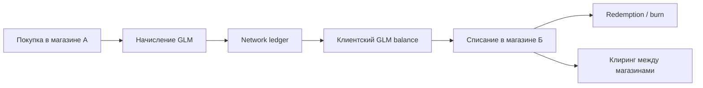
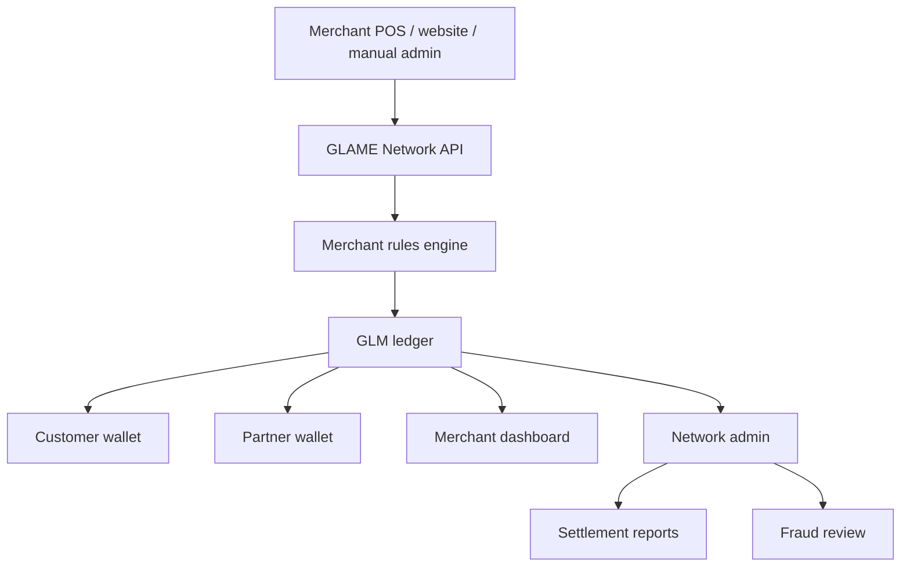

# GLAME Network: партнерская crypto loyalty platform для fashion-магазинов

Дата: 2026-07-01
Обновлено: 2026-07-06
Статус: GLAME Network остается strategic/discovery; CryptoGLAME дошел до controlled mainnet technical pilot, public launch закрыт approval-gate
Связанный документ: `docs/plans/2026-06-30-crypto-glame-strategy.md`
Рабочие названия: GLAME Network / GLAME Loyalty Network / GLM Partner Network

## 1. Идея

Создать отдельный продукт маркетинга и лояльности для сети независимых fashion, jewelry, beauty и lifestyle-магазинов, где покупатели и партнеры получают GLM-монетки за реальные покупки, рекомендации и полезные действия, а затем используют их в общей партнерской сети.

Это не просто бонусная программа одного магазина GLAME. Это общий loyalty layer для нескольких магазинов, которые работают по похожей модели:

- есть розничные и онлайн-продажи;
- есть клиенты с повторными покупками;
- есть стилисты, блогеры, консультанты, амбассадоры и партнеры;
- есть потребность обмениваться качественной аудиторией;
- есть желание давать клиенту бонус, который полезен не только в одном магазине.

Короткая формулировка:

> GLAME Network - это партнерская сеть fashion-магазинов с единой клубной валютой GLM. Магазины начисляют GLM за покупки и рекомендации, а клиенты используют GLM внутри всей сети по правилам каждого участника.

## 2. Почему это отдельный продукт

Внутренний CryptoGLAME развивает полезность GLM внутри GLAME. GLAME Network превращает GLM в B2B2C-инструмент: мы даем другим магазинам готовую программу лояльности, реферальную механику, партнерский кабинет, клиентский баланс, антифрод, правила списания и маркетинговую аналитику.

Главная ценность для GLAME:

- другие магазины начинают выпускать спрос на GLM;
- GLM получает больше мест применения;
- GLAME становится оператором сети, а не только магазином;
- партнеры магазинов приводят клиентов не только себе, но и в общую сеть;
- покупатели получают причину переходить между магазинами-участниками;
- появляется B2B-выручка: subscription, комиссия с оборота, комиссия с redemption или marketplace fee.

Главная ценность для магазина-участника:

- быстрый запуск криптобонусов без собственной разработки;
- доступ к аудитории GLAME и других магазинов;
- готовая реферальная программа для стилистов, блогеров и покупателей;
- более эмоциональная лояльность, чем обычные баллы;
- прозрачная история начислений и списаний;
- возможность участвовать в совместных кампаниях.

## 3. Базовая модель сети

Роли:

| Роль | Описание |
| --- | --- |
| GLAME Network Operator | оператор платформы, ledger, правил, отчетности, антифрода и бренда сети |
| Merchant | магазин-участник, который начисляет и принимает GLM |
| Customer | покупатель, который получает и тратит GLM в сети |
| Referrer / Partner | стилист, блогер, амбассадор или клиент, который приводит покупателей |
| Network Admin | команда GLAME, управляющая правилами, лимитами, модерацией и клирингом |
| Merchant Admin | администратор магазина-участника |

Базовый сценарий:

1. Магазин подключается к GLAME Network.
2. Магазин получает merchant account, настройки начисления и правила приема GLM.
3. Покупатель делает покупку в магазине А.
4. Магазин А начисляет покупателю и/или партнеру GLM.
5. GLM проходит hold до подтверждения покупки и окончания периода возврата.
6. Покупатель тратит GLM в магазине А, GLAME или магазине Б.
7. Сеть фиксирует redemption, burn/treasury-операцию и взаиморасчеты между магазинами.

## 4. Главное отличие от обычной бонусной программы

Обычные бонусы замыкают клиента внутри одного магазина. GLAME Network делает бонусы сетевыми:

- покупатель получает GLM в одном магазине и может использовать в другом;
- партнер приводит клиента в один магазин, но его аудитория остается в общей fashion-экосистеме;
- магазины обмениваются клиентами не хаотично, а через понятные правила и аналитику;
- GLM становится общей клубной валютой fashion-среды, а не скидочным купоном одного бренда.

Важно: GLM не должен позиционироваться как инвестиция. Его ценность создается применимостью в магазинах и сервисах сети, а не обещанием роста цены.

## 5. Продуктовые пакеты для магазинов

### Starter

Для одного магазина или небольшого бренда.

- merchant dashboard;
- ручная выдача GLM;
- QR-код клиента для начисления и списания;
- базовые правила: earn, hold, redeem;
- выгрузка отчетов;
- лимиты списания по категориям.

### Growth

Для магазина с онлайн-продажами и партнерами.

- API-интеграция с сайтом или CRM;
- реферальные коды для стилистов и блогеров;
- партнерский кабинет;
- правила начисления по категориям;
- совместные кампании с другими магазинами;
- антифрод и аудит.

### Network Pro

Для сети магазинов или сильного партнера.

- несколько торговых точек;
- роли сотрудников;
- advanced settlement;
- white-label элементы;
- сегментация и AI-маркетинг;
- индивидуальные лимиты эмиссии;
- доступ к network campaigns.

## 6. Экономика GLM в сети

Нужно разделить внутренний ориентир ценности и финансовые обязательства.

Продуктовое правило:

> 1 GLM может приниматься как 1 рубль внутренней скидочной или сервисной ценности по правилам конкретного магазина, категории, кампании и лимита списания.

Это не означает:

- обязательный выкуп GLM за рубли;
- гарантированный курс;
- обещание доходности;
- обязанность любого магазина принять GLM на 100% заказа.

### Главная фишка: earn/claim по учетной ценности и свободная рыночная цена

Самая сильная версия GLAME Network - это не просто бонусы, а монетка, которую пользователь получает за реальные покупки и привлечение клиентов, может claim в криптокошелек и затем держать, использовать или продать на рынке.

Ключевая механика:

- магазин начисляет GLM за покупку или приведенного клиента по понятной учетной логике;
- например, программа считает `1 GLM = 1 ₽` внутренней бонусной ценности при начислении;
- пользователь не покупает GLM у GLAME по фиксированному курсу, а зарабатывает право claim через реальное полезное действие;
- после hold и подтверждения покупки пользователь может claim GLM в кошелек;
- на бирже/DEX GLM может стоить ниже или выше 1 ₽, потому что цена определяется спросом, дефицитом, utility и ликвидностью;
- если рыночная цена выше 1 ₽, покупка в магазинах становится особенно привлекательной: клиент получает не просто скидочные баллы, а потенциально более ценный торгуемый актив.

Пример:

1. Клиент покупает товар на `50 000 ₽`.
2. Кампания начисляет `5%` в GLM: `2 500 GLM`.
3. В учетной логике это `2 500 ₽` бонусной ценности.
4. После окончания hold клиент claim-ит `2 500 GLM`.
5. Если рынок оценивает `1 GLM = 1,40 ₽`, рыночная стоимость награды равна `3 500 ₽`.
6. Для клиента покупка становится выгоднее, чем обычный cashback.

Это создает маркетинговый крючок:

> Покупайте у участников GLAME Network и получайте GLM, который можно использовать в сети или claim в кошелек. Рыночная цена GLM может отличаться от внутренней учетной ценности.

Важно формулировать аккуратно:

- можно: "GLM начисляется за покупки и рекомендации по правилам программы";
- можно: "после подтверждения покупки GLM можно claim в поддерживаемый кошелек";
- можно: "рыночная цена GLM определяется рынком";
- можно: "если рыночная цена выше внутренней учетной ценности, награда становится ценнее для пользователя";
- нельзя: "GLAME гарантирует, что GLM будет стоить выше 1 ₽";
- нельзя: "покупайте товары ради гарантированной прибыли";
- нельзя: "GLAME гарантирует обратный выкуп или биржевую ликвидность".

### Почему рыночная цена может быть выше 1 ₽

Премия к учетной ценности возможна только если у GLM есть дефицит и реальный спрос:

- GLM нужен для скидок и сервисов в сети магазинов;
- GLM открывает закрытые дропы, статусы и мероприятия;
- количество GLM, доступных для claim, ограничено emission cap;
- часть GLM сжигается при redemption;
- новые магазины создают новый спрос на GLM;
- пользователи покупают GLM перед покупкой, чтобы получить скидку или доступ;
- партнеры и амбассадоры держат GLM ради статуса.

Если GLM выпускается слишком легко, рынок быстро опустит цену. Поэтому правило `earn/claim` должно быть связано с маржей, реальным оборотом и лимитами эмиссии.

### Как не сломать экономику арбитражем

Если пользователь может получить GLM "по 1 ₽" через покупку и продать дороже, появится сильный стимул фармить покупки. Это хорошо, пока фарм означает реальные прибыльные продажи, и опасно, если он превращается в накрутку.

Защиты:

- GLM начисляется только после оплаты и проходит hold до окончания возвратов;
- ставка начисления зависит от маржи категории;
- товары с низкой маржой исключаются или имеют низкий earn rate;
- у кампаний есть бюджет и emission cap;
- крупные claim проходят KYC/AML и fraud review;
- self-referral запрещен;
- подозрительные покупки, возвраты и циклические сделки блокируются;
- для крупных партнерских начислений можно применять vesting;
- merchant видит прогноз скидочной/токеновой нагрузки до запуска кампании.

Правильная экономическая мысль:

> GLM premium на рынке - это не гарантированная доходность, а усилитель маркетинга. Если рынок ценит GLM выше внутренней учетной цены, покупка у партнеров становится привлекательнее. Но сеть должна выпускать GLM только под реальные продажи, которые покрывают стоимость такого стимула.

### Источники начисления

- покупка товара;
- покупка по рекомендации партнера;
- регистрация по приглашению;
- участие в совместной кампании;
- отзыв, UGC, фото или контент после модерации;
- посещение офлайн-точки или мероприятия;
- сервисная активность, ценная для магазина.

### Источники списания

- скидка на заказ в магазине-участнике;
- сервисы стилиста;
- закрытые подборки;
- ранний доступ к дропам;
- мероприятия;
- брендированные подарки;
- доставка или упаковка, если магазин разрешает;
- специальные network offers.

### Лимиты списания

Каждый merchant должен задавать правила приема GLM:

| Тип товара / услуги | Рекомендуемый лимит |
| --- | ---: |
| Новые коллекции | до 5-10% |
| Основной ассортимент | до 10-20% |
| Высокомаржинальные товары | до 20-30% |
| Outlet / clearance | до 30-50% |
| Сервисы и мероприятия | до 50-100% |
| Низкомаржинальные товары | исключить или до 5% |

Формула:

`max_glm_discount = order_total * merchant_category_limit * campaign_multiplier * customer_status_multiplier`

## 7. Клиринг и взаиморасчеты между магазинами

Это главный операционный блок сети.

Проблема: магазин А начислил GLM, а магазин Б принял GLM как скидку. Нужно определить, кто несет скидочную нагрузку и как компенсируется магазин Б.

Возможные модели:

### Модель 1. Merchant-funded GLM

Магазин, который начисляет GLM, финансирует будущую скидочную нагрузку.

- магазин А начислил 1 000 GLM;
- клиент потратил 1 000 GLM в магазине Б;
- сеть удерживает обязательство магазина А перед network pool;
- магазин Б получает компенсацию по правилам клиринга.

Плюс: честная экономика между магазинами.
Минус: сложнее бухгалтерия и договоры.

### Модель 2. Network treasury

Все начисления и списания проходят через общий treasury/pool.

- магазины платят subscription или процент с оборота;
- GLAME Network покрывает часть redemption из общего фонда;
- правила эмиссии жестко ограничены.

Плюс: проще для merchant на старте.
Минус: оператор несет риск неправильной эмиссии.

### Модель 3. Sponsored campaigns

GLM выпускается только под кампании с заранее заданным бюджетом.

- магазин вносит бюджет кампании;
- сеть начисляет GLM в пределах бюджета;
- redemption покрывается из бюджета кампании;
- остаток возвращается или переносится по договору.

Плюс: лучший вариант для MVP.
Минус: меньше ощущения общей свободной валюты.

Рекомендация для запуска: начать с `Sponsored campaigns + ограниченный Network treasury`, а merchant-funded clearing добавить после пилота.

## 8. MVP

Цель MVP: проверить, что 3-5 партнерских магазинов готовы начислять и принимать GLM, а покупатели понимают ценность сетевого бонуса.

Состав MVP:

- единый GLM ledger с merchant dimension;
- merchant profiles;
- правила earn/redeem по магазину;
- QR-сценарий начисления и списания;
- hold до окончания возврата;
- merchant dashboard;
- customer balance;
- redemption queue;
- admin approval для первых списаний;
- базовые отчеты по эмиссии, списанию и остатку;
- manual settlement report;
- оферта/договор для магазина-участника;
- правила программы для клиента.

Что не включать в MVP:

- публичный on-chain Jetton;
- DEX liquidity;
- свободный P2P marketplace;
- публичное обещание, что биржевая цена GLM будет выше 1 ₽;
- автоматический финансовый клиринг;
- обещание фиксированного курса;
- принятие GLM на 100% всех заказов.

Примечание: если стратегически выбирается версия "главная фишка - торгуемая монетка", MVP все равно лучше начинать с off-chain earned ledger и claim queue. Это позволит проверить earn/redemption/fraud/merchant economics до публичной биржевой ликвидности.

## 9. Архитектура MVP

Минимальные сущности:

- `network_merchants`;
- `network_merchant_locations`;
- `network_merchant_users`;
- `network_merchant_rules`;
- `network_campaigns`;
- `network_customer_wallets`;
- `network_partner_wallets`;
- `network_glm_accounts`;
- `network_glm_transactions`;
- `network_redemptions`;
- `network_settlement_periods`;
- `network_settlement_lines`;
- `network_fraud_events`;
- `network_policy_versions`.

Если текущий `glame_token_accounts` и `glame_token_transactions` останутся ядром, их нужно расширить измерениями:

- `merchant_id`;
- `network_id`;
- `campaign_id`;
- `source_merchant_id`;
- `redeem_merchant_id`;
- `funding_type`;
- `settlement_status`;
- `expires_at`;
- `hold_until`;
- `policy_version_id`.

## 10. Интеграции

Стартовые варианты подключения магазина:

### Manual

- начисление через merchant dashboard;
- списание через QR-код клиента;
- подходит для первого офлайн-пилота.

### CSV / Excel

- магазин загружает продажи;
- сеть рассчитывает GLM;
- подходит для магазинов без API.

### API

- create purchase;
- create return;
- issue GLM;
- redeem quote;
- confirm redemption;
- cancel redemption;
- get customer balance;
- get campaign rules.

### 1C / CRM

- синхронизация покупателей;
- импорт продаж;
- возвраты;
- категории товаров;
- отчеты по бонусной нагрузке.

## 11. Пользовательские сценарии

### Покупатель

1. Покупает платье в магазине-партнере.
2. Получает GLM после подтверждения покупки.
3. Видит баланс в приложении/личном кабинете GLAME Network.
4. Получает подборку магазинов, где можно использовать GLM.
5. Списывает часть GLM в GLAME или другом fashion-магазине.
6. Получает новый статус и персональные предложения.

### Магазин

1. Подключается к сети.
2. Настраивает правила начисления и списания.
3. Получает QR/виджет/API.
4. Запускает кампанию: "5% GLM за покупку новой коллекции".
5. Видит новых клиентов из сети.
6. Получает отчет: сколько GLM начислено, списано, сколько новых покупателей пришло.

### Стилист / блогер / партнер

1. Получает партнерский код в сети.
2. Приводит клиента в любой магазин-участник.
3. Получает GLM или комиссию по правилам конкретной кампании.
4. Видит статистику по магазинам.
5. Использует GLM в сети или копит статус.

## 12. Маркетинговые механики

- `GLM Welcome Week`: новые покупатели получают GLM за первую покупку в любом магазине сети.
- `Cross-store bonus`: купил в магазине А, получил повышенный GLM на первую покупку в магазине Б.
- `Stylist route`: стилист собирает образ из товаров нескольких магазинов, клиент получает network GLM.
- `Fashion pass`: статусный доступ к закрытым распродажам за GLM.
- `Double GLM weekend`: совместная акция нескольких магазинов.
- `Local fashion map`: карта партнерских мест, где принимают GLM.
- `Bring your audience`: блогер получает GLM за подтвержденные покупки в нескольких магазинах.

## 13. Бизнес-модель оператора

Возможные источники выручки GLAME Network:

- monthly subscription для merchant;
- onboarding fee;
- комиссия с подтвержденного оборота, прошедшего через network campaigns;
- комиссия с redemption;
- комиссия с marketplace/P2P на позднем этапе;
- платные AI-маркетинг сегменты;
- платные cross-promo кампании;
- premium merchant analytics;
- setup/integration fee для API/1C.

Пример MVP-тарифов для проверки спроса:

| Тариф | Для кого | Модель |
| --- | --- | --- |
| Pilot | 3-5 первых магазинов | бесплатно или символически за case study |
| Starter | малый магазин | фикс в месяц + лимит операций |
| Growth | активный магазин | фикс + процент с campaign turnover |
| Pro | сеть / сильный бренд | индивидуально |

## 14. Governance и правила сети

Нужен единый набор правил, иначе сеть быстро потеряет доверие.

Обязательные политики:

- кто может стать merchant;
- какие категории допустимы;
- как начисляется GLM;
- какие лимиты эмиссии у merchant;
- какой hold применяется по категориям;
- как обрабатываются возвраты;
- как работает redemption;
- кто несет скидочную нагрузку;
- как блокируются злоупотребления;
- какие сообщения можно использовать в маркетинге;
- что запрещено обещать клиентам.

Запрещенные коммуникации:

- "GLM растет в цене";
- "GLM можно гарантированно продать";
- "GLM обеспечен рублем";
- "GLM заменяет деньги";
- "инвестируйте в GLM";
- "получайте пассивный доход".

Разрешенные коммуникации:

- "получайте GLM за покупки";
- "используйте GLM в магазинах сети по правилам программы";
- "GLM открывает доступ к предложениям и сервисам";
- "GLM - клубная валюта партнерской fashion-сети";
- "размер списания зависит от магазина, категории и кампании".

## 15. Юридический и бухгалтерский контур

До запуска с внешними магазинами нужен отдельный legal/accounting review.

Вопросы:

- чем юридически является GLM для клиента;
- как оформляется скидка при списании GLM;
- кто несет бонусную нагрузку при cross-store redemption;
- как отражать merchant-funded кампании;
- как оформлять комиссию оператора;
- нужна ли отдельная оферта клиента GLAME Network;
- нужен ли отдельный договор присоединения merchant;
- как хранить согласия на обработку данных между магазинами;
- как учитывать возвраты и отмены;
- какие лимиты нужны для антифрода и AML/KYC, если появится P2P/on-chain.

MVP должен оставаться off-chain utility loyalty program без публичной продажи токена и без обещаний финансовой доходности.

## 16. Текущий status CryptoGLAME / GLAME partner

Актуально на 2026-07-06.

### Что уже работает

- TON Connect подключение кошелька с `ton_proof`: партнер подтверждает владение TON-адресом.
- Testnet и mainnet GLM Jetton развернуты; mainnet bank mint `10 000 000 GLM` выполнен в treasury/bank wallet.
- Mainnet hot-wallet и treasury настроены, hot-wallet пополнен GLM/TON gas, external signer через Cloudflare Worker прошел smoke-test на малой сумме.
- Admin readiness показывает:
  - GLM/TON gas hot-wallet;
  - GLM/TON gas treasury;
  - pending bridge operations;
  - health auto-transfer, settlement и 1C retry.
- `Баллы -> GLM в TON`:
  - пользователь создает заявку;
  - платформа списывает баллы в 1C;
  - GLM автоматически отправляется из hot-wallet в подтвержденный TON-кошелек;
  - TON transfer подтверждается watcher;
  - заявка закрывается как `processed/settled`.
- `GLM из TON -> баллы 1C`:
  - пользователь отправляет GLM в treasury;
  - watcher находит TON deposit;
  - проверяет sender, amount и jetton transfer notification;
  - начисляет баллы в 1C;
  - закрывает заявку как `processed`.
- On-chain GLM balance считывается из привязанного TON-кошелька и используется для GLM status.
- В истории GLM отображаются и платформенные операции, и внешние on-chain входящие/исходящие движения.
- Telegram bot уведомляет админа о критичных событиях, включая low hot-wallet balance, 1C reconciliation и bridge alerts.
- Admin refill plan показывает, сколько GLM/TON нужно долить в hot-wallet.
- Reward Store включен как витрина и admin queue. Оплата баллами 1C работает через списание баллов и очередь выдачи. Старое внутреннее списание GLM ledger отключено. GLM checkout работает через TON Connect: партнер подтверждает TON transfer GLM в treasury, watcher подтверждает оплату, админ выдает товар/сервис.
- Reward Store получил товарный слой MVP: `quantity_available`, фото товара, отображение `Осталось X шт.` в партнерской витрине и резервирование 1 штуки при оформлении за GLM или баллы.
- Публичный лендинг `/glm` открыт без авторизации: tokenomics, риски, utility-сценарии, офлайн-магазины GLAME, мобильное приложение и реферальный заработок GLM.

### Сверка продукта и реализации на 2026-07-06

| Направление | Факт | Решение |
| --- | --- | --- |
| Партнерские бонусы | Рабочий баланс берется из 1C `К списанию`; платформа больше не опирается на визуальный остаток формы карты как главный источник. | Оставить `К списанию` главным источником для CryptoGLAME, лоты формы карты показывать как диагностику. |
| Баллы -> GLM | Новый spend-flow через отрицательное начисление уменьшает рабочий остаток 1C; GLM отправляется из hot-wallet автоматически через external signer. | Сценарий считать базовым production-flow; не возвращаться к старому `СписанияБонусов`. |
| GLM -> баллы | TON deposit watcher подтверждает входящий GLM в treasury и начисляет баллы 1C. | Оставить auto-retry 1C и operator queue для спорных операций. |
| GLM Store | Товары/услуги можно оформить за баллы 1C или оплатить GLM через TON Connect; есть фото, ограниченный остаток, fulfillment queue и refund settlement по TON tx hash. | Контрольная покупка GLM Store прошла до `fulfilled`; следующий шаг - финальные правила/FAQ и operator runbook для спорных TON tx. |
| Внешние GLM-переводы | Партнер может получить GLM не от платформы; on-chain баланс влияет на GLM status и отображается отдельно от баллов. | Продолжать читать GLM из TON-кошелька, не создавать внутренний GLM-баланс на платформе. |
| Treasury / hot-wallet | Treasury содержит банк GLM; hot-wallet пополняется вручную/через TON Connect admin approval, readiness считает лимиты. GLM refill работает fixed batch: alert ниже `5000 GLM`, пополнение на `5000 GLM`; TON gas доводится до цели. | Авто-refill treasury без подтверждения не включать до production treasury signer/KMS. |
| Рабочая статистика | Testnet/pilot операции не удаляются из audit trail, но `GLM Effectiveness` и `Treasury turnover` считают только операции после `TON_GLM_OPERATIONAL_STATS_START_AT` в текущей сети. | Готово для clean operational start. |
| Admin UX | CryptoGLAME вынесен в отдельный `/admin/crypto`; в `Партнерах` оставлены рефералы, рефоводы, РМК, медиаматериалы, выплаты и настройки начислений. В `/admin/crypto` убраны партнерские блоки `Настройки отчислений`, `РМК`, `Медиаматериалы`. | Дальше можно вынести общие компоненты, но продуктово разделение готово. |
| Mainnet | GLM Jetton deployed, `10 000 000 GLM` minted в bank/treasury, external signer подключен, hot-wallet пополнен, smoke-test выполнен. | Public launch заблокирован до legal/accounting/security/treasury approvals, финальных лимитов и token verification/anti-spam. |

### Проверенные тестовые кейсы

- `Баллы -> GLM`: 100 баллов списаны в 1C, 100 GLM отправлены в TON, операция закрыта.
- `GLM -> баллы`: 250 GLM отправлены в treasury, 250 баллов начислены в 1C, операция закрыта.
- `GLM Store`: товар `GLAME travel pouch` оплачен `900 GLM` через TON Connect, watcher подтвердил deposit, заказ закрыт как `fulfilled`.
- `TON refund`: добавлен admin TON Connect refund из treasury и on-chain settlement по tx hash, проверяющий сумму и получателя Jetton transfer.
- Ошибка `sent_waiting_settlement` после успешного TON transfer исправлена: `ton_auto_transfer.status` теперь становится `settled`, а domain operation синхронизируется.
- Ошибка missing `glame_token_bridge_operations` для новых `GLM -> баллы` заявок исправлена: domain operation создается сразу при заявке.

### Важное уточнение по 1C

В 1C есть минимум два разных взгляда на бонусы:

1. Отчет движений бонусных баллов показывает рабочий доступный остаток через `К списанию`.
2. Форма бонусной карты и отчет остатков бонусных баллов показывают живые начисленные лоты и будущие сгорания.

До исправления spend-flow на pilot-потоке после операций:

- начислено: `750`;
- использовано: `350`;
- рабочее `К списанию`: `400`;
- форма карты / остатки начисленных лотов: `750`.

Для CryptoGLAME рабочим источником считается `К списанию`, потому что именно это значение отражает фактически доступные к использованию баллы. Форма карты 1C дополнительно контролируется как визуальный/лотный слой, чтобы оператор не видел расходящиеся остатки.

Для полного визуального совпадения в 1C найден рабочий OData-путь без чека ККМ. Проблема была в том, что прежний технический документ `НачислениеСписаниеБонусныхБаллов` заполнял табличную часть `СписанияБонусов`: она уменьшала рабочее `К списанию`, но не уменьшала регистр начисленных бонусных лотов, который показывает форма карты.

OData-проверка 2026-07-04:

- `Document_НачислениеСписаниеБонусныхБаллов_СписанияБонусов` содержит только `БонуснаяКарта_Key`, `Количество`, `КорректировкаКСписанию`;
- в этой табличной части нет полей лота, даты первоначального начисления или даты сгорания;
- наши spend-документы пишут одну строку `Expense` с `Начислено=points` и `КСписанию=points` на текущую дату;
- реальные РМК/кассовые списания идут через `Document_ЧекККМ.БезналичнаяОплата` со строкой `ВидОплаты = "Бонусы"` и `СуммаБонусов`;
- после `ЧекККМ` 1C сама распределяет расход по исходным лотам: появляются движения `Expense` по `Начислено` и отдельные будущие движения по `КСписанию` с `ДатаПервоначальногоНачисления`.

Проверенные варианты:

- `СписанияБонусов: Количество=10, КорректировкаКСписанию=0` - лоты не меняются, рабочий остаток не меняется;
- `СписанияБонусов: Количество=0, КорректировкаКСписанию=10` - рабочий остаток меняется, лоты не меняются;
- `НачисленияБонусов: Количество=-10` - рабочий остаток меняется `400 -> 390`, лоты меняются `750 -> 740`; после `Unpost` тестового документа все вернулось обратно.

Выбранное решение:

- для `Баллы -> GLM` используем `Document_НачислениеСписаниеБонусныхБаллов.НачисленияБонусов` с отрицательным `Количество=-points`;
- `СписанияБонусов` больше не используем в новом spend flow;
- `ЧекККМ` остается только для реального списания баллов при покупке в магазине;
- если потребуется отмена заявки, снимаем проведение этого отрицательного начисления.

Контрольный тест 2026-07-04 подтвердил, что новая заявка `Баллы -> GLM` через отрицательное начисление уменьшает и рабочий остаток, и форму карты 1C.

Для исторических операций, проведенных старым способом через `СписанияБонусов`, добавлена диагностическая сверка в админке: `платформа`, `1C К списанию` и `1C лоты`. Repair-workflow лотов был протестирован, но отключен по умолчанию: форма карты 1C и OData-регистр лотов могут вести себя не как один надежный источник, поэтому автоматическое выравнивание лотов может создать отрицательный визуальный остаток. По карте `79782860100` repair-документ `НФ-00000068` снят с проведения; контрольный рабочий баланс сходится: платформа `270`, 1C `К списанию` `270`.

Дополнительное исправление 2026-07-05: reconciliation раньше неверно считал `AccumulationRegister_БонусныеБаллы_RecordType` как сумму receipts/expenses по `RecordType`. В 1C Fresh рабочий остаток отчета должен считаться как `sum(Начислено) - sum(КСписанию)` по активным движениям `Period <= now`. После исправления тестовая карта `79782860100` снова сходится: платформа `270`, 1C расчетный рабочий остаток `270`.

### Текущие технические решения

- Основная бонусная программа для CryptoGLAME-операций: `Бонусная`.
- `ONEC_GLM_BRIDGE_SPEND_BONUS_PROGRAM_KEY` должен совпадать с `ONEC_BONUS_PROGRAM_KEY`.
- Нельзя больше использовать старый crypto bonus program key для списаний.
- Для расчетного баланса используем регистр `AccumulationRegister_БонусныеБаллы_RecordType`, активные строки с `Period <= now`.
- Для визуальной диагностики лотов используем `AccumulationRegister_НачисленияБонусныхБаллов_RecordType`.

### Следующий порядок работ

1. Зафиксировать в админке и партнерском кабинете подпись: `Баллы GLAME` = фактически доступно к списанию по `К списанию`, а не визуальный остаток формы карты 1C.
2. Добавить admin diagnostics по конкретному партнеру:
   - [x] платформа `loyalty_points`;
   - [x] 1C `К списанию`;
   - [x] 1C начисленные лоты;
   - [x] расхождение формы карты;
   - последние документы `НачислениеСписаниеБонусныхБаллов`.
3. Сделать отдельный тестовый spike по штатному списанию 1C:
   - [x] проверить варианты `СписанияБонусов`;
   - [x] проверить отрицательное `НачисленияБонусов`;
   - [x] заменить текущий технический spend flow на отрицательное начисление;
   - [x] провести новую заявку `Баллы -> GLM` и сверить форму карты 1C.
4. Для старых операций, проведенных прежним способом:
   - [x] добавить admin reconciliation `платформа / 1C К списанию / 1C лоты`;
   - [x] протестировать repair `Выровнять лоты`;
   - [x] отключить repair по умолчанию из-за риска отрицательного визуального остатка формы карты;
   - [x] снять проведение тестового repair-документа `НФ-00000068`;
   - [x] оставить Telegram/admin alert только для критичного расхождения `платформа != 1C К списанию`; лотные расхождения показывать как диагностику.
5. Если штатный механизм станет недоступен через OData, подготовить ТЗ для 1C-доработки:
   - метод `CryptoGlameSpendBonuses(card, points, operation_id)`;
   - идемпотентность по `operation_id`;
   - корректное уменьшение рабочих остатков и лотов;
   - возврат документа, баланса до/после и ошибок.
6. Добавить reconciliation alert, если:
   - [x] платформа `loyalty_points` != 1C `К списанию`;
   - [x] pending TON settlement старше лимита;
   - [x] лотные расхождения оставить диагностикой без Telegram-spam.
7. После стабилизации 1C-spend закрыть public mainnet launch gate:
   - [x] production hot-wallet зафиксирован публичным адресом и подключен через external signer без seed в backend;
   - [x] mainnet treasury/bank wallet утвержден: `UQAY9ub55iQ3U9G8r6h74Mk2GPaNVy8YkJSHkGyV1-Hn_7Dq`;
   - [x] mainnet GLM Jetton deployed: master `EQBaHSwImRBl25rWgCpG1is_g_fByAt-dT36APLnywC7v2fl`, metadata/icon опубликованы;
   - [x] первичный bank mint выполнен и on-chain подтвержден: `10 000 000 GLM` в treasury/bank wallet;
   - [x] readiness gate проверяет production signer/legal/security/treasury approvals;
   - [x] подключить external signer без seed в backend runtime env: Cloudflare Worker signer развернут, secrets вынесены в Cloudflare, backend env подключен, health/preflight check возвращает `ok`;
   - [x] Cloudflare signer обновлен на mainnet Jetton master;
   - [x] mainnet hot-wallet пополнен до рабочего запаса и проверен external signer smoke-test: `1 GLM` отправлен из hot-wallet в treasury;
   - [x] утвердить базовые production hot-wallet refill limits: alert ниже `5000 GLM`, refill batch `5000 GLM`, TON gas минимум `0.5`, цель `2`;
   - [~] security/legal/accounting/treasury approvals: сохранение approval-флагов добавлено в `/admin/crypto`, реальные решения еще должны быть подтверждены;
   - [~] публичные правила/оферта/FAQ: базовые policy/risk/bridge/FAQ опубликованы, до mainnet нужен legal approval и финальная оферта;
   - [x] operator runbook для спорных TON tx/refund/refill/1C retry;
   - [x] external signer mainnet smoke-test на малой сумме выполнен.
8. Довести GLM Store до on-chain utility:
   - [x] admin CRUD товаров и партнерская витрина;
   - [x] отключить внутреннее списание GLM ledger как checkout;
   - [x] добавить оплату товаров баллами 1C;
   - [x] добавить TON Connect transaction для оплаты товара в treasury;
   - [x] добавить watcher settlement для `glm_store_item`;
   - [x] переводить оплаченную покупку в admin queue выдачи;
   - [x] добавить фото, доступное количество и `Осталось X шт.` в партнерскую витрину;
   - [x] провести контрольный платеж GLM Store на testnet и проверить появление заказа в admin queue;
   - [x] закрыть тестовый заказ как `fulfilled`;
   - [x] добавить treasury turnover dashboard для входящих GLM, refill hot-wallet, refund-required обязательств и verified refund tx settlement.

## 17. Roadmap

### Этап 0. Discovery

- [ ] выбрать 5-10 потенциальных магазинов для интервью;
- [ ] проверить готовность начислять и принимать внешний бонус;
- [ ] выяснить допустимую скидочную нагрузку;
- [ ] проверить интерес к обмену аудиторией;
- [ ] согласовать предварительные правила клиринга;
- [ ] выбрать 3-5 магазинов для пилота.

### Этап 1. Network MVP без on-chain

- [ ] добавить merchant model;
- [ ] расширить GLM ledger merchant/campaign измерениями;
- [ ] добавить merchant dashboard;
- [ ] добавить QR earn/redeem;
- [ ] добавить hold и refund workflow;
- [ ] добавить rules engine для лимитов списания;
- [ ] добавить manual settlement report;
- [ ] подготовить merchant agreement draft;
- [ ] подготовить customer rules draft.

### Этап 2. Пилот 3-5 магазинов

- [ ] запустить 1-2 sponsored campaigns;
- [ ] включить начисление GLM за покупки;
- [ ] включить ограниченное списание GLM;
- [ ] собрать аналитику по новым клиентам;
- [ ] измерить redemption rate;
- [ ] проверить возвраты и спорные операции;
- [ ] вручную сверить клиринг.

### Этап 3. Интеграции и масштабирование

- [ ] API для merchant website/POS;
- [ ] CSV import;
- [ ] 1C/CRM connectors;
- [ ] автоматические отчеты;
- [ ] расширенный fraud scoring;
- [ ] merchant billing;
- [ ] network campaign builder.

### Этап 4. Advanced loyalty network

- [ ] статусы клиентов в сети;
- [ ] статусы партнеров/стилистов;
- [ ] совместные подборки нескольких магазинов;
- [ ] AI-сегментация покупателей;
- [ ] marketplace offers;
- [ ] partner attribution across merchants;
- [ ] treasury/burn analytics.

### Этап 5. On-chain readiness и controlled mainnet pilot

- [x] testnet TON Connect с `ton_proof`;
- [x] testnet GLM Jetton;
- [x] hot-wallet auto-transfer для `Баллы -> GLM`;
- [x] watcher settlement для `GLM -> баллы`;
- [x] treasury/hot-wallet balance readiness;
- [x] Telegram admin alerts для low-balance и bridge health;
- [x] daily audit hash;
- [x] GLM Store TON checkout, fulfillment queue и verified refund settlement по tx hash;
- [x] отдельный admin-раздел `/admin/crypto`;
- [ ] public proof of ledger snapshots;
- [x] 1C spend flow, который уменьшает и рабочий остаток, и визуальные лоты формы карты;
- [ ] legal approval для on-chain utility/bridge;
- [ ] policy для transferable GLM;
- [ ] KYC/AML правила для крупных операций;
- [x] TON Jetton testnet rehearsal completed;
- [x] фирменная GLAME coin icon обновлена до `/static/glm_policy/glm-token-icon-v3.png`: круглая монета с точным GLAME-знаком без темной квадратной плашки; Jetton metadata и ton-assets verification смотрят на v3.
- [~] token verification / anti-spam package для Tonkeeper готов: `GLM.yaml`, JSON-entry, PR description и публичные metadata/icon URL проверены; осталось отправить PR в `tonkeeper/ton-assets` и дождаться мержа/пропагации.
- [x] production signer через external signer: backend принимает только external signer endpoint flow без seed, Cloudflare Worker reference signer развернут, KV/secrets подключены, health endpoint проверен;
- [x] GLM Jetton mainnet deployed и первичный bank mint `10 000 000 GLM` on-chain verified;
- [x] external signer mainnet smoke-test: `1 GLM` отправлен из hot-wallet в treasury;
- [~] production treasury limits/daily cap/two-step approval: базовый hot-wallet refill threshold/batch готов, max per tx/daily cap и two-step approval остаются go/no-go задачами;
- [x] mainnet smoke-test на малой сумме;
- [ ] DEX/listing strategy без обещания цены;
- [ ] emission policy, которая объясняет, почему GLM нельзя бесконечно фармить через покупки;
- [ ] финальные правила earned GLM -> on-chain GLM и GLM -> баллы без внутреннего platform GLM balance.

## 18. KPI

Продуктовые:

- количество merchant applications;
- количество активных магазинов;
- количество покупателей с GLM;
- earn transactions;
- redemption transactions;
- cross-store redemption rate;
- repeat purchase rate;
- доля покупателей, пришедших из сети;
- partner-driven sales;
- activation rate после первого начисления.

Экономические:

- GMV магазинов в кампаниях;
- incremental revenue;
- merchant subscription revenue;
- operator commission;
- GLM issued;
- GLM redeemed;
- GLM expired/burned;
- outstanding GLM liability estimate;
- средний лимит списания;
- скидочная нагрузка по merchant.

Защитные:

- refund rate;
- fraud flags;
- self-referral attempts;
- concentration of GLM by user;
- merchant over-emission;
- settlement disputes;
- customer complaints;
- legal/policy incidents.

## 19. Риски и защита

| Риск | Защита |
| --- | --- |
| Магазины боятся платить за скидку, использованную у другого магазина | начать со sponsored campaigns и manual settlement |
| GLM воспринимается как финансовый актив | off-chain MVP, utility wording, no investment language |
| Перевыпуск GLM партнерами | лимиты эмиссии, approval, campaign budget |
| Съедание маржи магазинов | merchant-level category limits |
| Непонятный клиринг | прозрачные settlement reports |
| Возвраты после начисления | hold до окончания возвратного периода |
| Саморефералы и накрутки | fraud scoring, лимиты, ручная модерация |
| 1C форма карты, отчет движений и OData-регистры могут расходиться после тестовых документов | рабочий источник для CryptoGLAME - `К списанию`; reconciliation считает `sum(Начислено)-sum(КСписанию)`, лоты остаются диагностикой, cleanup только по runbook |
| Конфликт аудиторий между магазинами | правила категорий, opt-in cross-promo |
| Разный уровень сервиса у merchant | merchant vetting и возможность исключения |
| Сложная юридическая модель | legal/accounting review до публичного запуска |

## 20. Рекомендуемая стартовая стратегия

Лучший первый шаг - не строить сразу огромную открытую сеть, а сделать controlled pilot:

1. Выбрать 3-5 близких по аудитории, но не полностью конкурирующих магазинов.
2. Запустить GLM только off-chain.
3. Работать через sponsored campaign budgets.
4. Разрешить списание только до 10-20% заказа.
5. Делать клиринг вручную раз в месяц.
6. Сначала принимать GLM в GLAME и 1-2 дружественных магазинах.
7. Измерить, приводит ли общий GLM реальных новых покупателей.
8. Только после этого автоматизировать settlement и API.

## 21. Первые решения, которые нужно принять

- Как назвать продукт: `GLAME Network`, `GLAME Club Network`, `GLM Network` или другое.
- Какие категории магазинов допускаем на старте: jewelry, одежда, обувь, beauty, интерьер, lifestyle.
- GLM один общий для всех или у merchant есть branded sub-points с конвертацией в GLM.
- Кто финансирует redemption в MVP: campaign budget, network treasury или merchant-funded.
- Какой максимальный процент списания разрешаем в первом пилоте.
- Нужен ли отдельный customer app сразу или достаточно GLAME app + web wallet.
- Какой минимальный договорный пакет нужен для merchant pilot.
- Какой cleanup-runbook использовать для старых тестовых 1C-документов: новая тестовая карта предпочтительнее массового удаления документов.

## 22. Резюме

GLAME Network может стать большим самостоятельным продуктом: не "крипта ради крипты", а маркетинговая сеть для fashion-магазинов, где GLM работает как общий слой лояльности, рефералов, статусов и cross-store customer exchange.

Самая сильная версия идеи: GLAME становится оператором клубной экономики для независимых магазинов. Чем больше качественных партнеров принимает GLM, тем полезнее монетка, тем больше причин у клиентов возвращаться в сеть, а не только в один магазин.

Самая безопасная версия запуска: off-chain ledger, sponsored campaigns, лимиты списания, hold, ручной settlement и строгая коммуникация без инвестиционных обещаний.

## 23. Публичная страница GLM

- [x] Добавлен landing `/glm`: публичное описание GLM Coin, utility-сценариев, tokenomics, treasury/hot-wallet модели, roadmap и рисков без инвестиционных обещаний.
- [x] Landing `/glm` расширен офлайн-блоком GLAME Ялта / GLAME Симферополь с фото и объяснением, что GLM utility поддержана реальными баллами лояльности 1C за реальные покупки украшений, но не является гарантией цены или выкупа.
- [x] Landing `/glm` расширен блоком GLAME app: показан мобильный каталог и зафиксировано, что партнер может получать GLM за подтвержденные покупки рефералов по правилам программы.
- [x] Jetton metadata и ton-assets verification package дополнены URL `https://partner.glamejewelry.ru/glm`.
- [ ] После финального legal wording использовать landing как основную публичную ссылку для партнеров, wallet verification и token trust review.
