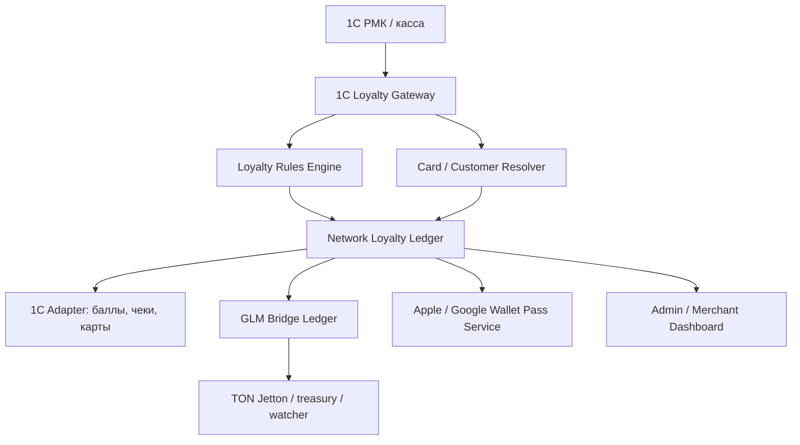

# Внешний сервер лояльности 1С + GLAME Network + Wallet-карты

Дата: 2026-07-06
Статус: discovery / architecture plan
Связанные документы:

- `docs/plans/2026-06-30-crypto-glame-strategy.md`
- `docs/plans/2026-07-01-glame-network-crypto-loyalty-platform.md`
- `backend/LOYALTY_BALANCE_SOURCE.md`
- `docs/integrations/1c/1C_INTEGRATION.md`

## 1. Короткий ответ

Да, внешний сервер лояльности для 1С можно сделать, но важно правильно назвать архитектуру.

В 1С "сервер лояльности" обычно означает HTTP-сервис, через который рабочее место кассира или отдельная 1С-база получает данные программ лояльности: карты, скидки, бонусы, сертификаты, промокоды и расчет применимых скидок. На скриншоте включен режим "сервер лояльности - получатель данных": РМК будет обращаться к указанному адресу и ожидать совместимый API.

Для GLAME правильная целевая модель:

```text
РМК / 1С касса
  -> 1C-compatible loyalty API
  -> GLAME Loyalty Server
  -> GLAME Network ledger / rules / anti-fraud
  -> 1C bonus points adapter
  -> GLM bridge / TON / Wallet cards
```

Физическая касса должна принимать обычные бонусные баллы 1С. GLM не принимаем напрямую в РМК: клиент сначала делает `GLM -> баллы 1С`, затем касса списывает баллы как обычный способ лояльности. Это уже совпадает с текущей CryptoGLAME-стратегией.

## 2. Цель

Создать собственный сервер лояльности GLAME, который:

- подключается к 1С/РМК как внешний источник расчета скидок, карт и бонусов;
- сначала обслуживает собственные магазины GLAME;
- затем подключает магазины-партнеры как merchants в GLAME Network;
- связывает обычную кассовую лояльность 1С с GLM через контролируемый bridge;
- выпускает цифровые карты лояльности в Apple Wallet / Google Wallet с QR/barcode;
- дает единый кабинет администрирования правил, лимитов, кампаний, партнеров, балансов и клиринга.

## 3. Что именно 1С ожидает от сервера лояльности

По документации и типовой логике 1С сервер лояльности используется для:

- проверки подключения (`ping`);
- получения данных о дисконтных/бонусных картах;
- расчета автоматических скидок по составу чека;
- работы с промокодами;
- работы с бонусами и подарочными сертификатами;
- возврата в РМК рассчитанных скидок, доступных бонусов и ограничений списания.

Официальная документация 1С описывает HTTP-сервис `СервисЛояльности`; в актуальной документации сервера лояльности 3.0.11 среди методов упоминаются `ping`, `calculatediscounts` и `promocodeinfo`.

Практический вывод: нельзя просто сделать "любой REST API". Нужно либо:

1. реализовать 1C-compatible HTTP API, который понимает конкретная версия РМК/УНФ/Розницы;
2. либо оставить 1С типовым поставщиком лояльности, а GLAME подключить к 1С через расширение/адаптер.

## 4. Две архитектурные опции

### Опция A. GLAME как прямой сервер лояльности для РМК

РМК в настройках указывает адрес GLAME Loyalty Server, логин и пароль. GLAME реализует совместимые endpoints сервера лояльности 1С.

Плюсы:

- 1С становится тонким кассовым клиентом;
- все правила, партнеры, GLM-логика и сеть живут в GLAME Platform;
- проще масштабировать на партнеров с разными учетными системами.

Минусы:

- нужно точно воспроизвести контракт 1С для целевых версий РМК/УНФ/Розницы;
- API может отличаться между релизами и конфигурациями;
- нужны contract tests на живой тестовой базе 1С;
- выше риск кассовых сбоев, если ответ сервера не совпадет с ожиданиями РМК.

### Опция B. 1С остается поставщиком для РМК, GLAME работает через 1С-адаптер

РМК говорит с типовым сервером лояльности 1С, а GLAME Platform синхронизирует клиентов, карты, баллы, кампании и bridge-операции через OData/расширение/регламентные задания.

Плюсы:

- меньше риска поломать кассу;
- быстрее пилотировать на собственном магазине;
- текущие наработки по OData, бонусным регистрам и `GLM <-> баллы 1С` используются без резкого разворота;
- РМК продолжает работать в привычном контуре.

Минусы:

- часть логики все еще живет в 1С;
- для партнеров с разными 1С нужна настройка адаптера;
- не все партнерские сценарии будут real-time без доработки 1С.

### Рекомендация

Идти поэтапно:

1. MVP для своего магазина делать по опции B, чтобы не рисковать кассой.
2. Параллельно снять реальный HTTP-контракт РМК с типового сервера лояльности через reverse proxy.
3. После contract tests сделать опцию A как отдельный `onec-loyalty-compatible-gateway`.
4. Для партнеров поддерживать оба режима: "через 1С-адаптер" и "прямой GLAME loyalty API".

## 5. Целевая архитектура



Главные модули:

- `1C Loyalty Gateway` - совместимый слой для РМК: ping, карты, расчет скидок, промокоды, бонусы, сертификаты.
- `Rules Engine` - правила начисления, списания, скидок, hold, лимитов, категорий, кампаний.
- `Network Ledger` - бухгалтерия loyalty-событий: earn, redeem, reserve, release, reversal, settlement.
- `1C Adapter` - чтение и запись баллов 1С, документы начисления/списания, сверка регистров.
- `GLM Bridge` - `points_to_glm`, `glm_to_points`, TON settlement, treasury/hot-wallet, KYC/AML limits.
- `Wallet Pass Service` - выпуск и обновление карт Apple Wallet / Google Wallet.
- `Merchant Dashboard` - правила магазина, лимиты, отчеты, клиринг, API keys.
- `Anti-fraud / Risk` - возвраты, self-referral, подозрительные чеки, лимиты операций.

## 6. Основные бизнес-сущности

### Merchant

Магазин-участник сети.

Поля:

- `id`, `name`, `legal_name`;
- `status`: `draft`, `pilot`, `active`, `paused`;
- `onec_mode`: `native_1c_provider`, `glame_gateway`, `api_only`;
- `settlement_model`: `merchant_funded`, `network_pool`, `hybrid`;
- `earn_limits`, `redeem_limits`, `monthly_emission_cap`;
- `stores`, `cash_registers`, `api_keys`.

### Customer

Единый покупатель сети.

Поля:

- телефон, email, ФИО;
- wallet pass id;
- linked TON wallet;
- consent flags;
- network status/tier;
- customer identifiers в 1С разных merchants.

### Loyalty Card

Карта клиента в сети.

Поля:

- `card_number`;
- `barcode_value`;
- `wallet_pass_serial`;
- `merchant_scope`: конкретный магазин или network-wide;
- `status`: active/blocked/merged;
- ссылки на карты 1С.

### Ledger Transaction

Неизменяемая запись движения.

Типы:

- `earn`;
- `hold`;
- `release`;
- `redeem`;
- `reserve`;
- `reversal`;
- `bridge_points_to_glm`;
- `bridge_glm_to_points`;
- `settlement`;
- `manual_adjustment`.

### Campaign / Rule

Правило начисления или списания.

Примеры:

- 5% баллами на категорию;
- до 20% списания баллами;
- двойные GLM за партнерский чек;
- запрет списания на низкомаржинальные товары;
- hold 14 дней до окончания периода возврата.

## 7. Кассовые сценарии

### Сценарий 1. Покупатель предъявляет Wallet-карту на кассе

1. Покупатель открывает Apple Wallet / Google Wallet.
2. Кассир сканирует QR/barcode.
3. РМК отправляет карту на сервер лояльности.
4. GLAME находит customer/card/merchant.
5. GLAME возвращает доступный бонусный баланс, статус, доступные скидки.
6. РМК рассчитывает чек с применимыми скидками.
7. После оплаты чек отправляется в 1С/GLAME.
8. GLAME начисляет бонусы/GLM после правил hold.

### Сценарий 2. Списание баллов 1С на кассе

1. Кассир выбирает списание бонусов.
2. GLAME проверяет доступный лимит списания по карте, чеку, категории и merchant rules.
3. РМК проводит оплату бонусами как обычную 1С-операцию.
4. GLAME получает событие чека и пишет ledger.
5. Reconciliation сверяет чек, регистр бонусов 1С и GLAME ledger.

### Сценарий 3. Клиент хочет потратить GLM в физическом магазине

1. До оплаты клиент в приложении делает `GLM -> баллы 1С`.
2. TON transfer уходит в treasury GLAME.
3. Watcher подтверждает Jetton transfer.
4. 1C Adapter начисляет баллы на карту.
5. Wallet-карта обновляет баланс.
6. На кассе клиент списывает уже обычные баллы 1С.

Это принципиально безопаснее, чем принимать GLM напрямую в РМК.

### Сценарий 4. Возврат товара

1. Возврат приходит из 1С или создается на кассе.
2. GLAME находит исходный чек.
3. Начисленные бонусы/GLM отменяются полностью или пропорционально.
4. Если GLM уже выведен, операция попадает в debt/recovery queue.
5. Если были списаны баллы, выполняется компенсация по правилам 1С и merchant settlement.

## 8. Wallet-карты

Wallet-карта - это не платежная карта и не криптокошелек. Это удобный носитель идентификатора клиента и статуса лояльности.

Что показываем в карте:

- название `GLAME Club` / `GLAME Network`;
- QR/barcode с `card_number` или signed token;
- имя клиента;
- уровень: Start / Muse / Prive / Ambassador;
- доступные баллы 1С;
- pending GLM / linked TON status только как информационный блок;
- последние акции;
- ссылка на приложение или web cabinet.

### Apple Wallet

Нужно:

- Apple Developer Account;
- Pass Type ID certificate;
- backend для генерации `.pkpass`;
- endpoint для обновлений pass;
- push notification для обновления баланса;
- уникальный `serialNumber` на карту.

### Google Wallet

Нужно:

- Google Wallet issuer account;
- JWT/class/object модель карты;
- backend для создания loyalty object;
- обновление баланса через Google Wallet API.

### Важное ограничение

Баланс на Wallet-карте должен быть справочным. Источник истины остается:

- для кассовых баллов - 1С-регистр / GLAME reconciliation;
- для GLM - TON wallet + bridge ledger;
- для pending/hold - GLAME ledger.

## 9. MVP-реализация для своего магазина

### Цель MVP

Запустить Wallet-карту GLAME и кассовый сценарий с 1С без смены всей кассовой архитектуры.

### Объем MVP

- единая карта клиента GLAME;
- выпуск Apple Wallet pass с QR/barcode;
- ручная или полуавтоматическая привязка карты к 1С-дисконтной карте;
- отображение баланса бонусов из 1С;
- `GLM -> баллы 1С` перед покупкой;
- `баллы 1С -> GLM` из приложения;
- журнал операций и reconciliation;
- admin-экран статусов и ошибок.

### Что не входит в MVP

- прямое принятие GLM на кассе;
- публичная торговля GLM;
- автоматический клиринг с партнерами;
- универсальная совместимость со всеми версиями 1С;
- сложные сетевые кампании между несколькими merchants.

## 10. Discovery: что нужно проверить в 1С

1. Версия конфигурации: УНФ/Розница/РМК, релиз, режим Fresh или локальная база.
2. Какой именно адрес ожидает поле `server/1cBaseName/hs/serviceName/`.
3. Какие HTTP endpoints РМК вызывает при:
   - проверке подключения;
   - открытии смены;
   - сканировании карты;
   - расчете скидок;
   - списании бонусов;
   - возврате чека;
   - работе офлайн/при медленном соединении.
4. Формат request/response: JSON/XML, заголовки, auth, кодировки, обязательные поля.
5. Как РМК ведет себя при timeout.
6. Какие данные кэшируются локально.
7. Можно ли подключить наш endpoint без расширения 1С.
8. Нужно ли публиковать типовой `СервисЛояльности` как эталон и проксировать его.

Лучший способ: поставить тестовую 1С-базу, включить типовой сервер лояльности, поставить reverse proxy между РМК и 1С, записать реальные запросы/ответы, затем написать contract tests.

## 11. Технический план по этапам

### Этап 0. Discovery и контракт 1С

Результат:

- матрица версий 1С;
- captured HTTP contract;
- Postman/HTTP коллекция;
- contract tests;
- решение, какие endpoints делаем в MVP.

Задачи:

- поднять тестовую РМК/УНФ/Розницу;
- опубликовать типовой `СервисЛояльности`;
- записать трафик через nginx/mitm/reverse proxy;
- описать payloads;
- проверить Basic Auth и таймауты;
- описать offline/fallback режим.

### Этап 1. Loyalty Core

Результат:

- базовая модель merchants/customers/cards/ledger/rules;
- API для поиска карты и расчета доступных скидок;
- admin CRUD для правил.

Задачи:

- добавить таблицы `loyalty_merchants`, `loyalty_cards`, `loyalty_rules`, `loyalty_ledger`, `loyalty_receipts`;
- сделать idempotency keys для всех кассовых операций;
- выделить `loyalty_rules_engine`;
- сделать audit trail;
- добавить ручные корректировки с причиной.

### Этап 2. 1C Adapter для своего магазина

Результат:

- чтение баланса из правильного регистра 1С;
- начисление и списание баллов через подтвержденные документы;
- сверка с GLAME ledger.

Задачи:

- использовать `AccumulationRegister_БонусныеБаллы_RecordType` как источник текущего остатка;
- для `Баллы -> GLM` использовать отрицательное начисление, а не прямое `СписанияБонусов`, согласно текущему исследованию;
- для `GLM -> баллы` использовать уже реализованный flow начисления;
- добавить retry/repair queue;
- добавить daily reconciliation report.

### Этап 3. Wallet Pass Service

Результат:

- Apple Wallet pass для клиента GLAME;
- QR/barcode сканируется на кассе;
- баланс обновляется после операций.

Задачи:

- получить Apple Pass Type ID certificate;
- реализовать генерацию `.pkpass`;
- добавить `GET /api/wallet/apple/pass/{card_id}`;
- добавить pass update endpoints;
- добавить push update после изменения баланса;
- подготовить Google Wallet слой после Apple MVP.

### Этап 4. 1C-compatible Gateway

Результат:

- РМК может подключиться к GLAME Loyalty Server напрямую в тестовом контуре.

Задачи:

- реализовать `ping`;
- реализовать card lookup;
- реализовать discount calculation;
- реализовать promocode lookup;
- реализовать bonus balance / bonus spend response;
- покрыть все captured cases contract tests;
- добавить slow connection mode;
- добавить локальный расчет скидок/fallback policy, если РМК это поддерживает.

### Этап 5. CryptoGLAME integration

Результат:

- GLM связан с кассовой лояльностью через bridge, без прямого принятия GLM в физическом магазине.

Задачи:

- связать Loyalty Core с `glame_token_bridge_operations`;
- добавить merchant-level лимиты `glm_to_points`;
- обновлять Wallet-карту после bridge;
- показывать клиенту "перевести GLM в баллы для покупки";
- добавить антифрод для быстрых циклов `GLM -> баллы -> покупка -> возврат`;
- связать возвраты 1С с GLM reversal/debt queue.

### Этап 6. Партнерский пилот

Результат:

- первый партнер подключен к GLAME Network.

Задачи:

- merchant onboarding checklist;
- договор/оферта/правила сети;
- API keys и sandbox;
- отдельные merchant limits;
- settlement report;
- партнерский dashboard;
- ручной клиринг в первом пилоте;
- после 1-2 циклов сделать semi-automatic clearing.

### Этап 7. Network settlement

Результат:

- сеть может учитывать, кто начислил бонус/GLM и кто принял его как скидку.

Задачи:

- выбрать модель финансирования: merchant-funded, network pool или hybrid;
- сделать ledger settlement entries;
- monthly statements для merchants;
- dispute workflow;
- payout/invoice export;
- caps по campaign/merchant/month;
- отчет маржинальности и нагрузки на скидки.

## 12. API-черновик внутреннего GLAME Loyalty Server

Это не финальный 1C-compatible контракт, а внутренняя нормализованная модель.

```http
POST /api/loyalty/cards/resolve
POST /api/loyalty/receipts/calculate
POST /api/loyalty/receipts/commit
POST /api/loyalty/receipts/refund
POST /api/loyalty/bridge/glm-to-points
POST /api/loyalty/bridge/points-to-glm
GET  /api/loyalty/customers/{id}/balance
GET  /api/loyalty/merchants/{id}/settlement
```

Пример расчета:

```json
{
  "merchant_id": "glame-yalta",
  "store_id": "yalta-main",
  "cash_register_id": "rmk-01",
  "receipt_id": "draft-123",
  "card_number": "79782860100",
  "items": [
    {
      "sku": "AG25145",
      "name": "Bracelet",
      "category_id": "jewelry",
      "quantity": 1,
      "price": 50000,
      "discountable": true
    }
  ],
  "requested_bonus_spend": 2500
}
```

Пример ответа:

```json
{
  "customer_found": true,
  "available_points": 2700,
  "max_points_to_spend": 2500,
  "discounts": [
    {
      "type": "bonus_spend",
      "amount": 2500,
      "reason": "20% category limit"
    }
  ],
  "earn_preview": {
    "points": 475,
    "glm_hold": 0,
    "hold_days": 14
  },
  "warnings": []
}
```

## 13. Безопасность и надежность

Обязательно:

- Basic Auth/API keys для РМК и партнеров;
- mTLS или IP allowlist для прямого кассового API;
- idempotency key на каждую операцию чека;
- immutable ledger;
- row locks для балансов и bridge-операций;
- timeout budget для кассы: быстрый ответ важнее красивой аналитики;
- degraded mode при недоступности GLAME;
- запрет пробития чека без расчета скидок только если бизнес готов к остановке кассы;
- отдельная очередь reconciliation, не в кассовом request path;
- rate limits;
- audit по всем ручным корректировкам.

## 14. Юридические и продуктовые ограничения

Нельзя обещать:

- гарантированный курс GLM;
- выкуп GLM за рубли;
- доходность;
- что GLM всегда можно потратить в любом магазине без лимитов.

Можно обещать:

- GLM используется по правилам программы;
- GLM можно перевести в баллы 1С через подтвержденный bridge, если сценарий включен;
- магазины задают лимиты списания;
- операции проходят hold, anti-fraud и возвратные корректировки.

Для партнеров нужны:

- договор участия в GLAME Network;
- правила merchant-funded/network-funded скидок;
- политика персональных данных;
- KYC/AML thresholds для crypto-сценариев;
- порядок возвратов;
- settlement rules.

## 15. Основные риски

| Риск | Вероятность | Влияние | Снижение |
| --- | --- | --- | --- |
| Несовместимость с API конкретной версии РМК | Средняя | Высокое | Reverse proxy capture + contract tests |
| Касса зависает из-за медленного сервера | Средняя | Высокое | Timeout budget, cache, degraded mode |
| Двойное списание бонусов | Средняя | Высокое | Idempotency, locks, reconciliation |
| Возврат после вывода GLM | Высокая | Среднее | Hold до периода возврата, debt queue |
| Партнер начисляет слишком много GLM | Средняя | Высокое | Monthly cap, margin rules, approval |
| Wallet показывает устаревший баланс | Средняя | Низкое | Пометка "справочно", push updates |
| Юридическая трактовка GLM как инвестиции | Средняя | Высокое | Utility-only wording, legal review |

## 16. Команда и роли

Минимально:

- backend engineer: loyalty core, 1C adapter, gateway;
- 1C developer: тестовая база, расширение, публикация сервисов, contract capture;
- mobile/backend engineer: Wallet pass;
- product/ops: правила лояльности, кассовые сценарии, партнерский onboarding;
- legal/accounting: GLM, персональные данные, settlement;
- QA: РМК-сценарии, возвраты, offline, таймауты.

## 17. Рекомендуемый первый план на 2 недели

### Неделя 1

- Поднять тестовую 1С/РМК с типовым сервером лояльности.
- Настроить reverse proxy и записать реальные запросы.
- Описать контракт `ping`, расчет скидок, карта, промокод, бонусы.
- Спроектировать таблицы Loyalty Core.
- Подготовить Apple Wallet certificate checklist.

### Неделя 2

- Реализовать `loyalty_cards` + `wallet pass MVP`.
- Связать QR/barcode с существующей картой 1С.
- Сделать экран администратора "карта клиента / баланс / bridge status".
- Сделать первый расчет баланса из 1С и обновление Wallet-карты.
- Подготовить решение: оставляем MVP через 1С-адаптер или начинаем прямой `1C Loyalty Gateway`.

## 18. Definition of Done для MVP

- Клиент получает карту GLAME в Apple Wallet.
- Кассир сканирует QR/barcode и находит клиента/карту.
- Баланс баллов соответствует расчету по 1С-регистру.
- `GLM -> баллы 1С` проходит и обновляет карту.
- `Баллы 1С -> GLM` проходит только при достаточном балансе и пишет bridge ledger.
- Возврат чека создает корректировку или задачу на recovery.
- Есть журнал всех операций.
- Есть ручной repair/retry для 1С-ошибок.
- Есть документированный go/no-go для прямого подключения РМК к GLAME Loyalty Server.

## 19. Источники для discovery

- 1С:ИТС, "Сервер лояльности в 1С:Рознице, 1С:УНФ и 1С:РМК": `https://its.1c.ru/db/metod81/content/8007/hdoc`
- 1С:ИТС, "Документация Сервер лояльности 3.0.11": `https://its.1c.ru/db/metod8dev/content/6024/hdoc`
- 1С:ИТС, "Как подключить web-сервис Сервер лояльности": `https://its.1c.ru/db/content/metod81/src/appsolutionselffinanced/small%20business/retail/i8108007.htm`
