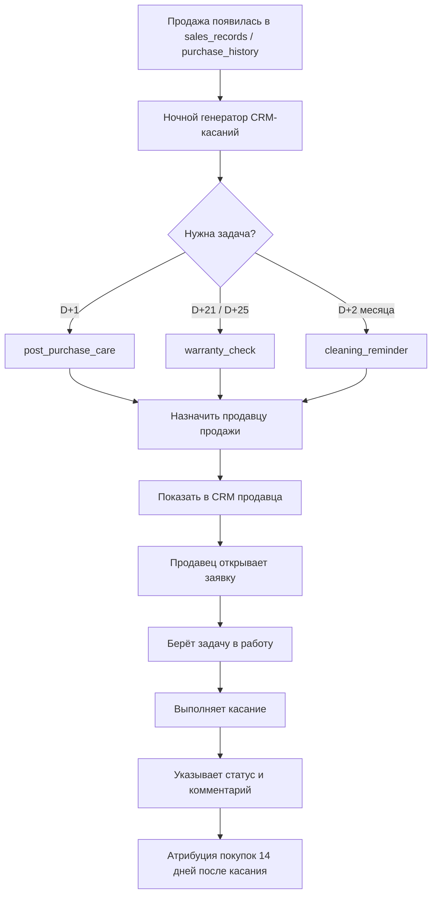

# План реализации CRM-касаний после покупки

Дата создания: 2026-08-05  
Статус: черновик для обсуждения, дополнения и поэтапной реализации

## Цель

Сделать в CRM автоматическую систему задач для продавцов после покупки клиента.

Основная логика: продавцу, который совершил продажу, должна автоматически поступать CRM-задача на взаимодействие с покупателем в нужный момент жизненного цикла покупки. Это не массовая рассылка, а персональные касания от ответственного продавца с корпоративного телефона.

## Базовый сценарий касаний

### 1. На следующий день после покупки

Тип касания: сообщение.

Когда создаём задачу: на следующий календарный день после продажи.

Кому назначаем: продавцу, который оформил продажу.

Цель:

- поблагодарить за покупку;
- закрепить корпоративный контакт GLAME в телефоне покупателя;
- объяснить, по каким вопросам клиент может обратиться: консультация по украшению, подбор к образу, подарок, дистанционный сервис;
- отправить короткие рекомендации по уходу за украшением.

Правило для агента:

- просьба сохранить контакт добавляется только в первое сообщение с корпоративного номера;
- повторно эту просьбу не используем;
- если клиент уже общался с GLAME по этому номеру, фразу можно убрать;
- указываем не только уход, но и пользу канала: консультация, подбор к образу, подарок, дистанционный сервис.

Сообщение лучше отправлять двумя короткими частями, чтобы не было полотна.

Основной вариант.

Сообщение 1:

> Татьяна, здравствуйте! Это Ирина из GLAME, ТРК Центрум. Спасибо, что выбрали украшение у нас.
>
> Сохраните, пожалуйста, этот номер — это корпоративный контакт GLAME. Сюда можно написать, если понадобится консультация по украшению, помощь с подбором к образу или подарком. В том числе можем помочь дистанционно.

Сообщение 2:

> И коротко по уходу: украшение лучше хранить отдельно, снимать перед водой, спортом и сном, а парфюм и крем наносить до украшений. Пусть носится красиво и с удовольствием.

Если покупка была подарком.

Сообщение 1:

> Алексей, здравствуйте! Это Ирина из GLAME, ТРК Центрум. Спасибо, что выбрали подарок у нас.
>
> Сохраните, пожалуйста, этот номер — это корпоративный контакт GLAME. Сюда можно написать, если понадобится помощь с украшением или нужно будет снова подобрать подарок без долгого поиска. Можем помочь и дистанционно.

Сообщение 2:

> Коротко по уходу: украшение лучше хранить отдельно, снимать перед водой, спортом и сном, а парфюм и крем наносить до украшений. Если у получателя появятся вопросы, можно написать нам сюда.

Что фиксируем в задаче:

- покупатель;
- телефон;
- дата покупки;
- продавец;
- магазин;
- изделие/категория, если доступно из чека;
- текст рекомендованного сообщения;
- статус отправки/отработки;
- комментарий продавца;
- была ли покупка в течение 14 дней после касания.

### 2. D+21 / D+25 — сервисно-гарантийное касание

Тип касания: звонок.

Когда создаём задачу: ближе к окончанию гарантийного периода, ориентир D+21 / D+25 после покупки.

Кому назначаем: продавцу, который оформил продажу. Если продавец больше не активен или не найден — ответственному продавцу магазина или управляющему.

Кому не создаём: возвраты, сервисные конфликты, клиенты со статусом “не беспокоить”.

Важное правило тона: не говорим “у Вас заканчивается гарантия” — это звучит тревожно. Говорим мягко: “по недавней покупке хотели уточнить, всё ли хорошо”.

Цель:

- проверить изделие в носке;
- получить обратную связь;
- если всё хорошо — аккуратно открыть тему новинок / “порадовать себя”;
- если есть вопрос по изделию — сначала решить сервисный вопрос, без коммерческого давления.

Скрипт звонка:

```text
Татьяна, здравствуйте! Это Ирина из GLAME, ТРК Центрум.
Вы у нас покупали украшения 01.08.2026 в магазине ТРК Центрум. Помните нас? Мы всегда звоним нашим покупателям перед окончанием гарантийного срока, чтобы уточнить, что всё в порядке с украшениями, которые приобрели. Возможно, есть какие-то вопросы по чистке или хранению украшений?
```

Если всё хорошо:

```text
Отлично, очень рада. Тогда не буду долго отвлекать.
У нас сейчас появились новые украшения, есть несколько позиций, которые действительно лучше увидеть вживую. Когда будете рядом с Центрумом — зайдите, покажем Вам.
```

Если клиент проявил интерес:

```text
Мы отобрали несколько красивых позиций из нового поступления. Я отправлю Вам фото после звонка, а если что-то понравится — сможем оставить к Вашему визиту.
```

Если не в городе:

```text
Понимаю. Тогда отправлю Вам фото того, что сейчас появилось в GLAME. А когда будете в Симферополе, зайдите — покажем вживую. Если что-то понравится, сможем оставить к Вашему приезду.
```

Если проблема:

```text
Понимаю Вас. Тогда сначала разберёмся с изделием. Пришлите, пожалуйста, фото при дневном свете или принесите украшение в GLAME, ТРК Центрум. Мы посмотрим и передадим вопрос на проверку.
```

Сообщение после недозвона:

```text
Татьяна, здравствуйте! Это Ирина из GLAME, ТРК Центрум.
Звонила по Вашей недавней покупке — хотели уточнить, всё ли хорошо с украшением в носке. Если есть вопрос по изделию, напишите нам, пожалуйста.

И если будет настроение посмотреть что-то новое для себя, в магазине сейчас есть несколько красивых позиций — можем показать в Центруме или отправить фото.
```

Что фиксируем:

- дозвонились / не дозвонились;
- результат разговора;
- требуется ли сервис;
- нужна ли повторная связь;
- дата следующего действия;
- комментарий покупателя;
- статус задачи.

### 3. Через 2 месяца после покупки

Тип касания: сообщение.

Когда создаём задачу: через 2 месяца после даты покупки.

Кому назначаем: продавцу, который оформил продажу.

Цель:

- напомнить об уходе;
- предложить чистку или обслуживание;
- мягко вернуть клиента в контакт без прямой агрессивной продажи.

Текст сообщения:

```text
{client_name}, здравствуйте! Это {seller_name} из GLAME, {store_name}.
Вы выбирали у нас украшение несколько месяцев назад. Если часто его носите, уже можно принести в GLAME — посмотрим состояние и при необходимости аккуратно почистим.
Будем рады Вас видеть.
```

Что фиксируем:

- сообщение отправлено / не отправлено;
- клиент ответил / не ответил;
- пришёл на обслуживание;
- была покупка после касания;
- комментарий продавца.

## Источники данных

Для генерации задач нужны следующие данные:

- продажи из основной таблицы продаж;
- покупатель: `customer_id`, ФИО, телефон;
- чек/документ продажи;
- дата продажи;
- магазин;
- продавец, который оформил продажу;
- состав покупки, если доступен;
- гарантийный срок;
- существующие CRM-задачи, чтобы не создавать дубли;
- история коммуникаций, чтобы видеть предыдущие касания.

## Предлагаемые типы CRM-задач

| Код | Название | Канал | Срок создания |
| --- | --- | --- | --- |
| `post_purchase_care` | Уход после покупки | Сообщение | D+1 после покупки |
| `warranty_check` | Сервисно-гарантийное касание | Звонок | D+21 / D+25 после покупки |
| `cleaning_reminder` | Напоминание о чистке | Сообщение | D+2 месяца после покупки |

## Статусы задач

Базовые статусы:

- `new` — новая;
- `in_progress` — в работе;
- `contacted` — связались;
- `no_answer` — нет ответа / не дозвонились;
- `message_sent` — сообщение отправлено;
- `service_requested` — нужен сервис;
- `postponed` — перенесено;
- `overdue` — просрочено, задача не выполнена за 3 календарных дня;
- `completed` — завершено;
- `cancelled` — отменено;
- `duplicate` — дубль.

Для интерфейса можно показывать русские названия:

- Новая;
- В работе;
- Связались;
- Нет ответа;
- Сообщение отправлено;
- Нужен сервис;
- Перенесено;
- Просрочено;
- Завершено;
- Отменено;
- Дубль.

## Правила назначения ответственного

Основное правило:

1. Если в продаже указан продавец и он есть в системе — назначить задачу ему.
2. Если продавец указан в 1С/таблице, но не сопоставлен с пользователем платформы — сохранить имя продавца и показать задачу как “продавец не сопоставлен”.
3. Если продавец не найден — назначить ответственному по магазину.
4. Если ответственный по магазину не задан — назначить управляющему/администратору для ручного распределения.

Важно: в задаче нужно хранить и `seller_user_id`, и исходное имя/ID продавца из продажи, чтобы не терять связь с первичными данными.

## Правила дедупликации

Нельзя создавать дублирующие задачи на одно и то же касание.

Уникальность задачи:

- покупатель;
- документ продажи или ID покупки;
- тип касания;
- плановая дата касания.

Если задача уже есть:

- не создавать новую;
- при необходимости обновить данные продажи/продавца/магазина;
- не затирать комментарии и результат продавца.

## Жизненный цикл задачи



Рабочий сценарий продавца:

1. Продавец заходит на платформу в раздел CRM.
2. Видит список назначенных ему задач.
3. Открывает конкретную заявку/карточку задачи.
4. Нажимает “Взять в работу” или переводит статус в `in_progress`.
5. Выполняет действие:
   - отправляет сообщение с корпоративного телефона;
   - или совершает звонок покупателю.
6. Указывает итоговый статус выполнения.
7. При необходимости оставляет комментарий:
   - что сказал покупатель;
   - нужно ли обслуживание;
   - нужна ли повторная связь;
   - есть ли возражения/вопросы;
   - договорились ли о визите.
8. Если нужен следующий шаг, продавец указывает дату следующего действия.

Правило просрочки:

- на каждую CRM-задачу даётся 3 календарных дня, начиная с даты работы;
- если задача не закрыта за этот период, система переводит её в статус `overdue`;
- продавец не может самостоятельно взять просроченную задачу в работу или обновить результат;
- вернуть просроченную задачу в работу может только администратор: он назначает исполнителя, после чего задача переходит в `in_progress`.
9. После сохранения результат попадает:
   - в историю задачи;
   - в историю коммуникаций покупателя;
   - в аналитику продавца;
   - в аналитику CRM-кампаний/касаний.

## Backend: что нужно реализовать

### 1. Модель правил CRM-касаний

Нужно завести централизованное описание правил:

- тип касания;
- смещение от даты покупки;
- канал;
- шаблон текста/скрипта;
- активность правила;
- приоритет;
- окно дедупликации.

Возможные файлы:

- `backend/app/services/crm_touchpoint_rules.py`
- или расширение существующего `CrmTaskService`.

### 2. Генератор задач

Сервис должен:

1. брать новые продажи за период;
2. определять покупателя;
3. определять продавца;
4. рассчитывать даты касаний;
5. проверять, нет ли уже созданной задачи;
6. создавать задачи в `crm_tasks`;
7. писать событие в `crm_task_events`;
8. возвращать отчёт: создано, пропущено, ошибки сопоставления.

Генератор должен запускаться:

- ночью автоматически;
- вручную из админки кнопкой “Сгенерировать CRM-касания”;
- возможно точечно по одной продаже/покупателю для отладки.

### 3. Расчёт окончания гарантии

Нужно определить бизнес-правило гарантии:

- гарантия фиксированная для всех украшений;
- или зависит от категории/бренда/товара;
- или приходит из 1С;
- или временно используем дефолт, например `purchase_date + N месяцев`.

До уточнения бизнес-правила поле должно быть настраиваемым, а не зашитым навсегда.

### 4. Атрибуция результата

Для каждого касания нужно считать:

- была ли покупка в течение 14 дней после касания;
- количество чеков;
- сумма покупок;
- документы продаж;
- магазин покупки;
- продавец покупки.

Эти данные должны отображаться:

- в CRM-задаче;
- в истории коммуникаций покупателя;
- в аналитике кампаний;
- в аналитике продавцов.

## Frontend: что нужно реализовать

### 1. CRM-задачи продавца

Для продавца задача должна быть простой:

- кто покупатель;
- телефон;
- что сделать;
- готовый текст сообщения или скрипт звонка;
- кнопка/действие “скопировать сообщение”;
- статус;
- комментарий;
- следующая дата действия;
- результат покупок после касания.

Карточка задачи продавца должна поддерживать полный рабочий цикл:

- открыть заявку;
- взять в работу;
- посмотреть причину задачи и рекомендованное действие;
- скопировать текст сообщения или открыть скрипт звонка;
- изменить статус;
- оставить комментарий;
- указать дату следующего действия;
- сохранить результат;
- завершить задачу.

Минимальные действия в карточке:

- “Взять в работу”;
- “Сохранить”;
- “Завершить”;
- “Перенести”;
- “Отменить” — только если задача ошибочная или неактуальная.

Комментарий не должен быть обязательным для всех статусов, но должен быть обязательным для важных исходов:

- `contacted`;
- `no_answer`;
- `service_requested`;
- `postponed`;
- `cancelled`.

### 2. Админский раздел CRM

Администратор должен видеть:

- фильтр по типу касания;
- фильтр по кампании/правилу;
- фильтр по продавцу;
- фильтр по магазину;
- фильтр по статусу;
- просроченные задачи;
- задачи без комментария;
- задачи с покупками после касания.

Нужна отдельная аналитика:

- сколько задач создано по каждому правилу;
- сколько выполнено;
- сколько просрочено;
- конверсия в покупку;
- выручка после касания;
- эффективность по продавцам.

### 3. История коммуникаций покупателя

В карточке покупателя в разделе “Сообщения” нужно показывать:

- CRM-касание после покупки;
- гарантийный звонок;
- напоминание о чистке;
- текст/скрипт;
- статус;
- комментарий продавца;
- результат: была ли покупка в течение 14 дней.

## Шаблоны касаний

### Сообщение D+1: уход после покупки

Черновик:

```text
Здравствуйте, {name}! Спасибо за покупку в GLAME 💛

Подготовили для вас короткие рекомендации по уходу за украшением:
— храните отдельно от других украшений;
— избегайте контакта с водой, парфюмом и бытовой химией;
— протирайте мягкой сухой салфеткой после носки;
— при необходимости приносите украшение в бутик на чистку или проверку.

Сохраните, пожалуйста, этот контакт — вы всегда можете написать нам по любым вопросам: уход, сервис, гарантия или подбор украшений.
```

### Звонок D+21 / D+25: сервисно-гарантийное касание

Скрипт:

```text
{name}, здравствуйте! Это {seller_name} из GLAME, {store_name}.
Вы у нас покупали украшения {purchase_date} в магазине {store_name}. Помните нас? Мы всегда звоним нашим покупателям перед окончанием гарантийного срока, чтобы уточнить, что всё в порядке с украшениями, которые приобрели. Возможно, есть какие-то вопросы по чистке или хранению украшений?

Если всё хорошо:
Отлично, очень рада. Тогда не буду долго отвлекать.
У нас сейчас появились новые украшения, есть несколько позиций, которые действительно лучше увидеть вживую. Когда будете рядом с {store_name_short} — зайдите, покажем Вам.

Если клиент проявил интерес:
Мы отобрали несколько красивых позиций из нового поступления. Я отправлю Вам фото после звонка, а если что-то понравится — сможем оставить к Вашему визиту.

Если не в городе:
Понимаю. Тогда отправлю Вам фото того, что сейчас появилось в GLAME. А когда будете в городе, зайдите — покажем вживую. Если что-то понравится, сможем оставить к Вашему приезду.

Если проблема:
Понимаю Вас. Тогда сначала разберёмся с изделием. Пришлите, пожалуйста, фото при дневном свете или принесите украшение в GLAME, {store_name}. Мы посмотрим и передадим вопрос на проверку.
```

### Сообщение D+2 месяца: чистка / обслуживание

```text
{client_name}, здравствуйте! Это {seller_name} из GLAME, {store_name}.
Вы выбирали у нас украшение несколько месяцев назад. Если часто его носите, уже можно принести в GLAME — посмотрим состояние и при необходимости аккуратно почистим.
Будем рады Вас видеть.
```

## Вопросы для уточнения

1. Какой гарантийный срок используем по умолчанию?
2. Одинаковый ли гарантийный срок для всех украшений?
3. Нужно ли создавать гарантийное касание по каждой покупке или объединять несколько покупок одного клиента в одну задачу?
4. Если клиент купил несколько раз у разных продавцов, кто становится ответственным за последующие касания?
5. Нужно ли учитывать возвраты/отмены продаж?
6. Нужно ли исключать покупателей, у которых уже есть открытая сервисная задача?
7. Должны ли сообщения отправляться вручную продавцом или в будущем можно подключить отправку из платформы?

## Этапы реализации

### Этап 1. Документирование и согласование правил

- согласовать гарантийный срок;
- согласовать тексты сообщений и скрипты;
- согласовать правила назначения ответственного;
- согласовать правила дедупликации.

### Этап 2. Backend-генератор задач

- добавить правила касаний;
- реализовать генерацию задач из продаж;
- добавить ручной запуск из админки;
- добавить ночной cron;
- добавить отчёт генерации.

### Этап 3. UI продавца

- показать новые типы задач;
- добавить готовый текст/скрипт;
- добавить статусы и комментарии;
- добавить быстрый переход к покупателю.

### Этап 4. UI администратора

- фильтры по типу касания;
- аналитика по правилам;
- аналитика по продавцам;
- контроль просрочек и задач без комментариев.

### Этап 5. История покупателя

- отображать все CRM-касания в сообщениях покупателя;
- показывать результат 14 дней после касания;
- показывать покупки, связанные с касанием.

### Этап 6. Проверка на реальных данных

- прогнать генератор на историческом периоде;
- проверить 20–30 покупателей вручную;
- проверить назначения продавцам;
- проверить отсутствие дублей;
- проверить аналитику покупок после касания.

## Критерии готовности MVP

MVP можно считать готовым, если:

- задачи автоматически создаются по продажам;
- продавец видит свои задачи;
- администратор видит все задачи и аналитику;
- задачи не дублируются;
- в карточке покупателя видна история касаний;
- покупки после касания атрибутируются в течение 14 дней;
- есть ручной и ночной запуск генерации;
- можно понять, почему задача создана или пропущена.

## Примечания

- На первом этапе не нужно делать автоотправку сообщений. Продавец должен отправлять сообщение вручную с корпоративного телефона.
- Важно хранить не только итоговый статус, но и историю изменений задачи.
- Тексты сообщений должны быть редактируемыми в будущем.
- Технически этот план должен опираться на существующие таблицы `crm_tasks`, `crm_task_events`, продажи и историю коммуникаций покупателей.
