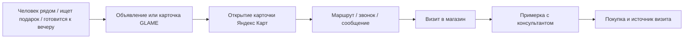

# План реализации Traffic & Growth Board: Яндекс-реклама для GLAME Ялта

Дата создания: 2026-08-14  
Последнее обновление: 2026-08-15  
Статус: внутренний контур, OAuth и read-only импорт Директа готовы; ожидание первой синхронизации, офлайн-атрибуции и фактического запуска

## Цель первого релиза

Сделать Traffic & Growth Board рабочим местом AI-агента GLAME, который готовит, ведёт и анализирует рекламные кампании Яндекса для офлайн-магазина GLAME в Ялте.

Главный результат рекламы — не клики на каталог, а измеримый офлайн-путь:

Первый канал — Яндекс: Директ, Яндекс Бизнес и Яндекс Карты, поиск, РСЯ, видео/баннеры и геосегменты. Архитектура должна оставаться многоканальной: далее подключаются Сбер, Авито и другие агрегаторы без переписывания ядра.

## Статус на 2026-08-14

| Блок | Статус | Фактический результат |
| --- | --- | --- |
| Рабочие проекты и чаты | ✅ Сделано | В Board есть левая колонка проектов; у каждой кампании отдельный чат и история решений. |
| Паспорта кампаний и согласование | ✅ Сделано | Карточка запуска содержит карту, бюджет, радиус, срок теста, KPI и чек-лист. Передача на согласование не публикует рекламу. |
| Карточка GLAME в Яндекс Картах | ✅ Ссылка внесена | Для `GLAME_YALTA_MAPS` установлен URL карточки, чек-лист заполнен пользователем; нужна только периодическая ручная проверка актуальности. |
| Пять кампаний Ялты | ✅ Созданы как проекты | `MAPS`, `SEARCH_HOT`, `GEO_NOW`, `TOURIST_GEO`, `GIFT` существуют как отдельные задачи со стартовыми KPI и бюджетной логикой. |
| Товарный фид Яндекс Бизнес | 🟡 Автоматизация готова | Генератор YML работает в Board; фид загружен в Яндекс Бизнес: 1 297 из 1 297 товаров. UUID заменены на числовые ID, `shortDescription` ограничен 250 символами. Добавлена постоянная публичная YML-ссылка с сохраняемыми фильтрами; её осталось один раз подключить в Яндекс Бизнес. |
| Пакет креативов и согласование | ✅ Сделано | AI Brand Media получает задачу и медиатеку кампании; в Board есть предпросмотр объявлений, смена фото прямо в карточке, выборочная доработка и согласование каждого варианта или всего пакета. |
| Hermes-профиль и база знаний | ✅ Сделано | Профиль `glame-traffic-growth` подключён к отдельному vault `GLAME Traffic Growth`; базовые инструкции принадлежат Anatoliy, брендовые и внешние рекламные решения согласует Elena. |
| Яндекс OAuth и реестр кабинетов | ✅ Сделано | OAuth-приложение настроено в Board, Client secret хранится защищённо, авторизация владельца кабинета пройдена; доступен только read-only импорт Директа. |
| Аналитика и офлайн-атрибуция | 🟡 Частично | В Board есть единая воронка: Директ (автоматический read-only), реестр нескольких счётчиков Метрики (сайт, приложение, партнёрские площадки) и факты Бизнеса/Карт. Доступен срез «все источники / конкретный магазин»: действия карточки берутся из её счётчика Метрики, кабинет Бизнеса привязывается к счётчику магазина, а кампания Директа — отдельно к нужному магазину. Для каждого магазина можно загрузить Excel/CSV‑выгрузку с детализацией по дням; повторная загрузка безопасно обновляет даты. Нужны регулярная выгрузка или API‑адаптер, кассовый источник и автоматические отчёты. |
| Фактический запуск рекламы | ⏳ Не начато | Кампании в рекламном кабинете не созданы и бюджет не списывался. |

### Что готово для операционной работы сейчас

1. Создать/открыть нужный проект в Traffic & Growth Board.
2. Заполнить паспорт и подготовить креативы через AI Brand Media.
3. Передать пакет на согласование.
4. В блоке «Товарный фид для Яндекс Бизнес» сохранить фильтры для автообновления и скопировать постоянную YML-ссылку.
5. В Яндекс Бизнес выбрать источник «YML-фид», вставить эту ссылку и дождаться первой успешной загрузки. Дальше Яндекс обновляет каталог автоматически по той же ссылке.

### Ближайший блок работ

Выполнить первую read-only синхронизацию Яндекс Директа и сверить кампании с ежедневной статистикой в Board. Только после сверки данных и явного согласования можно добавлять API-действия записи.

## Принципы и границы агента

- Целевая точка — подтверждённая карточка ялтинского магазина GLAME в Яндекс Картах, а не каталог по умолчанию.
- Агент готовит и оптимизирует кампании на основе данных, но любые внешние необратимые действия требуют уровней доступа и согласования.
- `draft` — агент может создать черновик в GLAME; `approval_required` — сформировать пакет на согласование; `approved` — оператор/руководитель подтверждает бюджет, гео и креативы; только после этого разрешён запуск или изменение через API рекламной площадки.
- Агент не должен сам менять платёжные реквизиты, повышать дневной лимит выше утверждённого, удалять кампании, публиковать медиа или отвечать на отзывы без явного разрешения.
- Личные данные клиентов и токены рекламных кабинетов не передаются в LLM-промпты и не хранятся в Obsidian. В журнал и промпт попадают только агрегированные показатели и ссылки/идентификаторы с ограниченным доступом.

## Роли и контуры доступа

### Hermes и Obsidian

Создать отдельный Hermes-профиль `glame-traffic-growth` — это имя уже назначено для `traffic-growth-agent` в `backend/app/services/hermes_agent_runtime.py`. Не использовать общий профиль директора: у рекламного агента будут другие инструменты, инструкции и доступ к медиа.

Для знаний создать отдельный Obsidian vault, например `GLAME Traffic Growth`, с синхронизацией в контролируемый каталог. В нём хранить только рабочие материалы:

- `00-briefs/` — утверждённые брифы, магазины, офферы, ограничения;
- `01-yandex/` — карта кампаний, ключи, минус-слова, геосегменты, чек-листы;
- `02-media/` — каталог доступных ассетов с ID, правами и статусом модерации, но не секреты;
- `03-reports/` — ежедневные и недельные отчёты;
- `04-experiments/` — гипотезы, A/B-тесты, решения и результаты;
- `99-runbook/` — инструкции по инцидентам и ручной передаче.

Доступ профиля: чтение vault и медиакаталога, запись только в собственные отчёты/черновики. Доступ к API GLAME — через сервисную учётную запись с минимальными правами. Яндекс OAuth-токены — в secrets/environment, с ротацией и без отображения в UI или логах.

### Ответственность человека

| Роль | Подтверждает |
| --- | --- |
| Руководитель/директор | бюджет, KPI, запуск, масштабирование и существенные изменения гео |
| Маркетолог/оператор | корректность карточки, медиа, тексты, настройку кабинета и модерационные требования |
| Управляющий магазина | часы работы, готовность команды, учёт источника офлайн-визита |
| Агент Traffic & Growth | анализ, подготовку черновиков, рекомендации, мониторинг и отчётность |

## Что проверяем до разработки и запуска

1. Получить и верифицировать URL карточки именно магазина GLAME в Ялте: адрес, график, телефон, маршрут, отзывы и фото.
2. Назначить владельца рекламного кабинета Яндекс Директ/Бизнес и способ OAuth-авторизации API; подтвердить, какие операции API разрешены на первом этапе.
3. Зафиксировать дневной тестовый бюджет: 2 000 ₽ на 10–14 дней; определить потолок расхода без повторного согласования.
4. Подготовить контент карточки: товары и услуги из ТЗ, фасад/вход, интерьер, витрина, примерка, украшения на человеке, упаковка и три коротких ролика.
5. Настроить офлайн-атрибуцию у кассы через промокоды кампаний: продавец применяет код в 1С после идентификации покупателя по телефону/дисконтной карте. Дополнительно фиксирует сценарий визита, если клиент не использовал код. Без этого агент не сможет оптимизировать под визиты и продажи.
6. Утвердить baseline: органические открытия карточки, маршруты, звонки, посещаемость и продажи Ялты за 14–28 дней до теста.

## Состав первого запуска в Яндексе

| Кампания | Цель | Канал и аудитория | Стартовая доля бюджета |
| --- | --- | --- | --- |
| `GLAME_YALTA_MAPS` | Открытие карточки, маршрут, звонок | Продвижение организации/Карты | 35% |
| `GLAME_YALTA_SEARCH_HOT` | Перехват горячего спроса | Поиск, Ялта | 25% |
| `GLAME_YALTA_GEO_NOW` | Зайти в магазин, находясь рядом | РСЯ/видео/баннер, 0,5–1 км | 25% |
| `GLAME_YALTA_TOURIST_GEO` | Туристический сценарий | Геосегменты набережной, пляжа, отелей, ресторанов, парковок | тест после достаточного инвентаря |
| `GLAME_YALTA_GIFT` | Подарочный спрос | Поиск + РСЯ; отдельный тест мужчин 25–55 | 15% |

Если бюджет сокращён, оставить `MAPS`, `SEARCH_HOT` и `GEO_NOW`. `TOURIST_GEO` не запускать до утверждения точек и оценки доступного охвата.

Общие настройки из ТЗ:

- поиск в часы работы магазина; для гео/РСЯ тестовые окна: 10:30–13:00, 15:30–18:30, 18:30–21:30;
- карта или специальная посадочная с действием «Открыть маршрут» — целевая ссылка;
- для сайта обязательны UTM: `utm_source=yandex`, `utm_medium=cpc`, `utm_campaign`, `utm_content`, `utm_term={keyword}`;
- применить согласованный список минус-слов, включая маркетплейсы, «бесплатно», «дешево», «оптом», ремонт, ломбарды, вакансии и DIY-запросы;
- не использовать давление ценой, распродажи и холодный трафик на каталог.

## Целевая модель данных

Текущая `marketing_campaigns` пригодна для отображения общей кампании, но не хранит достаточных данных для управления Яндексом. Добавить отдельные сущности (названия предварительные):

| Сущность | Назначение и ключевые поля |
| --- | --- |
| `ad_connections` | Площадка, рекламный кабинет, OAuth-secret reference, статус, разрешения, владелец |
| `ad_campaigns` | Внешний ID, магазин, платформа, тип кампании, статус, бюджет, цель, ссылка, период, решение на запуск |
| `ad_groups` / `ad_creatives` | Гео, расписание, аудитории, ключи/минус-слова, текст, media asset ID, статус модерации |
| `ad_metrics_daily` | Дата, показы, клики, расход, CTR, CPC, открытия карточки, маршруты, звонки, сообщения, визиты, продажи, выручка |
| `offline_attribution_events` | Время, магазин, источник, сценарий, визит/покупка, сумма, чек; связь с кампанией при известной атрибуции |
| `ad_recommendations` | Диагноз, гипотеза, ожидаемый эффект, риск, действие, статус согласования, результат |
| `feed_exports` | Версия фида, URL, число товаров, ошибки валидации, время публикации |
| `ad_audit_log` | Кто/что предложил, согласовал, отправил в площадку, старое/новое значение и результат |

Все внешние идентификаторы и сырьевые ответы API сохранять отдельно от аналитической витрины. Метрики должны быть идемпотентны по `(platform, campaign_external_id, date, attribution_window)`.

## API и интеграции

### Этап A — read-only и подготовка

1. Коннектор Яндекс Директ/Бизнес/Карт с проверкой авторизации и перечнем разрешений.
2. Импорт структуры кампаний, статусов, модерации и ежедневной статистики в GLAME; запуски синхронизации вручную и по расписанию.
3. Подключение существующей Яндекс.Метрики к единому разрезу кампании/UTM; Метрика дополняет, но не заменяет показатели Карт и офлайн-источника.
4. Реестр медиа GLAME: выбор только разрешённых файлов с указанием формата, размера, прав и статуса готовности.
5. Импорт таблицы магазина/кассы для офлайн-атрибуции, с проверкой дублей и отчётом о качестве данных.

### Офлайн-атрибуция через промокоды 1С

Промокод — основной источник **подтверждённой** связи между рекламной кампанией и покупкой в офлайн-магазине. Он не заменяет общую оценку рекламного эффекта: часть покупателей увидит рекламу, но не назовёт код, поэтому в аналитике необходимо разделять «подтверждено промокодом» и «общий эффект кампании».

1. Для каждой тестовой кампании создавать отдельный короткий код: например, `YALTAGIFT`, `YALTAMAPS`, `YALTANEAR`. Не создавать отдельный код на каждый вариант объявления, пока не накопится достаточная статистика.
2. Код связан в GLAME с кампанией, оффером, периодом действия, лимитом использований, размером скидки и правилом «только первая покупка».
3. Для первой покупки обязательна идентификация по телефону или дисконтной карте 1С; это защищает от повторного применения и позволяет увидеть повторные покупки привлечённого клиента.
4. В рекламном тексте использовать премиальный оффер: «Назовите код … и получите привилегию на первую покупку», а не постоянную коммуникацию распродажи.
5. В 1С определить технический носитель кода: предпочтительно применённая акция/основание скидки или дополнительный реквизит чека. До автоматизации провести тестовый чек с кодом и зафиксировать поле, которое возвращает OData/API.
6. Доработать синхронизацию чеков: распознавать код, сохранять погашение с ID чека, кампанией, временем, суммой до скидки, суммой скидки, выручкой и обезличенной связью с клиентом.
7. В Traffic Board показывать по каждому коду: использований, подтверждённых визитов/покупок, выручку, средний чек, размер предоставленной скидки, CPA и ROAS. Метрики без кода помечать как неподтверждённые.

### Этап B — управляемая запись

После успешного read-only пилота добавить создание черновиков кампаний и обновление разрешённых полей через API. Каждый запрос проходит validation → preview → approval → execution → audit log. Первым автоматизированным действием должна быть не публикация, а формирование черновика и пакета на согласование.

### Этап C — расширение площадок

Для Сбера, Авито и следующих каналов реализовать адаптеры с одним контрактом: `connection`, `campaign`, `creative`, `daily_metrics`, `recommendation`, `approval`. Это позволит отображать сравнимую аналитику без привязки UI к API одной площадки.

## Функции Traffic & Growth Board

### 1. Обзор

- карточки KPI за 7/14/30 дней: расход, показы, CTR, CPC, открытия карты, маршруты, звонки, офлайн-визиты, продажи, выручка, CPA визита и ROAS там, где атрибуция надёжна;
- фильтры: магазин, канал, кампания, период, кампания/группа, статус;
- разделение «данные площадки», «Метрика», «подтверждено магазином» и явное обозначение неполной атрибуции.

### 1a. Рекламные проекты и рабочий чат

Верхний рабочий блок Board повторяет понятную механику CRM Board: слева — колонка «Рекламные проекты», справа — чат AI Traffic & Growth. Каждый проект — отдельная задача агента и, соответственно, отдельная история решений, а не один общий чат доски.

- кнопка `+` создаёт проект кампании; сразу выбирает его и открывает его чат;
- карточка проекта показывает канал/тип, название, статус, дату создания и краткий результат, когда агент его зафиксировал;
- выбор карточки переключает чат на историю только этой кампании;
- первый проект по умолчанию — `GLAME_YALTA_MAPS`; далее создаются поиск, GEO NOW, туристические сегменты, подарок, ретаргетинг или любой пользовательский проект;
- внутри выбранного проекта агент обсуждает бриф, создаёт черновики, фиксирует результат и формирует следующий шаг; внешний статус кампании остаётся в общем реестре кампаний ниже.

На первом шаге проектом служит существующая agent-task, поэтому не требуется дублировать историю сообщений или вводить отдельную сущность только для UI. После появления `ad_campaigns` она связывается с тем же `task_id`, а не заменяет его.

### 2. Кампании

- список кампаний с платформой, целью, бюджетом, расходом, статусом, модерацией и последней синхронизацией;
- карточка кампании: настройки, креативы, гео, аудитории, ключи, UTM, временные окна и таймлайн решений;
- черновик запуска из утверждённого шаблона Ялты; preview в человекочитаемом виде;
- кнопки «передать на согласование», «согласовать», «вернуть на доработку», «поставить на паузу» согласно роли пользователя.

### 3. Карта и гео

- подтверждённая карточка магазина, чек-лист её готовности и дата последней проверки;
- наборы геозон: магазин, радиус 0,5/1/2/3 км, набережная, пляж, отели, рестораны, прогулочные зоны, парковки;
- карта/список геозон, радиус и объяснение, зачем они задействованы; реальные геовозможности определяются API/интерфейсом Яндекса и не симулируются.

### 4. Аналитика и рекомендации

- воронка «показ → клик/открытие карты → маршрут/звонок → визит → продажа»;
- разрезы по часу, дню недели, группе, гео, креативу, сценарию («подарок», «турист», «вечер», «рядом»);
- диагностика: мало показов, есть клики без визита, есть визиты без продаж, рост стоимости действия, усталость креатива, ошибка карточки/маршрута;
- рекомендация всегда содержит данные, гипотезу, предложенное изменение, ожидаемое влияние, риск, лимит и необходимость согласования;
- ежедневный короткий и недельный развёрнутый отчёты автоматически сохраняются в GLAME и Obsidian vault.

Текущая реализация: в единой воронке Board отдельно отображаются автоматические показатели Яндекс Директа, посещения сайта из Метрики и сохранённые дневные действия карточки Яндекс Бизнес/Карт (открытия, маршруты, звонки, сообщения, переходы на сайт). Для каждого подключённого магазина доступен ручной ввод одной даты и пакетный импорт XLSX/XLS/CSV из Яндекс Бизнеса с разбивкой по дням. Повторная загрузка обновляет существующие даты, а не создаёт дубли. Пока read-only API Бизнеса/Карт не подключён, это импортируемый источник из кабинета.

## Товарный фид для РСЯ

Фид нужен как отдельный этап, а не блокер запуска локальных кампаний. В проекте уже есть импорт YML из 1С; его следует развить в экспортный пайплайн.

1. Определить поддерживаемый Яндексом тип фида и формат для выбранного рекламного продукта на дату внедрения.
2. Сформировать feed из актуального каталога и остатков: стабильный ID, название, цена, наличие, URL, изображение, категория, бренд, материал/коллекция при наличии.
3. Исключать товары без актуальной цены, наличия, корректного изображения или пригодной посадочной страницы.
4. Валидировать до публикации, публиковать версионированный URL, обновлять по расписанию и показывать ошибки в Board.
5. До появления корректного фида не использовать динамические товарные объявления; запускать утверждённые имиджевые и локальные креативы.

## Логика агента

Агент получает из GLAME утверждённый бриф, доступные медиа, состояние карточки, кампании, агрегированные данные площадок, Метрики и офлайн-атрибуции. Он обязан:

1. проверить полноту входных данных и не рекомендовать запуск при критическом отсутствии карточки, бюджета, медиа или учёта источника;
2. сформировать черновик с KPI, аудиторией, гео, бюджетом, расписанием, посадочной, креативами, ключами и минус-словами;
3. объяснить, почему предлагает изменение, и направить его на согласование;
4. после запуска анализировать результаты ежедневно, а пересмотр делать по минимально достаточной статистике, а не по единичному дню;
5. через 3 дня применить дерево диагностики из ТЗ; через 10–14 дней подготовить решение «масштабировать / оптимизировать / остановить»;
6. фиксировать все решения и фактические результаты, чтобы последующие рекомендации учитывали прошлые эксперименты.

## Очерёдность реализации и критерии готовности

### Фаза 0 — данные и операционная готовность

Статус: 🟡 частично выполнена.

Подтвердить карточку Ялты, аккаунты, владельцев, бюджет, доступные медиа, базовую статистику и процесс вопроса у кассы.

Сделано: ссылка на карточку внесена, чек-лист карточки заполнен, YML-фид загружен полностью, кабинет владельца OAuth-авторизован, медиатека кампании и пакет креативов доступны для согласования.  
Осталось: подтвердить права на выбранные рекламные медиа, дневной бюджет и гео, собрать baseline, создать тестовый промокод в 1С и определить поле его возврата в API/синхронизации чеков.

### Фаза 1 — рабочий контур GLAME и Hermes

Статус: 🟡 основной UI-контур выполнен.

Создать vault и профиль `glame-traffic-growth`, добавить его инструкции, ограничения, доступы и health-check. Расширить Board до сущностей рекламной кампании, рекомендаций и согласований. Создать миграции и API для реестра кампаний, ежедневных метрик и аудита.

Сделано: проекты, паспорта, согласование, аудит внутренних действий, передача ТЗ Brand Media, медиатека кампании, реестр рекламных кабинетов (Яндекс Директ / Бизнес / Карты), OAuth-настройка с защищённым Client secret, авторизация владельца, выделенный Hermes-профиль и отдельный Obsidian vault с ограничениями на хранение данных. Администратор может добавлять, изменять и отключать связи с кабинетами. Для согласованного проекта доступны отдельные безопасные шаги: создать в Директе черновик ЕПК с выбранным счётчиком Метрики, затем одну пустую Unified-группу с локальным регионом, одно комбинаторное объявление-черновик, согласованный пакет ключевых фраз и контролируемый импорт до трёх оригиналов из медиатеки GLAME. Изображения сперва загружаются в библиотеку Директа и только отдельным подтверждением привязываются к черновику. Разрешены лишь локальные JPG/PNG/GIF, поэтому GLAME не забирает сторонние URL. Последний шаг «Отправить на модерацию» доступен только после чекбокса, повторного системного подтверждения и точной фразы; он вручную вызывает `Ads.moderate` и фиксирует пользователя, время, ID кампании/группы/объявления, ключи и хеши изображений в неизменяемом журнале задачи. Ни агент, ни синхронизация не могут отправить объявление на модерацию или включить показы автоматически.  
Осталось: проверить первый полный черновик и ручную отправку на модерацию на фактическом кабинете, затем дождаться решения Директа и отдельно проверить старт/расход в рамках установленного лимита; read-only адаптеры Бизнеса/Карт остаются отдельной задачей.

### Фаза 2 — Яндекс read-only, офлайн-атрибуция и аналитика

Статус: 🟡 read-only импорт кампаний и дневных метрик Директа реализован; ежедневный регламент синхронизации и отчёта включён. Единый источник офлайн-атрибуции ещё не подтверждён.

Подключить статистику Яндекс Директ/Бизнес/Карт в доступном объёме, Метрику, импорт погашений промокодов из чеков 1С и витрину воронки. Реализовать ежедневную синхронизацию, контроль пропусков и отображение свежести данных.

Сделано: ежедневно в 07:30 UTC выполняется только read-only синхронизация подключённых кабинетов Яндекс Директа. Отчёт сохраняется в GLAME: показы, клики, расход, CTR, CPC, конверсии, свежесть данных и ошибки отдельных кабинетов. Для кампаний, переданных на модерацию, регламент отмечает точки «день 3» и «дни 10–14» для диагностики и решения на согласование; ставки, бюджеты, статусы кампаний и сообщения не изменяются.

Готово, когда: Board показывает по Ялте раздельные данные площадки и магазина, можно увидеть конверсию воронки и объяснить, откуда взялась каждая метрика.

### Фаза 3 — пилот пяти кампаний

Статус: 🟡 проекты подготовлены, один пакет креативов создан и доступен для выборочного согласования; запуск не начат.

Подготовить кампании из ТЗ, пройти ручную модерацию/согласование и запустить при утверждённом дневном лимите. Агент ежедневно формирует отчёт, на третий день — диагностический отчёт, к 10–14 дню — итоговое решение.

Осталось: согласовать варианты креативов и права на медиа, подтвердить бюджеты/гео, подготовить в GLAME черновик ЕПК и пройти контрольный лист; затем отдельным согласованным шагом создать группы и объявления для предпросмотра, включить учёт офлайн-источника и собрать первые 3/10–14 дней фактических метрик. Включение показов остаётся ручным финальным действием.

### Фаза 4 — безопасное управление и фид

Статус: 🟡 постоянная публичная YML-ссылка реализована; требуется подключение источника в Яндекс Бизнес и контроль первой загрузки.

После успешного пилота включить через API только разрешённые записывающие операции: создание черновика, отправка на модерацию и изменение заранее согласованных ставок/лимитов. Реализовать версионированный товарный фид и его контроль качества.

Сделано: YML генерируется из активного каталога, валидируется до скачивания и успешно принят Яндекс Бизнес. Для GLAME Ялта добавлен стабильный публичный URL, который строит актуальный фид из каталога при каждом запросе Яндекса; фильтры по цене, наличию, бренду и категории сохраняются в настройках Board.  
Осталось: один раз вставить ссылку в Яндекс Бизнес и подтвердить первую загрузку; после синхронизации 1С добавить журнал экспортов/ошибок и проверку качества обновления.

### Фаза 5 — адаптеры следующих площадок

Статус: ⏳ не начата.

Подключать Сбер, Авито и другие системы по общему контракту, начиная с read-only аналитики и черновиков, затем с утверждённых операций записи.

Готово, когда: новые каналы появляются в общей воронке и используют те же правила согласования, KPI и аудита.

## KPI первого пилота

Целевые численные пороги нужно утвердить после baseline, поэтому в первом запуске измеряем:

- долю показов и открытия карточки;
- стоимость открытия карточки, маршрута и звонка;
- долю маршрутов/звонков от открытий карточки;
- подтверждённые визиты и покупки с источником;
- CPA визита и CPA покупки, где источник известен;
- выручку, средний чек и ROAS с обязательной маркировкой окна и качества атрибуции;
- процент записей магазина с заполненным источником — KPI качества данных.

## Оставшиеся блокеры и решения

1. 🟡 OAuth-приложение, авторизация владельца и read-only импорт Директа готовы: Client ID и Client secret сохранены в защищённом хранилище GLAME. Нужно нажать «Синхронизировать» и проверить, что кабинет/организация разрешены Яндексом для чтения.
2. Нужно согласовать, можно ли агенту после read-only этапа создавать черновики через API; запуск, изменение ставок и списание бюджета остаются ручным подтверждением.
3. 🟡 Медиатека кампании и задача AI Brand Media реализованы. Нужен ответственный за рекламные фото/видео и подтверждение прав на выбранные материалы перед внешней публикацией.
4. 🟡 Основной способ офлайн-атрибуции выбран: отдельный промокод на кампанию с применением в 1С для первой покупки. Нужно создать тестовый код `YALTAGIFT`, провести тестовый чек, определить возвращаемое поле OData/API и затем добавить распознавание в синхронизацию GLAME. Для визитов без кода продавец дополнительно фиксирует источник и сценарий.
5. ✅ Завести отдельный Obsidian vault `GLAME Traffic Growth` и определить владельца его базовых инструкций: vault создан в контролируемом каталоге, базовые инструкции принадлежат Anatoliy; брендовые и внешние рекламные решения согласует Elena.
6. 🟡 Публичная ссылка автоматического фида готова. Нужно подключить её в Яндекс Бизнес и подтвердить первую загрузку; затем добавить журнал экспортов/ошибок после синхронизации 1С.

## Следующий практический шаг

В реестре рекламных кабинетов нажать «Синхронизировать» у авторизованного Яндекс Директа: GLAME безопасно загрузит список кампаний и дневные показатели за 14 дней. Затем сверить данные в новом блоке «Рекламная аналитика — Яндекс Директ». Параллельно в проекте `GLAME_YALTA_GIFT` согласовать или точечно доработать варианты креативов, подтвердить права на медиа, бюджет и гео.
