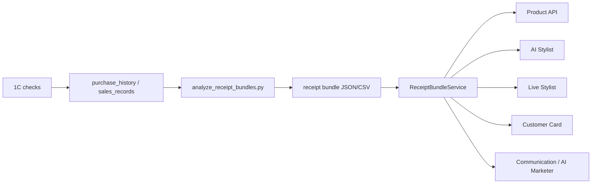
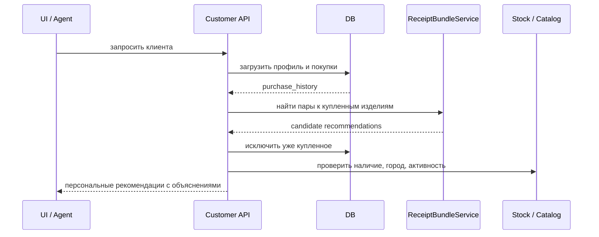

# Рекомендательная система комплектов по чекам 1С

## Назначение

Система анализирует реальные чеки из 1С и выявляет, какие украшения покупают вместе. Эти связки отражают работу продавцов и стилистов: кольцо с колье, браслет с серьгами, чокер с браслетом, изделия одной коллекции или неожиданные сочетания, которые хорошо продаются вживую.

Цель системы:

- превратить историю чеков в источник рекомендаций;
- помогать AI Stylist и живым стилистам собирать комплекты;
- улучшать персональные рекомендации по истории покупок клиента;
- находить закономерности совместимости изделий;
- использовать реальные продажи как сигнал поверх ручных правил, фотоанализа и LLM.

Это не замена стилиста, а дополнительный слой фактов: "эти изделия уже покупали вместе".

## Ключевая идея

Каждый чек рассматривается как мини-комплект. Если два изделия часто встречаются в одном чеке, система считает их потенциально совместимыми.

Для каждой пары считаются метрики:

- `pair_receipts` - сколько чеков содержали оба изделия;
- `support` - доля чеков, где встретилась пара;
- `confidence` - вероятность купить B, если уже купили A;
- `lift` - насколько пара сильнее случайного совпадения;
- `jaccard` - мера пересечения аудиторий двух изделий;
- `score` - итоговый скоринг совместимости.

Высокий `lift` показывает сильную связь, но может быть нестабилен на малом количестве чеков. Поэтому в практическом использовании важны одновременно `pair_receipts`, `confidence`, `lift` и `score`.

## Где находится реализация

- Скрипт расчета: `backend/analyze_receipt_bundles.py`
- Сервис чтения результата: `backend/app/services/receipt_bundle_service.py`
- API рекомендаций: `backend/app/api/products.py`
- Данные отчета: `backend/data/receipt_bundle_analysis/`

Система сейчас работает без отдельной таблицы БД: offline-скрипт считает отчет в JSON/CSV, backend читает последний отчет и отдает рекомендации через API.

## Источники данных

Основной источник:

- `purchase_history`

Резервный источник:

- `sales_records`

Ключевые поля:

- ID документа/чека: `document_id_1c` или `document_id`;
- товар: `product_id`, `product_id_1c`, `product_article`, `product_name`;
- категория и бренд: `category`, `brand`, `product_category`, `product_brand`;
- дата покупки;
- сумма и количество.

При построении рекомендаций служебные позиции исключаются по названию: упаковка, пакет, коробка, мешочек, салфетка, доставка, сертификат.

## Как считается отчет

Запуск из backend:

```bash
cd /root/glame-platform/backend
python3 analyze_receipt_bundles.py
```

Полезные параметры:

```bash
python3 analyze_receipt_bundles.py --days 730 --limit 300
python3 analyze_receipt_bundles.py --min-pair-support 5 --min-confidence 0.05
python3 analyze_receipt_bundles.py --source sales-records --days 365
```

Результат сохраняется в:

```text
backend/data/receipt_bundle_analysis/
```

Форматы:

- JSON - для backend и агентов;
- CSV product pairs - для аналитиков и стилистов;
- CSV category pairs - для категорийных паттернов.

## API

### Рекомендации по product_id

```http
GET /api/products/{product_id}/receipt-bundles?limit=6
```

### Рекомендации по артикулу

```http
GET /api/products/receipt-bundles/by-article?article=73050&limit=6
```

Дополнительные параметры:

- `limit` - количество рекомендаций;
- `min_score` - минимальный скоринг;
- `require_catalog_match` - вернуть только те пары, где второе изделие найдено в каталоге.

Пример смысла ответа:

```json
{
  "source_product": {"article": "73050", "name": "Браслет Crystal..."},
  "report_found": true,
  "items": [
    {
      "counterpart_article": "73034",
      "counterpart_name": "Чокер Crystal...",
      "score": 0.7978,
      "pair_receipts": 3,
      "confidence": 0.18,
      "lift": 37.81,
      "reasons": [
        "Покупали вместе в 3 чеках",
        "lift 37.81",
        "confidence 18.0%"
      ],
      "product": {"id": "...", "article": "73034"}
    }
  ]
}
```

## Как применять в продукте

### 1. Карточка товара

На карточке товара показываем блок:

- "Часто покупают в комплект";
- "С этим изделием стилисты сочетали";
- "Комплект по реальным покупкам".

Алгоритм:

1. Берем текущий `product_id`.
2. Запрашиваем `/api/products/{product_id}/receipt-bundles`.
3. Показываем товары с высоким `score`, наличием и фото.
4. Если данных мало, добираем текущими агентскими рекомендациями.

### 2. AI Stylist

AI Stylist должен использовать чековые связки как один из главных источников фактов.

Пример:

1. Пользователь просит: "Подбери серьги к этому браслету".
2. Агент определяет исходный товар.
3. Запрашивает receipt-bundle рекомендации.
4. Смешивает результат с правилами стиля, фотоанализом, наличием и бюджетом.
5. Объясняет рекомендацию: "Эту пару часто покупали вместе; она совпадает по коллекции/форме/камням".

Важно: LLM не должен выдумывать совместимость, если есть реальные данные чеков. Чековая система дает grounded-сигнал.

### 3. Живой стилист

В интерфейсе live stylist стоит добавить быстрый блок:

- "Комплекты по продажам";
- "Что предложить следующим";
- "Пары к выбранным изделиям".

Стилист выбирает товар, система предлагает изделия, которые уже покупали вместе. Это ускоряет подбор и помогает новым продавцам перенимать практику сильных стилистов.

### 4. Карточка покупателя

Когда мы запрашиваем данные о покупателе и его историю покупок, система должна строить рекомендации поверх его покупок.

Базовый сценарий:

1. Получаем клиента.
2. Загружаем `purchase_history`.
3. Для каждого купленного изделия запрашиваем receipt-bundle пары.
4. Убираем товары, которые клиент уже купил.
5. Убираем недоступные или неактивные товары.
6. Сортируем по персональному скору.

Так мы получаем список: "что логично предложить этому клиенту дальше".

### 5. Сравнение рекомендаций с историей покупок

Это самый важный слой персонализации.

Если клиент уже покупал браслет Crystal, а система знает, что к нему часто покупают чокер Crystal и серьги Crystal, то рекомендация усиливается. Если клиент уже покупал чокер, мы не предлагаем его повторно, а ищем следующую связанную позицию.

Персональный скор может учитывать:

- совпадение с уже купленными коллекциями;
- совпадение с любимыми категориями;
- совпадение с любимыми брендами;
- наличие в городе клиента;
- ценовой диапазон клиента;
- давность последней покупки;
- количество чековых подтверждений;
- отсутствие товара в истории клиента.

Пример формулы:

```text
personal_score =
  receipt_bundle_score * 0.40
  + category_affinity * 0.20
  + brand_or_collection_affinity * 0.15
  + price_fit * 0.10
  + stock_fit * 0.10
  + novelty * 0.05
```

### 6. Коммуникации и маркетинг

CommunicationAgent и AI Marketer могут использовать систему для персональных сообщений.

Примеры:

- "К вашему браслету Crystal стилисты часто подбирают чокер из этой же линии";
- "Вы покупали серьги Magna, к ним хорошо работает браслет Bicolor";
- "К вашей последней покупке есть готовый комплект в наличии в вашем городе".

Это лучше обычных массовых рассылок, потому что сообщение строится от реальной покупки клиента.

### 7. Подбор образов и look generation

При генерации образа система должна:

1. выбрать базовое изделие;
2. запросить чековые пары;
3. добавить 1-3 совместимых изделия;
4. проверить стилистические ограничения;
5. сохранить объяснение, почему комплект собран.

Так generated look становится не только красивым, но и основанным на реальных продажах.

## Как использовать "везде"

Система должна стать общим recommendation signal, который доступен всем агентам и UI.

Рекомендуемая схема:



Минимальный принцип:

- если в системе есть `product_id` или `article`, надо проверить receipt-bundle рекомендации;
- если есть `user_id`, надо сравнить эти рекомендации с историей покупок;
- если есть город/остатки, надо отфильтровать по доступности;
- если есть фотоанализ или стиль, надо перескорить результат, а не игнорировать чековые данные.

## Рекомендуемый pipeline для покупателя



## Правила ранжирования

Рекомендации надо делить на уровни доверия:

- `strong` - много чеков, высокий score, товар найден в каталоге и есть в наличии;
- `medium` - хороший score, но мало чеков или нет точной проверки наличия;
- `weak` - есть сигнал, но мало данных; использовать как подсказку стилисту, не как автоматическую рекомендацию.

Не стоит автоматически продвигать пары, если:

- пара основана на 1-2 чеках и нет других подтверждений;
- второй товар уже куплен клиентом;
- товар неактивен;
- нет остатков;
- товар служебный: упаковка, пакет, коробка, салфетка;
- цена сильно не соответствует профилю клиента.

## Регламент пересчета

Систему нужно регулярно перестраивать, потому что каждый новый чек - это новый сигнал совместимости. Если продавцы начали активно собирать новый комплект, рекомендационная система должна увидеть это через ночной пересчет.

На старте достаточно пересчитывать отчет раз в сутки после синхронизации 1С. В backend добавлен ночной scheduler:

- сервис: `backend/app/services/receipt_bundle_recalc_scheduler.py`;
- подключение: `backend/app/main.py`;
- дефолтное время: `04:30` по времени сервера;
- результат: новый JSON/CSV отчет в `backend/data/receipt_bundle_analysis/`;
- API автоматически читает самый свежий JSON-отчет.

Рекомендуемый порядок ночных задач:

1. синхронизировать продажи и новые чеки из 1С;
2. синхронизировать остатки;
3. пересчитать инвентарную аналитику;
4. пересчитать receipt bundle рекомендации;
5. утром AI Stylist, live stylist и карточки клиентов уже используют свежие связки.

### Автоматический пересчет в backend

Переменные окружения:

```env
RECEIPT_BUNDLES_RECALC_ENABLED=true
RECEIPT_BUNDLES_RECALC_HOUR=4
RECEIPT_BUNDLES_RECALC_MINUTE=30
RECEIPT_BUNDLES_ANALYSIS_DAYS=730
RECEIPT_BUNDLES_ANALYSIS_LIMIT=500
RECEIPT_BUNDLES_MIN_PAIR_SUPPORT=3
RECEIPT_BUNDLES_MIN_CONFIDENCE=0.03
RECEIPT_BUNDLES_SOURCE=auto
RECEIPT_BUNDLES_OUTPUT_DIR=data/receipt_bundle_analysis
RECEIPT_BUNDLES_RECALC_TIMEOUT_SECONDS=1800
```

Если нужно временно выключить пересчет:

```env
RECEIPT_BUNDLES_RECALC_ENABLED=false
```

### Ручной пересчет

Рекомендуемый cron:

```bash
cd /root/glame-platform/backend
python3 analyze_receipt_bundles.py --days 730 --limit 500
```

Ручной запуск полезен после массовой загрузки исторических продаж или исправления маппинга товаров.

После роста объема данных можно:

- считать отдельно по магазинам;
- считать отдельно по сезонам;
- считать отдельно по категориям;
- хранить результат в таблице БД;
- добавлять инкрементальный пересчет.

## Будущие улучшения

### Таблица рекомендаций

Вынести JSON-отчет в БД:

- `receipt_bundle_rules`;
- `receipt_bundle_category_rules`;
- `customer_next_best_products`.

Это ускорит API и позволит строить индексы.

### ML-слой

Когда данных станет больше, можно обучать модель совместимости:

- вход: признаки двух изделий, история совместных чеков, категории, коллекции, цена, материал, камни, цвет;
- выход: вероятность совместной покупки или score комплекта.

Association rules остаются explainable baseline, ML добавляется поверх них.

### Обратная связь

Нужно собирать события:

- рекомендация показана;
- стилист выбрал рекомендацию;
- клиент добавил в избранное;
- клиент купил рекомендованное;
- стилист отклонил рекомендацию.

Эти события позволят улучшать скоринг.

## Статус

Реализовано:

- offline-анализ чеков;
- JSON/CSV отчет;
- фильтрация служебных позиций;
- API по `product_id`;
- API по `article`;
- сопоставление рекомендованного артикула с каталогом.
- ночной scheduler для регулярного пересчета.

Следующий этап:

- подключить систему в AI Stylist;
- добавить блок в карточку товара;
- добавить блок в карточку покупателя;
- добавить персональный next-best-products сервис;
- связать пересчет с задачей синхронизации продаж из 1С в единую цепочку мониторинга.
